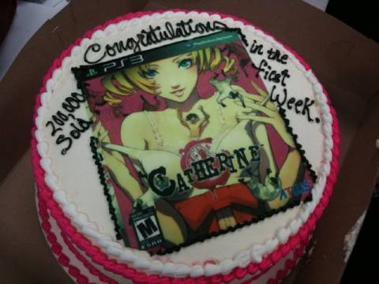

Op 4 augustus 2011 plaatste game-uitgever Atlus op Twitter [de foto van een taart](https://web.archive.org/web/20160709043018/https://twitter.com/#!/AtlusUSA/status/99153805672845312), met daarop de cover van zijn nieuwste game _Catherine_ geglaceerd. Die hadden ze verdiend, vonden ze, want ze hadden in slechts twee weken 200.000 kopieën van deze game verkocht.

> [!NOTE]
>
> Dit artikel verscheen eerder op het inmiddels offline gehaalde Bashers.

En dat voor een obscuur Japans spel dat het door zijn experimentele spelmechanieken nog wel eens moeilijk kon krijgen in het westen. Allemaal basisloze zorgen, verzuchtten reageerders opgelucht na het lezen van dit nieuws op de sites die het oppikten. Maar wat Atlus niet in zijn tweet vermeldde was aan wie de 200.000 exemplaren verkocht waren.

## Twee kopers

Een retailspel passeert twee kopers: een retailer, gevolgd door een ‘gewone klant’ die hem voor een meerprijs bij de eerste koper aanschaft.

Het aantal retailers dat de game van een uitgever aanschaft is vaak makkelijk te achterhalen. Immers: een uitgever werkt samen met zijn distribiteur, die tot in detail bijhoudt aan wie er wat is verkocht.

Het aantal klanten-aankopen is echter een heel ander verhaal. Cijfers van marktbureaus zoals het Amerikaanse NPD of Nederlandse GFK bieden na een langere tijd vaak pas inzage. Is een spel nog maar een tweetal weken uit, dan kun je hooguit een schatting maken op basis van retailers die terugkomen voor meer kopieën.

## Reuring

Die 200.000 van Atlus bleken uiteindelijk door retailers gekocht te zijn. Er waren nog maar [78.000 exemplaren](https://web.archive.org/web/20160709043018/http://www.joystiq.com/2011/08/04/cake-catherine-sold-200-000-units-in-first-week/) over de toonbank gegaan, bleek later. Op het moment van publicatie maakte dat Atlus niet uit. En geef ze maar eens ongelijk: websites namen het nieuwsfeit [argeloos over](https://web.archive.org/web/20160709043018/http://www.xgn.nl/ps3/nieuws/29140/200000-exemplaren-catherine-verkocht-in-vs-in-week-n/).

Dat grote aantal maakte natuurlijk indruk op potentiële kopers, die zo werden aangespoord om dit succesverhaal in huis te halen. Alleen daarom was er al reden om de speciaal gemaakte taart bij Atlus aan te snijden. Ze hadden wat te vieren. Dat ze een tweet aan dit heugelijke feit konden wijten, makkelijk verkeerd geïnterpreteerd door websites, was een fijne bonus.

## Gears

Atlus is geen uitzondering op de regel. _Gears of War 3_ is volgens recente persberichten ook [3 miljoen keer aangeschaft](https://web.archive.org/web/20160709043018/http://www.joystiq.com/2011/09/29/gears-of-war-3-sold-over-3-million-units-in-first-week/). Door 3 miljoen gamers? Laat mij niet lachen.
