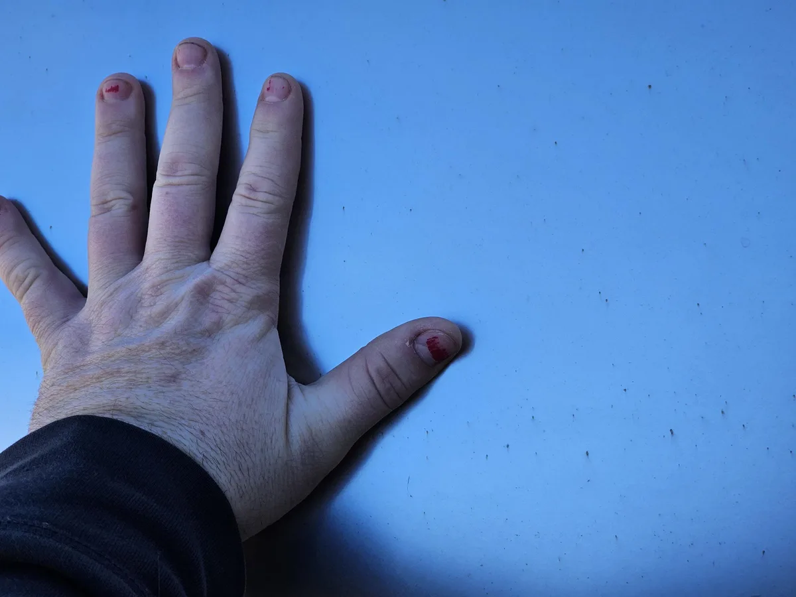

De meldingen verschenen op Cybertruck Owners Club, een forum waar Cybertruck-eigenaren verhalen kunnen uitwisselen. "Ik ontving mijn Cybertruck op 1 februari. Naarmate er regen op viel, viel mij op dat het metaal begon te roesten zoals anderen ook hebben gemeld", meldt gebruiker [vertigo3pc](https://www.cybertruckownersclub.com/forum/threads/cybertruck-spots-corrosion.12242/). Op een foto is te zien hoe kleine roestvlekjes op het metaal te zien zijn.

> [!NOTE]
> Dit artikel verscheen eerder op [Bright](https://www.bright.nl/nieuws/1180476/de-eerste-tesla-cybertrucks-beginnen-al-te-roesten.html).

Bezoeker [Raxar](https://www.cybertruckownersclub.com/forum/threads/rust-spots-corrosion-is-the-norm.11988/) hoorde van een dealer dat de Cybertruck oranje roestvlekken kan krijgen in de regen. Datzelfde probleem is waarom ooit werd geadviseerd om de klassieke DeLorean-auto niet in de regen te laten staan.

[Business Insider](https://www.businessinsider.com/tesla-cybertruck-owners-starting-rust-rain-orange-specks-elon-musk-2024-2?international=true&r=US&IR=T) stuitte op een blogpost van metaalleverancier Mead Metals, die beschreef dat roestvrijstaal alsnog kan roesten bij een bepaald klimaat. Meestal is de oorzaak water, al kan 'langdure blootstelling aan hitte' daar ook toe leiden.

## 'Geen coating'

Het gebrek aan een coating over de auto zou ertoe leiden dat de roestvlekken snel kunnen ontstaan. Wellicht dat de autofabrikant dit kan oplossen door alsnog zo’n coating aan te brengen.

Daar staat tegenover dat ook Tesla niks kan doen aan de werking van roestvrijstaal. Maar als het materiaal makkelijk roest en verweerd raakt, was het misschien niet de handigste keuze voor een SUV.
