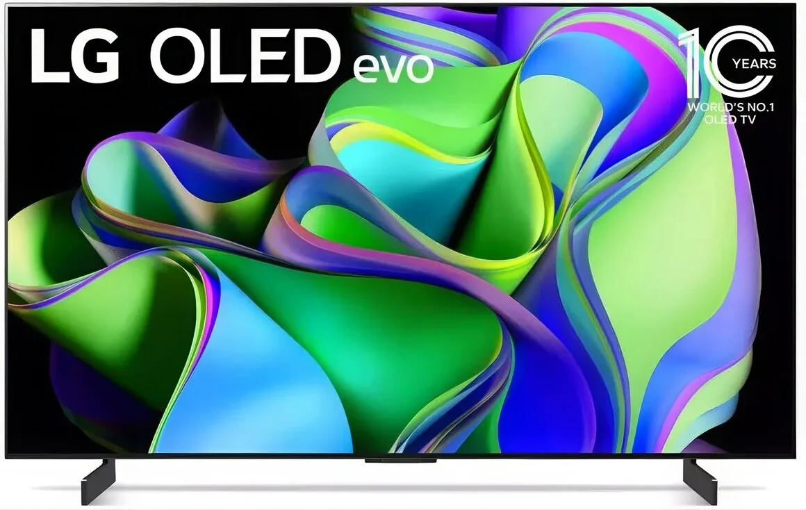
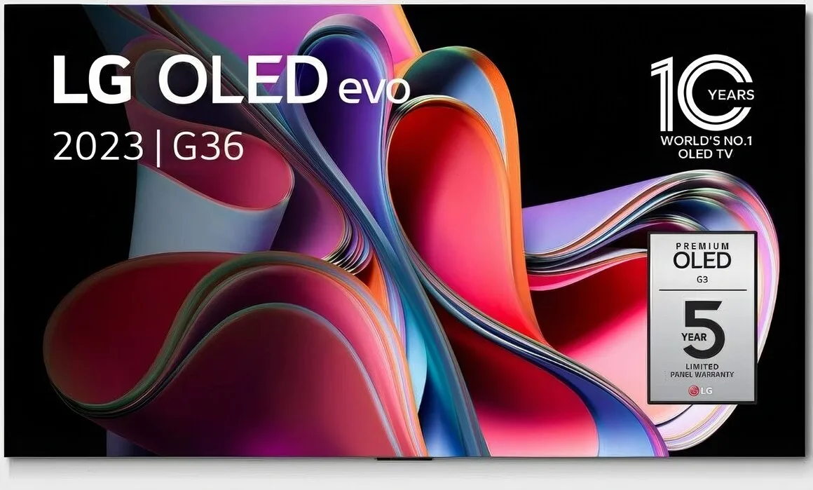
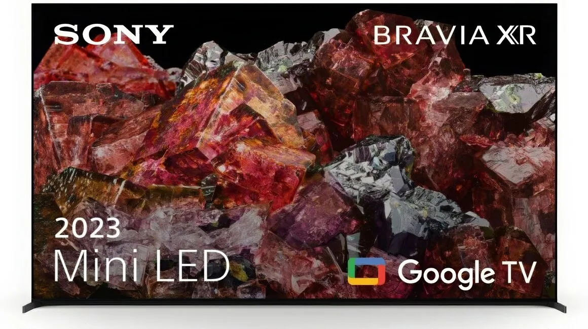

Met wielrennen, Formule 1 en een aanstormend EK Voetbal in Duitsland lijkt de sportzomer zachtjes aan van start te gaan. En wat is dan de beste televisie om alles haarfijn te kunnen volgen? Techjournalist Bastiaan Vroegop legt uit wat er op de markt is en wat de beste keuze is.

> [!NOTE]
> Dit artikel verscheen eerder op [AD](https://www.ad.nl/wonen/de-filmkijker-vindt-het-niks-maar-voor-de-sportliefhebber-is-dit-een-handige-functie-op-je-tv~aaf1a69f/).

Het is jarenlang al de regel in televisieland: wie een echt goede televisie wil hebben, koopt er eentje met een OLED-scherm. Bij deze beeldtechniek wordt iedere pixel individueel belicht, wat zorgt voor een extra hoog contrast en mooiere kleuren. Als de tv een deel van het scherm zwart wil maken, kunnen bijvoorbeeld de pixels op die plek helemaal worden uitgeschakeld. Traditionele LCD-televisies hebben altijd verlichting achter de pixels gebouwd, waardoor zwart er vaak uitziet als erg donkergrijs.

Alternatieve technologieën zoals mini-LED en micro-LED worden op het moment ook ontwikkeld, maar de eerste schermen die dit gebruiken zijn vaak buitengewoon duur. Een oled-tv is ook niet goedkoop, maar de prijs-kwaliteitverhouding hierbij is veel beter te rechtvaardigen. Daarnaast heb je ook tv’s met QD-OLED, een soort tussenweg die mooiere beelden dan LCD geeft, maar minder mooi dan bij echte OLED-panelen.

## De norm is 4K

Vroeger moest je nog kiezen tussen een tv met resolutie van 1920 bij 1080 pixels of een scherper 4K-scherm, inmiddels is dat veel minder een dilemma: bijna alle televisies in midden- en hoogsegment werken met 4K.

Heb je toch een 1080-televisie op het oog, dan hoeft dat niet per se een ramp te zijn. Veel Nederlandse kanalen zenden wedstrijden in die lagere resolutie uit. Kijk dan goed naar de resoluties die worden ondersteund door de plekken waar jij sport wilt kijken. Wil je na de voetbalwedstrijd Netflix kijken, dan ontkom je waarschijnlijk niet aan 4K-beeld.

## Motion Smoothing

Moderne televisies hebben een optie genaamd _Motion Smoothing_, die ervoor zorgt dat het beeld soepeler beweegt. Filmfans doen er neerbuigend over: je tv moet frames ‘verzinnen’ om het beeld te versoepelen, wat tegen de visie van de originele makers ingaat. Het kan daarnaast wat onnatuurlijk aanvoelen, als je zit te kijken naar een videogame of een goedkope soap-serie.

Sport is de grote uitzondering, omdat _Motion Smoothing_ ervoor zorgt dat de bal natuurlijker beweegt en makkelijker op je scherm te volgen is. Zet voordat je een wedstrijd kijkt daarom _Motion Smoothing_ aan. De optie zit verstopt in de beeldinstellingen van je tv en kan meerdere namen hebben, zoals Action Smoothing, Motion Enhancement, TruMotion of Action Motion Plus.

## Aanrader van dit moment: LG OLED evo C3

LG Oled EVO C3 © RV

Op techsite Tweakers staat de [OLED evo C3 van LG](https://tweakers.net/reviews/11196/lg-oled-evo-c3-misschien-wel-de-verkoophit-van-het-najaar.html) stipt bovenaan de lijst met aanraders. Het is volgens de site een tv met ‘zeer goede beeldkwaliteit’, geeft in zowel HDR- als SDR-kleuren beelden mooi weer en verwerkt beeld ook uitstekend om het nog mooier te maken. Voor het model van 55 inch betaal je op het moment ongeveer 1150 euro, wat niet heel duur is voor een oled-scherm.

Het is niet LG’s topmodel, wat betekent dat de helderheid achterblijft vergeleken met andere, duurdere tv’s. Dat kan gedoe opleveren als je tv tegenover een raam op de zonzijde staat, maar met een gordijntje dicht is dat al snel opgelost. Verder is de tv voorzien van alles dat je verwacht, waaronder vier moderne HDMI-poorten die ook alle resoluties en framerates van gameconsoles ondersteunen.

## Duurder en beter: LG OLED evo G3

LG Oled EVO G3 © RV

De helderheidsproblemen bij de C3 zijn grotendeels opgelost in de G3, een oled-tv met de hoogste piekhelderheid tot nu toe. Dat maakt de tv beter te bekijken in bijvoorbeeld een kamer met direct daglicht en zorgt ervoor dat HDR-uitzendingen van wedstrijden er prachtig uitzien. Die hogere helderheid maakt namelijk ook een nog hoger contrast mogelijk.

Voor die verbetering betaal je wel meer: een tv van 55 inch kost rond de 1500 euro, bijna een derde meer dan de C3 hierboven. Wie helemaal gek wil doen kan voor rond de 2000 euro een model van 65 inch groot kopen, of zelfs gaan voor een 83 inch-televisie van meer dan 4000 euro.

## Een tv met miniled: Sony Bravia XR-65X95L

Sony © RV

Hoewel oled de mooiste beelden geeft, staat de technologie er ook om bekend inbrandproblemen te veroorzaken. Hierdoor blijft bijvoorbeeld het logo van een omroep in de hoek van je beeld kleven terwijl je allang ergens anders naartoe bent gezapt. Bij moderne oled-tv’s gebeurt dat niet zo snel meer, maar de kans blijft bestaan.

Wie bang is voor inbranden kan een lcd-televisie kopen, maar dan krijg je een minder mooie beeldkwaliteit. Miniled is in die gevallen een interessant alternatief: hierbij zitten achter de pixels van je tv 480 kleine lampjes die individueel uitgeschakeld kunnen worden om het contrast te verbeteren.

De Sony Bravia XR X95L is zo’n tv met miniled die volgens Tweakers ‘een hoge lichtopbrengst en nauwkeurige beeldweergave biedt’. Het zwartniveau is niet helemaal perfect, dus daar moet je op inleveren. Je betaalt er rond de 2200 euro voor.
