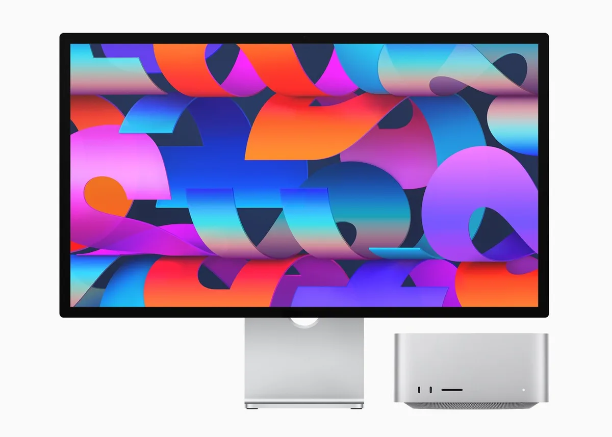
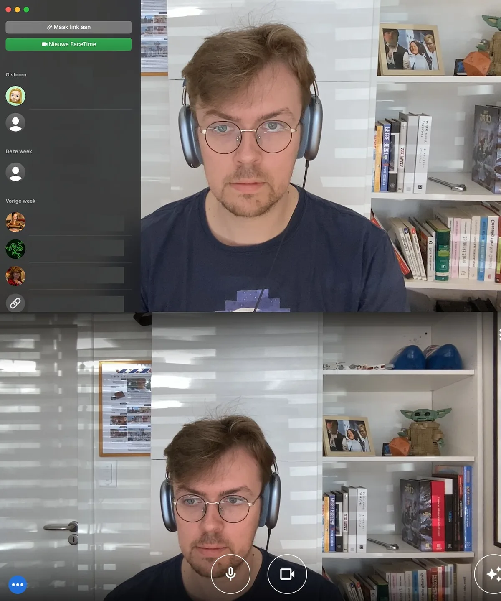

Apples nieuwe Mac Studio is een ouderwetse computer die je op een monitor, muis en toetsenbord aansluit. We hebben hem alvast getest en zetten vijf dingen op een rij die zijn opgevallen.

> [!NOTE]
> Dit artikel verscheen eerder op [AD](https://www.ad.nl/tech/de-nieuwe-mac-studio-getest-hij-maakt-een-soort-fluitgeluid~a91391a5/).

De Mac Studio is voor Apple een verrassend traditionele computer. Waar eerdere desktop-Macs vaak een monitor en pc in één waren, is dit ‘gewoon’ een computer die je zelf op een monitor, muis en toetsenbord kunt aansluiten.

Daardoor past hij wel makkelijker in het gemiddelde thuiskantoor. Je kunt hem gewoon verbinden met die ergonomisch afgestelde monitor die je al had, en alles werkt met je huidige muis en toetsenbord.

## 1\. Alles start meteen

De Mac Studio draait op de M1 Max, een opgevoerde versie van Apples eerste eigen computerchip. Tot 2020 gebruikte het bedrijf de processoren van fabrikant Intel, maar met de M1-reeks is het bedrijf een heel andere richting ingeslagen.

Het verschil valt meteen op als je van een oude Intel-Mac overstapt naar de nieuwe Mac Studio. Alles start nagenoeg direct op: het inlogscherm verschijnt binnen een seconde, waarna je zonder significante wachttijd in je desktopomgeving zit. Daar start bijna iedere app op zonder dat je ook maar met je ogen kunt knipperen.

Je zult hooguit bij zware taken soms even moeten wachten, maar die verlopen op de door ons geteste Mac Studio ook sneller dan op een oude Intel-versie van de MacBook.

Beide nieuwe Apple-producten van dichtbij. © Apple

## 2\. Hij maakt altijd een klein beetje herrie

Aan de binnenzijde van de Mac Studio zitten ventilatoren die altijd de warme lucht uit de computer blazen - ook als er geen zware processen lopen. Hierdoor maakt de computer continu een klein beetje geluid, al valt dat eigenlijk alleen op in een doodstille ruimte. Bij desktopcomputers is dat vaker het geval, al wordt bij Windows-pc’s met eenzelfde compacte vormfactor de ventilator soms uitgezet als de computer niks zwaars hoeft te doen.

Daarnaast hebben we het idee dat de Mac Studio ook luider is dan bijvoorbeeld een MacBook Pro. Door de vorm van de kast lijkt de akoestiek anders dan bij eerdere Macs, en klinkt het soms haast alsof de computer heel zachtjes staat te fluiten. Geen halszaak, maar wel goed om vooraf te weten.

## 3\. Het is eigenlijk een MacBook Pro voor duizend euro minder

De goedkoopste modellen van de Mac Studio hebben aan de binnenzijde een M1 Max-chip, die eerder ook al in de MacBook Pro’s werd toegevoegd. Maar probeer je een MacBook Pro met dezelfde configuratie te kopen, dan ben je dik duizend euro meer kwijt. De Mac Studio is met zijn prijskaart van 2329 euro daarmee nog geen budgetmachine, maar het is wel een goedkoper alternatief voor wie Apples krachtige processor wil.

Overigens verkoopt het bedrijf ook een Mac Studio met de nieuwe M1 Ultra - die eigenlijk bestaat uit twee keer de M1 Max aan elkaar vastgeplakt. Een computer met die chip is met 4629 euro vele malen duurder, maar is wat ons betreft alleen relevant voor de professionals die bizar zwaar werk moeten doen. De M1 Max is meer dan snel genoeg voor de meeste mensen.

## 4\. Het beeldscherm werkt ook met Windows-computers

Apple verkoopt naast de Mac Studio ook de Studio Display, een 27 inch-beeldscherm met 5K-resolutie. Bij onze tests werkte die alleen nog maar in combinatie met de Mac Studio, maar volgens de techreus komt er een update, zodat hij ook aangesloten kan worden op andere Macs.

En misschien nog wel interessanter: het scherm gaat ook werken in combinatie met Windows-computers. Het was nog even de vraag of dat het geval zou zijn, omdat het display met zijn ingebouwde hard- en software specifiek voor Macs bedoeld leek. Maar een machine met Windows en vermoedelijk zelfs Linux kan gewoon worden ingeprikt, al is het afhankelijk van je hardware of de 5K-resolutie benut kan worden.

## 5\. Center Stage is geweldig bij videobellen, maar werkt bij lang niet alle apps

Speciale software in de webcam zorgt ervoor dat het beeld altijd goed wordt uitgelijnd, zodat jij als videobeller altijd midden in het beeld staat. Dat werkt verrassend goed: zelfs als je naar links of rechts loopt, beweegt de webcam mee alsof je een persoonlijke cameraman hebt.

Maar dan moet je videobelsoftware wel Center Stage ondersteunen. Dat is het geval in bijvoorbeeld Apples eigen FaceTime, maar bij gesprekken in Google Meet blijft de webcam bewegingloos staan. En juist dan is de webcam wat onhandig uitgelijnd: bij ons is er flink wat ruimte boven het hoofd, tenzij we het scherm in een onaangename hoek manoeuvreren.

Een videogesprek met Center Stage (boven) versus een gesprek zonder (onder). © Bastiaan Vroegop

_Bekijk hieronder onze video’s op techgebied:_
