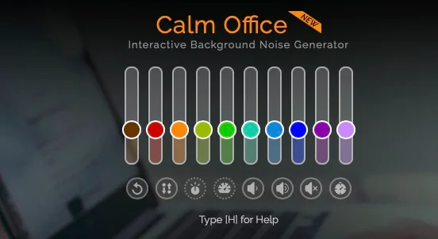

**Airco en printers**

> [!NOTE]
> Dit artikel verscheen eerder op [Bright](https://www.bright.nl/nieuws/1125975/deze-app-speelt-kantoorgeluiden-af-tijdens-het-eenzame-thuiswerken.html).

Daarmee biedt de website en app soelaas voor het grote aantal mensen dat tijdens de corona-uitbraak vanuit huis werkt. Je kunt [MyNoise](https://mynoise.net/about.php) rechtstreeks vanuit je webbrowser gebruiken. Een van de onderdelen is [Calm Office](https://mynoise.net/NoiseMachines/openOfficeNoiseGenerator.php).

MyNoise heeft tien gekleurde schuifbalkjes waarmee je het volume van verschillende kantooronderdelen kunt verhogen of verlagen. Denk daarbij aan bijvoorbeeld het geluid van kletsende collega’s, de zoemende airconditioner of een printer die documenten uitspuugt. Zo haal je de storende audio weg om een perfecte atmosfeer naar jouw smaak te maken.

Die schuifbalken maken MyNoise ook net iets slimmer dan bestaande alternatieven. Streamingdiensten zoals Spotify staan vol met cd’s waarop bijvoorbeeld regengeluiden worden afgespeeld, om te helpen met concentreren. Maar daarbij zit je altijd vast aan de compositie van de maker.

De app is gratis voor iedereen te gebruiken. Er zijn ook apps voor [iOS](https://apps.apple.com/be/app/mynoise/id813099896) en [Android](https://play.google.com/store/apps/details?id=com.mynoise.mynoise&hl=en).

MyNoise is ontwikkeld door Stéphane Pigeon, een promovendus met een passie voor geluiden. Het is wel mogelijk om hem een kleine donatie toe te sturen voor zijn werk, als bedankje.

## Getest: wifis-speakers Denon versus Sonos

[Bekijk ingesloten media](https://www.youtube.com/embed/jKMB6xI1eE4?autoplay=1&modestbranding=1)

**[Volg Bright op YouTube](https://bit.ly/brighttv) voor meer tech-video's**
