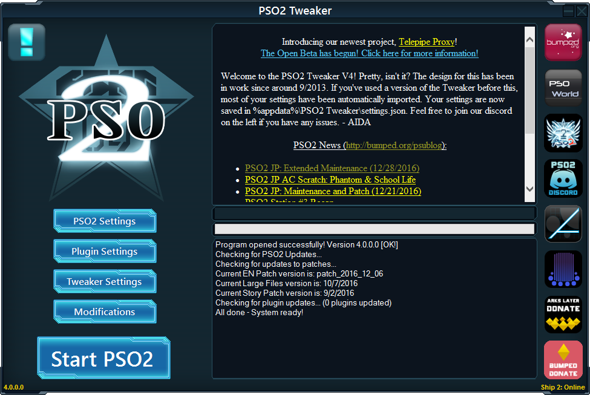

De MMORPG Phantasy Star Online 2 is inmiddels al bijna vijf jaar speelbaar, maar officieel is het spel nooit in het westen verschenen. Toch kun je de game al jaren gewoon in het Engels spelen.

__Phantasy Star__ begon ooit als sologamereeks op oude SEGA-spelcomputers, maar transformeerde op de Dreamcast in een online RPG. Ineens konden gamers samen met andere internetvrienden op pad om monsters te verslaan en schatten te verzamelen – toen nog uniek op een spelcomputer.

> [!NOTE]
>
> Dit verhaal verscheen eerder op [Laadscherm](https://laadscherm.nl/deze-fans-vertalen-al-vijf-jaar-phantasy-star-online-2/).

De serie kreeg een vaste schare fans in het Westen, die __Phantasy Star Online__ bleven spelen terwijl SEGA nieuwe uitbreidingen en spin-offs uitbracht. __Phantasy Star Online 2__ moest de volgende halte voor deze online gamers worden.

Toen de ontwikkeling van de Japanse versie van start ging, bleef het echter angstvallig stil rondom de Engelstalige versie. Bij navraag zei SEGA dat de nieuwste __Phantasy Star__ voor het Westen “was uitgesteld”, waarbij geen extra informatie werd verschaft. Een mogelijke verschijningsdatum werd niet gegeven

## Japan eerst

Niet iedereen was verrast. Bij vorige delen had SEGA er een handje van de Japanse servers eerder nieuwe content te bieden. Japanse spelers lagen hierdoor vaak een jaar voor. Dat de Westerse servers nu laag op de prioriteitenlijst stonden, was daarom in de lijn der verwachtingen.

Omdat Japan vaak door SEGA werd voorgetrokken, zaten de meest hardvochtige spelers al jaren op de Japanse servers van bijvoorbeeld spin-off Phantasy __Star Universe__. Daarmee was eigenlijk de basis gelegd voor een fanvertaling van __Phantasy Star Online 2__.

De fans die dit project op zich zouden nemen, waren immers al langer gewend om zich door Japanse menu’s en dialogen te worstelen. En nu konden ze hun kennis gebruiken om hun Engelstalige vrienden mee te laten spelen.

[Bekijk ingesloten media](https://www.youtube.com/embed/bm1ZPgxStE4?feature=oembed)

## Constant bijbenen

Fanvertalingen van games zijn niks nieuws. Begin jaren ’90 had je bijvoorbeeld al Dennis Lardenoye en Ron Bouwland, twee Nederlanders die Japanse games voor de MSX in het Engels uitbrachten. Sindsdien zijn er steeds meer van dit soort fanprojecten opgedoken, waardoor bijvoorbeeld __Ys: The Oath in Felghana__, __Mother 3__ en __Secret of Mana 2__ via omwegen alsnog voor Engelssprekende gamers toegankelijk werden.

Maar een project als __Phantasy Star Online 2__ is van een andere orde. De MMORPG is ontworpen om spelers maanden- of zelfs jarenlang bezig te houden, waardoor de hoeveelheid tekst gigantisch is. Een MMORPG is ook zelden af. Ontwikkelaars blijven nieuwe content toevoegen, waardoor ook de stapel vertaalwerk continu blijft groeien. Zolang SEGA de game blijft bijwerken, moeten vertalers dit bijbenen.

Ter illustratie: op het moment heeft de vertaling 117.317 vertaalde regels tekst. Ga je er van uit dat iedere regel gemiddeld tien woorden heeft, dan zijn dat 1,2 miljoen woorden. Dat is meer dan het dubbele van de gehele __In de Ban van de Ring__\-trilogie, waarbij de teller op 481.000 woorden staat. Zelfs bij gemiddeld vijf woorden per regel is de gamevertaling nog immenser dan die klassieke boekenreeks.

Daarmee is nog niet eens de volledige game vertaald. Op het moment is 83,2 procent van de game omgezet naar het Engels, waarmee alle belangrijke missies, het hoofdverhaal en relevante menu’s zijn vertaald. Een groot deel van de game is echter nog onaangeraakt.

Het online karakter van __Phantasy Star Online 2__ maakt het project nog complexer. Delen van het spel zijn te vertalen door de geïnstalleerde bestanden op de computers van spelers te bewerken, maar bijvoorbeeld de beschrijvingen van nieuwe wapens en pantsers worden vanaf de server live verstuurd.

Een Engelse vertaalpatch moet dus ook netwerkverkeer onderscheppen om vervolgens zelf Engelse teksten naar de game te versturen – allemaal zonder de cheatsoftware van slag te laten raken.

Bovenstaande zorgt voor veel technische complicaties bij de ontwikkeling van een vertaalpatch, wat het des te indrukwekkender maakt hoe makkelijk deze geïnstalleerd kan worden. De vertalers hebben een [eigen launcher](http://arks-layer.com/) voor __Phantasy Star Online 2__ gemaakt die zowel de gamedata als de vertaalpatches checkt. Heeft de MMO een nieuwe update en is hier een vertaalpatch voor? Met een enkele knopdruk worden deze geïnstalleerd.

## Aida Enna

Bovenstaande zorgt bij elkaar voor ontzettend veel ontwikkelwerk. De vertaalpatch wordt gemaakt onder leiding van een speler met de bijnaam Aida Enna, die zegt dat ze met al haar activiteiten een volle werkweek kan vullen. “Het kan lastig zijn om dit te combineren met mijn leven, maar door onder andere medische problemen heb ik veel vrije tijd om hieraan te besteden.”

Maar denk niet dat Aida in haar eentje dit project draaiende houdt. Naast haar, werken vijf programmeurs en drie vertalers op het moment mee om de MMO in het Engels speelbaar te maken. Andere spelers bieden af en toe aan om te helpen met onderdelen van de fanpatch, waarna ze op een [creditspagina](http://arks-layer.com/credits.php) worden vermeld. Dat zijn soms vertalers, maar ook vaak technici. “Er gaat altijd wel iets stuk”, zegt Aida.

En dat zijn alleen nog maar de mensen die aan __Phantasy Star Online 2__ in het Engels werken. Naast het kernteam schrijven er ook mensen mee aan vertalingen naar het Frans, Duits, Russisch en Spaans. De spin-offs voor smartphones en de PlayStation Vita worden ook naar het Engels vertaald, waarvoor het installatieproces op vergelijkbare wijze zo simpel mogelijk gemaakt is.

## Een beetje erkenning

Al vijf jaar sleutelt Aida met haar team aan het vertaalproject. In die tijd heeft SEGA zich slechts één keer publiekelijk uitgesproken over het initiatief. Er werd toen een character creator uitgebracht voordat het spel live ging, die meteen naar het Engels vertaald werd. Iets dat volgens SEGA “bizar snel” gebeurde.

Waarom SEGA het team van Aida nog niet heeft ingelijfd om de game officieel in het Westen uit te brengen, is onduidelijk. “We hebben tijdens een conferentie eens contact met ze gehad, waarbij we onze contactinformatie hebben doorgegeven. Sindsdien hebben we niks meer gehoord.” SEGA weigerde in het verleden tegenover journalisten te spreken over het vertaalproject.

Toch is het volgens Aida vrij duidelijk dat de gamestudio een oogje in het zeil houdt: “We voegden vier jaar geleden bijvoorbeeld een plug-in toe aan onze patchsoftware, waarmee spelers de gedane schade per seconde konden bijhouden. Kort daarna werd ons vertaalprogramma toegevoegd aan SEGA’s lijst met cheatsoftware, waardoor niemand meer kon spelen.”

“SEGA zei dat iedereen met screenshots van dit soort hulpmiddelen meteen zou worden verbannen. Ik reageerde hierop door de nieuwe toevoeging weer uit onze software weg te halen, waarna SEGA ons meteen weer uit de cheatlijst verwijderde.”

Dat is voor Aida voldoende bewijs dat SEGA prima op de hoogte is van wat het vertaalteam allemaal doet – en dat het bedrijf hier verder geen grote bezwaren tegen heeft. Zolang ze maar niks doen waar SEGA het mee oneens is.

“SEGA is ons misschien ook wel een beetje dankbaar”, denkt Aida. “We brengen een hoop spelers binnen, waardoor ze succesvolle cijfers kunnen rapporteren zonder uit te breiden naar het Westen. Engelstalige spelers kopen daarnaast microtransacties via de smartphonegame, wat alleen maar goed nieuws is voor SEGA en zijn aandeelhouders.”
