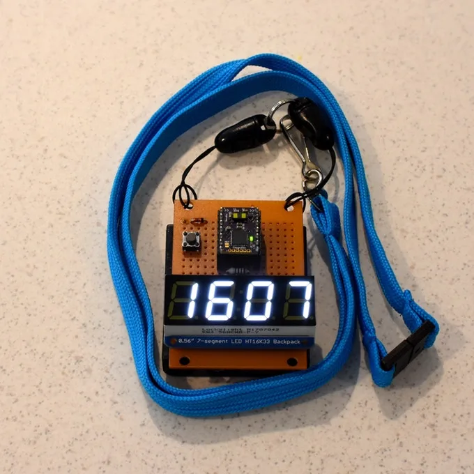

**Anderhalvemetersamenleving**

> [!NOTE]
> Dit artikel verscheen eerder op [Bright](https://www.bright.nl/nieuws/1126055/deze-gadgets-zorgen-dat-iedereen-15-meter-afstand-houdt.html).

De badge is afkomstig van een bedrijf dat kleine sensoren voor robots bouwt. Een ingebouwde sensor ziet hoe ver het meest nabije voorwerp is en laat die afstand zien op een ingebouwd schermpje. Op die manier wordt iedereen die je tegenkomt gewezen op die afstand.

De maker heeft een vroeg prototype gebouwd, dat hij op grotere schaal hoopt te produceren. Hij zamelt daarom geld in via crowdfundwebsite [Kickstarter](https://www.kickstarter.com/projects/sensordots/the-social-distancing-badge/description). Wie minstens 60 Australische dollar (zo'n 34 euro) doneert, krijgt er eentje toegestuurd. Vroege vogels ontvangen hem in mei, terwijl latere donateurs tot juni moeten wachten.

Net als bij andere Kickstarters geldt: het project gaat alleen door als het doelbedrag wordt gehaald. Het project heeft echter slechts 3.950 Australische dollar nodig om dat punt te bereiken en heeft hier nog anderhalve week voor.

## Designmaskers van Oculus

Tegelijkertijd werkt een ontwerper van VR-bedrijf Oculus aan een gezichtsmasker met een vergelijkbare functie. Kleine LED-lampjes op dit masker laten korte animaties zien, die voorbijgangers er aan herinneren om op gepaste afstand te blijven. Het masker is echter puur cosmetisch, en belooft de drager niet te beschermen tegen het virus.

Dit LED-masker kan voor 90 dollar (circa. 80 euro) [alvast worden besteld](https://www.lumencouture.com/buy-led-light-up-dresses/shop-tech-warning-face-mask/). De eerste exemplaren gaan in mei naar kopers toe, "of misschien wel eerder". Hij houdt het op een volle batterij maximaal vier uur vol - lang genoeg om even een boodschap te doen.

[Bekijk ingesloten media](https://www.youtube.com/embed/aYAwOimNzb0?autoplay=1&modestbranding=1)

[Bekijk ingesloten media](https://www.youtube.com/embed/zyyKqwqXfIs?autoplay=1&modestbranding=1)

## Technologie tegen corona: gaat dit helpen?

**[Volg Bright op YouTube](https://bit.ly/brighttv) voor meer tech-video's**
