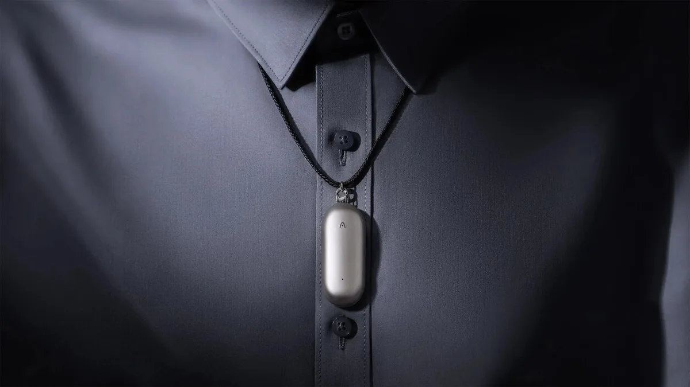
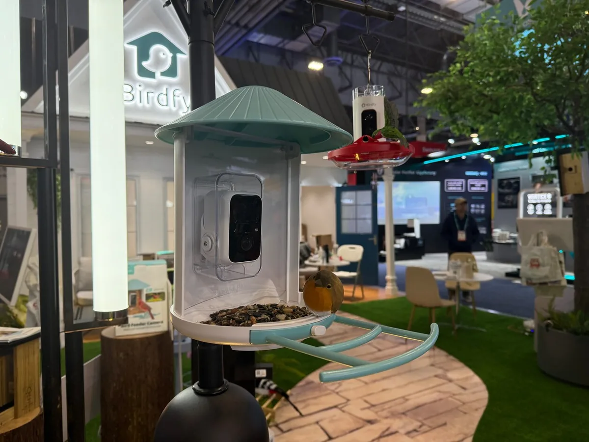
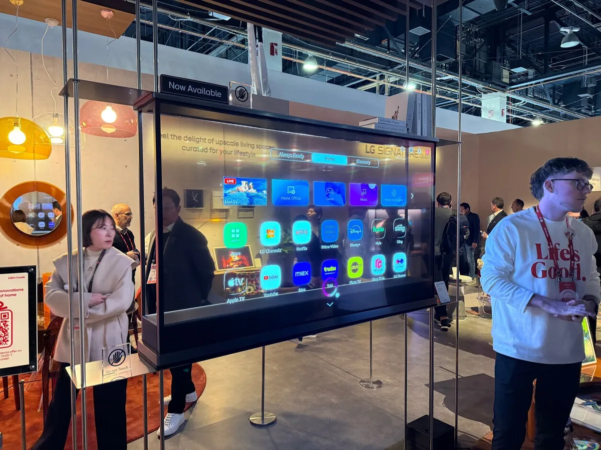
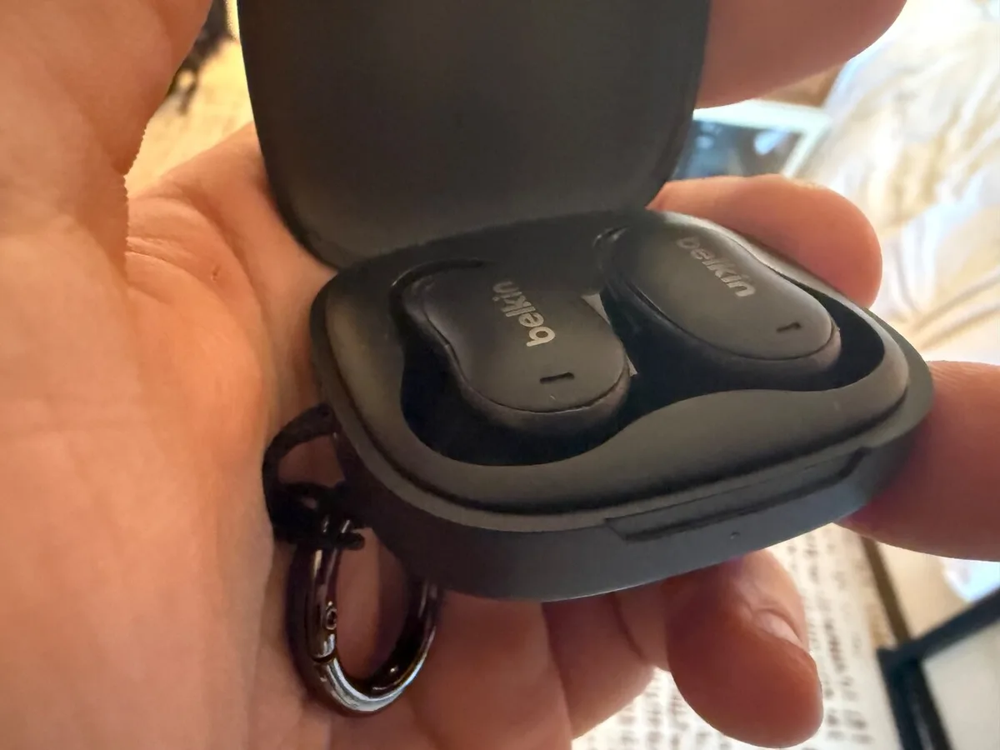
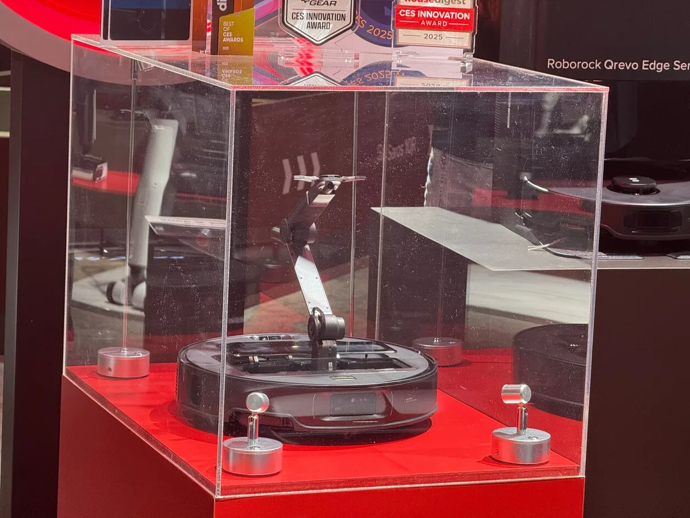
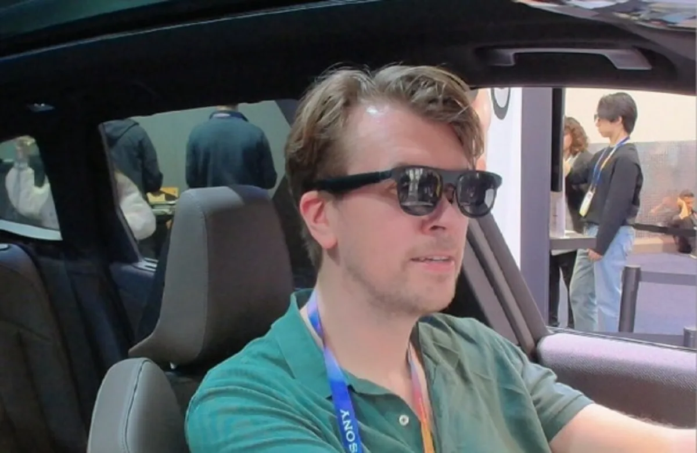

Op gadgetbeurs CES zijn de meest bizarre gadgets gepresenteerd, waarvan vele nooit op de markt zullen verschijnen. We zetten een aantal op een rij die wél gewoon in 2025 in de winkels komen te liggen.

> [!NOTE]
> Dit artikel verscheen eerder op [AD](https://www.ad.nl/tech/deze-gekke-gadgets-van-techbeurs-ces-liggen-dit-jaar-al-in-de-winkels~a15d8826/).

## Ballie

Samsungs Ballie werd vijf jaar geleden al eens op CES getoond, maar leek toen slechts een vage belofte. De schattige huisrobot rolt op wieltjes door je huis en kan je met simpele vragen helpen. Zo vertelt het machientje welke fles wijn je het beste kunt drinken of je kunt het vragen de lampen aan te doen. Met een ingebouwde projector kan Ballie informatie op de grond projecteren, waar je met je voeten op kunt tappen om antwoord te geven.

De Zuid-Koreaanse technologiegigant belooft dat Ballie nu toch echt in de winkels komt te liggen in de eerste helft van 2025. Meer details ontbreken vooralsnog; het bedrijf heeft nog niet bekendgemaakt in welke landen Ballie als eerste verkrijgbaar zal zijn en wat de prijs van de robot zal zijn.

## Plaud

De Plaud NotePin is een zeer kleine microfoon die je aan je shirt, ketting of pols kunt bevestigen. Door erop te tikken start je een opname, waarna je de audio op je telefoon kunt downloaden. De bijbehorende app maakt gebruik van AI om alles wat om je heen wordt gezegd, uit te schrijven en vervolgens een samenvatting te maken. Zo kan Plaud tijdens een lange vergadering meeluisteren en daarna de belangrijkste punten in twee alinea’s opsommen.

De Plaud NotePin is een kleine microfoon die met AI gesprekken voor je uitschrijft. © Plaud

Voor 170 dollar zijn de gadgets te bestellen. Let wel op: je kunt per maand slechts 300 minuten aan audio laten uitschrijven. Daarna moet je een betaald abonnement afsluiten.

## Birdfy Feeder

Dit is leuk voor wie graag vogels wil kijken, maar tegelijkertijd geen zin heeft om daar echt iets voor te doen. De Birdfy Feeder is een vogelhuisje met ingebouwde camera die bij beweging wordt geactiveerd. Zit er een vogel voor de lens, dan identificeert een bijbehorende AI in een smartphone-app de soort. Deze kunstmatige intelligentie kan in totaal zesduizend vogelsoorten herkennen.

De Birdfy Feeder op techbeurs CES. © Bastiaan Vroegop

De Birdfy Feeder kost 150 dollar, maar daarmee ben je er nog niet: voor de AI die vogels herkent moet je een abonnement afsluiten van 5 dollar per maand.

## LG Signature OLED T

Televisiefabrikant LG staat erom bekend af en toe te stunten met hun televisies. Enkele jaren geleden bracht het bedrijf een oprolbaar tv-scherm uit, dat in zijn soundbar terugrolt als je hem uitzet. Het nieuwe paradepaardje is de LG Signature OLED T - een televisie met een transparant beeldscherm. Hierdoor valt het forse 77 inch-scherm minder op als hij niet in gebruik is, denkt de fabrikant.

LG's transparante oledscherm moet maar liefst 60.000 dollar kosten. © Bastiaan Vroegop

De Signature OLED T ligt dit jaar in de winkels, maar zal niet aan iedereen besteed zijn: er wordt uitgegaan van een adviesprijs van maar liefst 60.000 dollar.

## Belkin SoundForm Anywhere

Op het eerste gezicht lijken de nieuwe draadloze oordopjes van Belkin op de vele concurrenten die al op de markt zijn, maar de SoundForm Anywhere heeft iets unieks: een plat ontwerp zonder uitstekende stengels zorgt ervoor dat de dopjes niet uit je oren steken. Dit maakt het mogelijk om comfortabel op je zij te liggen terwijl je naar muziek luistert, wat de oordopjes ideaal maakt voor wie graag met muziek of een audioboek in slaap valt.

De draadloze oordoppen van Belkin zitten ook comfortabel in je oor als je op een kussen ligt. © Bastiaan Vroegop

Belkin wil de SoundForm-doppen vanaf het tweede kwartaal van 2025 verkopen. Hoeveel ze gaan kosten, is nog niet bekendgemaakt.

## Roborock Saros S70

De nieuwe robotstofzuiger van Roborock heeft een unieke gimmick. Bovenop het apparaat zit een kleine robotarm die alle kanten op kan bewegen. Deze arm kan objecten tot 300 gram optillen om het pad tijdens het stofzuigen vrij te maken. Met andere woorden, je kunt al die rondslingerende speeltjes en andere rommel laten liggen terwijl de robot de vloer reinigt.

De robotarm op deze stofzuiger van Roborock ruimt rommel op. © Bastiaan Vroegop

De Saris S70 is sinds februari te koop. Met een prijskaartje van 1600 dollar is hij echter niet goedkoop.

## Xreal One Pro

Deze slimme bril bevat twee kleine schermpjes die ervoor zorgen dat je een groot virtueel beeldscherm ziet wanneer je de bril draagt. Sluit de bijbehorende kabel aan op een laptop en je beschikt over een gigantisch scherm om op te werken, of verbind hem met je spelcomputer om op datzelfde scherm te gamen. Het apparaat is amper groter dan een gewone zonnebril, wat reizen ermee vergemakkelijkt.

Twee kleine schermpjes laten een virtuele monitor zien in deze bril van Xreal. © Bastiaan Vroegop

Xreal maakt al langer dit soort brillen, maar de One Pro heeft een paar nieuwe snufjes. Met een knop aan de zijkant kun je de zonneglazen bijvoorbeeld lichter maken, zodat je beter je omgeving ziet tijdens het kijken. De One Pro is vanaf maart te koop voor 650 euro.
