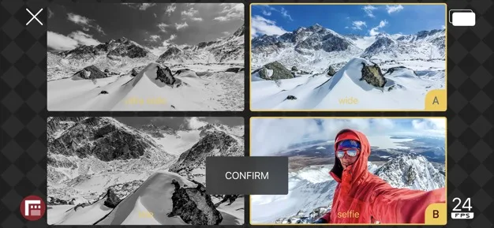

**DoubleTake**

> [!NOTE]
> Dit artikel verscheen eerder op [Bright](https://www.bright.nl/nieuws/1125147/deze-iphone-app-filmt-met-drie-cameras-tegelijk.html).

De app is gemaakt door Filmic Pro, dat vaker professionele video-apps voor smartphones heeft ontwikkeld. Twee camera’s achterop de telefoon en de selfiecamera leggen de video’s vast. Het beeld van de wide-angle-lens wordt opgeknipt om een teleshot na te bootsen, zodat je in totaal vier shots hebt.

Apple liet bij de onthulling van de iPhone 11 en 11 Pro al een vroege versie van [DoubleTake](https://apps.apple.com/app/doubletake-by-filmic-pro/id1478041592?ls=1) zien, om te laten zien waar de nieuwe camera’s toe in staat zijn. Daarbij werd gedemonstreerd hoe de app meerdere shots van een interview kan vastleggen, zodat één camera voortaan voldoende is.

De hoeveelheid video’s die je tegelijk kan maken, hangt af van het aantal camera’s op je telefoon. Volgens Filmic Pro heb je minstens een iPhone XS of XR nodig. Op andere toestellen kan DoubleTake worden geïnstalleerd, maar dan mag je slechts met één lens per keer filmen.

[Bekijk ingesloten media](https://www.youtube.com/embed/suYlQVKAudM?autoplay=1&modestbranding=1)

## Cameratest: hoe goed scoort de iPhone 11 Pro?

**[Volg Bright op YouTube](https://bit.ly/brighttv) voor meer tech-video's**
