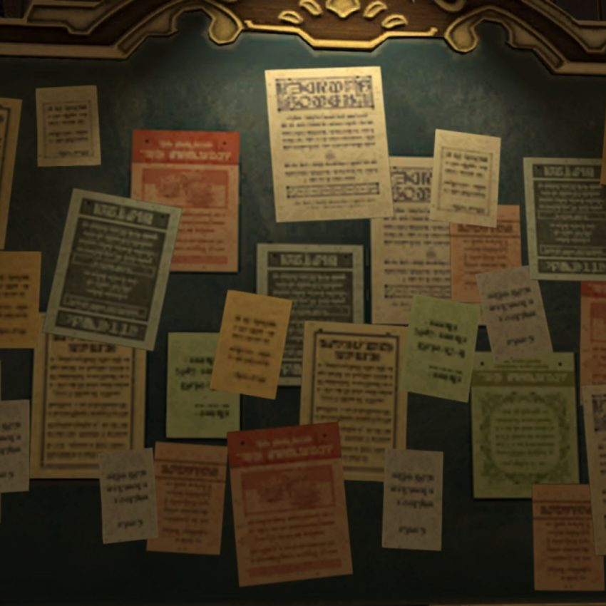
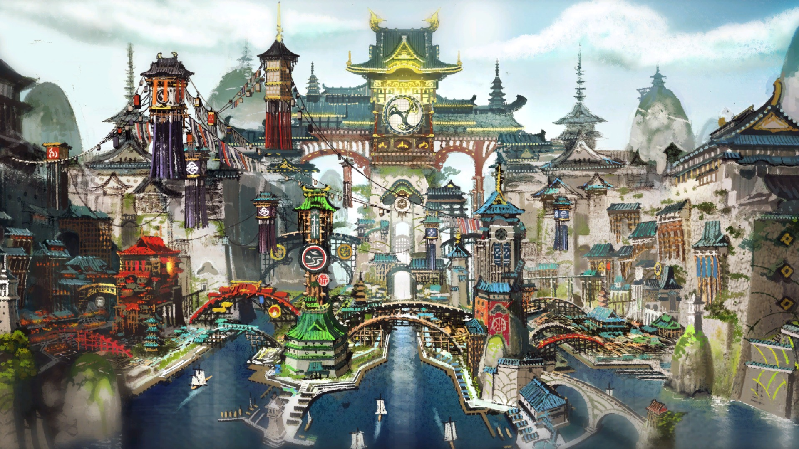

**Ook in deze game is geld macht.**

Terwijl de meeste spelers van Final Fantasy XIV bezig zijn met het verkennen van kerkers, zit de ‘miljardair’ Shalice op haar berg goud. Deze ‘miljardair’ is inmiddels stinkend rijk in de game geworden.

Iedere dag gaan duizenden spelers in Final Fantasy XIV op avontuur in een wereld gevuld met bossen, woestijnen, steden en gevaarlijke krochten. Ze werken samen om moeilijke vijanden te verslaan en om onbekende gebieden te verkennen.

Net als in andere MMORPG’s, schuilt achter deze game een gedeelde economie. Gamers verzamelen voorwerpen uit de spelwereld en bieden die te koop aan, waar anderen weer drankjes, voedsel, wapens en pantsers van maken om voor een meerprijs aan te bieden.

> [!NOTE]
>
> Dit verhaal verscheen eerder [op Laadscherm](https://laadscherm.nl/miljardair-speelt-final-fantasy-xiv-alsof-wall-street-is/).

Verspreid door de wereld van Final Fantasy XIV staan grote prikborden die spelers kunnen gebruiken om spullen te verhandelen. Bij één van deze prikborden is Shalice vaak te vinden. Door te smeden, verzamelen, kopen en te verkopen heeft zij haar eigen handelsimperium in de game uitgebouwd. De bankrekening staat bomvol: haar personage heeft het maximale bedrag van 1 miljard gil bereikt, terwijl niet-speelbare personages in dienst van haar allemaal een vergelijkbaar bedrag in hun bezit hebben. De teller staat op deze manier al op 9 miljard gil. Meer kan Shalice niet bezitten zonder een totaal nieuw personage te starten.

## Piramide

Shalice werkt in de echte wereld vanuit huis als financieel consultant. Daarnaast springt ze vaak bij op het gebied van human resources. “Dit werk heeft me ontzettend veel geleerd dat ik in de game kan toepassen. Er is haast geen verschil tussen hoe de echte wereld en virtuele wereld soms werken.”

“De personages in de game zijn mensen die bijna altijd wel wensen hebben. Ze willen luxe producten, exclusieve materialen en zelfs voedsel. Alles uit de piramide van Maslow bestaat in deze game.”

Daarmee verwijst Shalice naar een theorie van psycholoog Abraham Maslow uit de 20e eeuw. Volgens Maslow hebben mensen over het algemeen vijf wensen: lichamelijke behoeften, veiligheid en zekerheid, sociaal contact, erkenning en waardering, en zelfrealisatie. “Voorzie in de behoeften van spelers en je bent in no-time rijk”, denkt Shalice.

Kugane is een nieuwe hoofdstad in Final Fantasy XIV: Stormblood.

## Netwerken

Die vergelijking met de echte wereld blijft de ‘giljardair’ maken. Op de MMO-zakenmarkt zijn fraudeurs bijvoorbeeld net zo’n groot risico als in de echte wereld. “Als je wordt belazerd, doen de spelbeheerders niks om je in zo’n situatie te helpen. Je zult het zelf moeten oplossen.”

En net als in de echte handelswereld is een goed netwerk met mede-ZZP’ers een must: “Er zijn een hoop mensen bereid om contact met je te maken in deze game”, zegt Shalice. “Zogeheten gatherers, die op zoek gaan naar materialen, zijn vaak harde werkers die ik ontzettend respecteer. Ze doen werk dat ik liever niet zelf doe, dus ik probeer ze te belonen als ik met ze samenwerk. Dan komen ze later naar me terug om weer zaken te doen.”

## Macht

Shalice beseft wel dat haar flinke geldrekening eigenlijk niet heel veel nut heeft. Gil heeft volgens de speler weinig waarde in Final Fantasy XIV, simpelweg omdat je het aan weinig kunt besteden. Er is een overkookte huizenmarkt, maar zelfs in de aanschaf van dure huizen lijkt Shalice geen interesse te hebben. Dit is simpelweg iets dat zij al jarenlang doet, ongeacht de game.

Het personage van Shalice in Final Fantasy XIV.

“Mijn eerste MMO was MU Online. Dit was een wat kleine titel met een simpel gevechtssysteem, maar met een uitgebreide economie die in handen was van de machtigste spelers. Als je in deze game de persoon met de juiste middelen was, dan had je in feite de krachtigste guilds en spelers in je macht.”

Het voelde zo goed dat Shalice zich alleen maar richtte op het verdienen van geld in MU. Dat heeft zij daarna volgehouden in Ragnarok Online, Lineage 2 en TERA. Iedere game leverde een andere ervaring op zodra er grote hoeveelheden geld beschikbaar kwamen. “In Lineage 2 kon je bijvoorbeeld een clan omkopen om een kasteel te veroveren. Op die manier kon je koning worden.”

## Aard

Dat geld verzamelen lijkt in de aard van Shalice te zitten: “Ik ben er honderd procent zeker van dat mijn liefde voor geld in games mij heeft aangespoord om een zakenvrouw in de echte wereld te worden. Ik ben er ook goed in.”

Ze blijft daarom nog wel eventjes doorgaan. In Final Fantasy XIV heeft Shalice inmiddels een tweede personage om nog meer geld op te plaatsen. “Als je zoveel hebt als ik, is het moeilijk om niet te blijven verdienen. Het is net als in de echte wereld: met geld verdien je geld. Heb je meer, dan wordt het makkelijker.”
