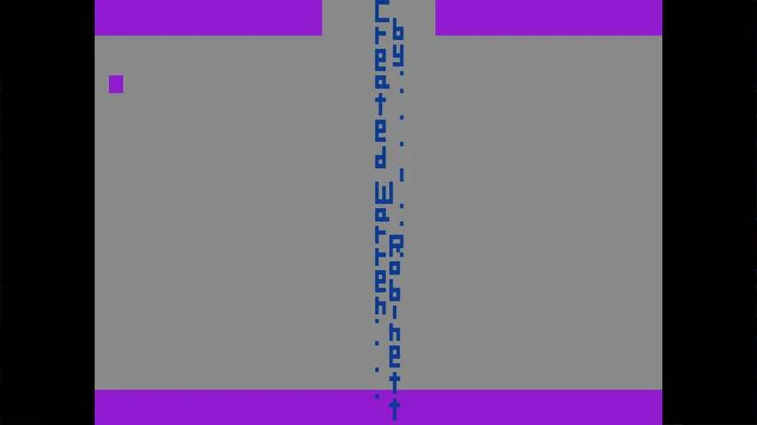
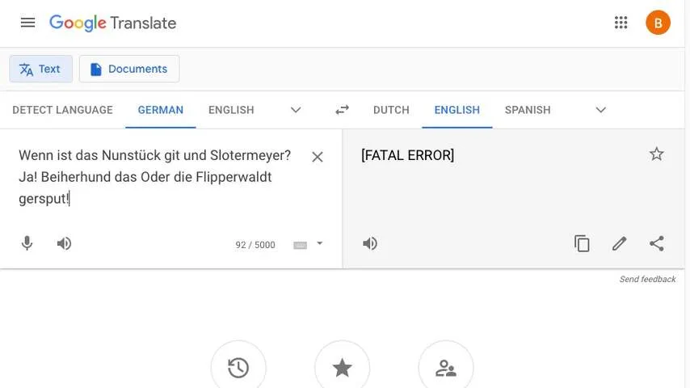

**Tijdens Pasen komen veel mensen samen met vrienden en familie om met de kinderen paaseieren te zoeken. Maar ook op het internet zijn er genoeg paaseieren verstopt, die je gewoon op je telefoon of laptop bij elkaar kunt rapen.**

> [!NOTE]
> Dit artikel verscheen eerder op [NU.nl](https://www.nu.nl/tech-achtergrond/6125306/deze-paaseitjes-kun-je-op-het-wereldwijde-web-zoeken.html).

Je vindt ze inmiddels in nagenoeg iedere grote app of game en op veel websites: _easter eggs_. Deze digitale geheimpjes zitten verstopt in de krochten van softwarecode, wachtend tot een creatieve gebruiker ze vindt.

De eerste easter egg zat in het spel _Adventure_ uit 1980. Hoewel programmeur Warren Robinett het spel grotendeels alleen had gemaakt, mocht hij van zijn werkgever zijn naam niet in een soort virtuele aftiteling stoppen ter erkenning. Hij besloot zijn naam alsnog stiekem in het spel te verwerken; hij kon alleen gevonden worden door een reeks complexe handelingen uit te voeren.

Robinetts baas was vervolgens de eerste die het een easter egg noemde, omdat het vinden ervan hem deed denken aan het zoeken naar paaseieren. Het werd een traditie onder softwaremakers, die inmiddels meer dan veertig jaar vergelijkbare geheimpjes in hun apps en games verstoppen.

_Deze 'paaseitjes' kun je op het wereldwijde web zoeken — Beeld: Atari_

## Grapjes in de Google-zoekmachine

De Google-zoekmachine zit vol met allerlei kleine easter eggs. Wie zoekt naar '_The answer to life, the universe and everything_' krijgt als antwoord bijvoorbeeld het getal 42, een verwijzing naar het sciencefictionboek _The Hitchhiker's Guide to the Galaxy_.

Misschien wel het opvallendste Google-grapje vindt plaats als je de zoekterm '_[Do a barrel roll](https://www.google.com/search?q=do+a+barrel+roll&oq=do+a+barrel+roll&aqs=chrome.0.69i59j0l9.2736j0j7&sourceid=chrome&ie=UTF-8)_' invoert: het gehele browservenster draait dan een rondje, een hommage aan het Nintendo-spel _Star Fox_, waarin ruimteschepen deze manoeuvre kunnen uitvoeren.

## Verstopt in navigatieapps

Kaartendiensten van techreuzen bevatten vaak ook kleine geheimen. Bezoek je bijvoorbeeld het London Eye via Apple Maps, dan draait het reuzenrad langzaam rond zodra je het in 3D bekijkt. Maak je een 3D-tour bij de Big Ben, dan klopt de tijd op de klok ook echt.

Wie in Google Maps naar Earl's Court in Londen gaat, ziet een oude, blauwe politietelefooncel staan die in scifiserie _Doctor Who_ wordt gebruikt als ruimteschip. Die kan [via Streetview](https://www.google.com/maps?hl=en&ll=51.492132,-0.192862&spn=0.007288,0.011641&sll=51.492637,-0.193680&layer=c&cid=12502927659667388442&panoid=LYc4W_m-BJQAAAQIt-IsCQ&cbp=13,121.57,,0,0&gl=US&t=m&z=17&cbll=51.492146,-0.192985) van binnen worden bekeken, waarna je naar de set van de tv-serie wordt getransporteerd.

Sommige easter eggs in kaartenapps zijn subtieler. Bekijk je Loch Ness op Google Maps, dan verandert het poppetje voor Street View in een klein, groen monstertje.

_Deze 'paaseitjes' kun je op het wereldwijde web zoeken — Beeld: Google_

## Easter eggs met taalgrapjes

Wie op Facebook de standaardtaal van het sociale netwerk aanpast, kan ook kiezen voor de taal English (Upside Down). Hierdoor draait het sociale netwerk al zijn tekst met 180 graden. Vroeger was het mogelijk de site met een piratenaccent in te stellen, maar die functie is later weggehaald.

Monty Python schreef aan het einde van de jaren zestig een sketch over een Duitse mop die zo grappig was dat iedereen die haar hoorde er dood aan ging. Dat geldt anno 2021 ook voor Googles vertaalmachine: wie op Google Translate het grapje '_Wenn ist das Nunstück git und Slotermeyer? Ja! Beiherhund das Oder die Flipperwaldt gersput_!' invoert en het probeert te vertalen naar het Engels, krijgt een 'fatale foutmelding' terug.

Vertalen naar het Nederlands overleeft de zoekmachine overigens wel gewoon, maar dan blijkt al snel dat de helft van de woorden eigenlijk gewoon verzonnen is.

_Deze 'paaseitjes' kun je op het wereldwijde web zoeken — Beeld: Google_
