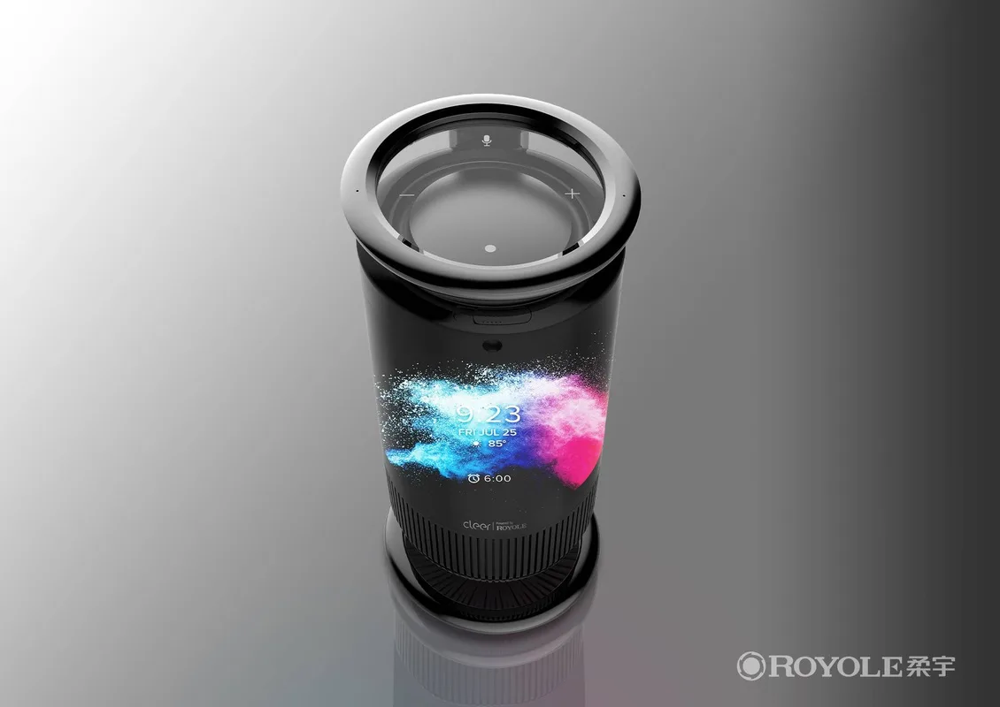

**Royole Mirage**

> [!NOTE]
> Dit artikel verscheen eerder op [Bright](https://www.bright.nl/nieuws/1124878/deze-slimme-speaker-omwikkeld-met-een-touchscreen.html).

De Mirage heeft drie full-range drivers en een basradiator. Het 8 inch AMOLED-touchscreen bedekt nagenoeg het volledige apparaat, dat voor 899 dollar (800 euro) verkocht gaat worden.

Royole heeft nog niet gezegd waar het scherm exact voor gebruikt zal worden, maar op vroege afbeeldingen is een visualisatie-effect te zien dat vermoedelijk met de muziek meebeweegt. Daarnaast worden de tijd, datum en ingestelde wekkers getoond.

Mogelijk wordt het scherm ook ingezet voor videogesprekken: bovenin de Mirage zit namelijk een 5 megapixel-camera. Deze kan bij privacyzorgen fysiek worden dichtgeklapt.

## Amazon Alexa

Twee microfoons vangen geluid uit de gehele kamer op, zodat je de speaker met een stemassistent kunt bedienen. Alexa van Amazon zit in het apparaat ingebouwd.

Het is geen wonder dat Royole een speaker met zo’n omwikkelscherm maakt. De fabrikant was in januari 2019 de eerste die een [opvouwtelefoon presenteerde](https://www.youtube.com/watch?v=dguTIatuChE), en was daarmee onder andere techgigant Samsung voor.

[Bekijk ingesloten media](https://www.youtube.com/embed/dguTIatuChE?autoplay=1&modestbranding=1)

## Royole's vouwtelefoon in januari 2019:

**Geen Bright-video missen? [Abonneer je op ons YouTube-kanaal](https://bit.ly/brighttv)**

[Bekijk ingesloten media](https://www.youtube.com/embed/GdWYIlynNV8?autoplay=1&modestbranding=1)

## Kijk ook: highlights techbeurs CES 2020
