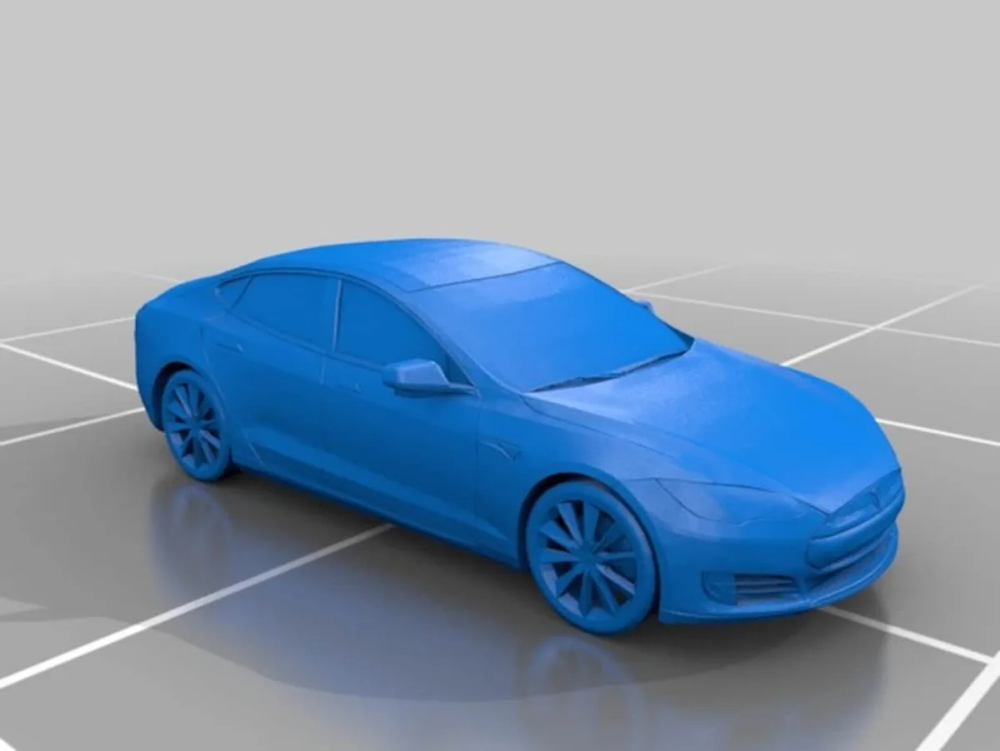
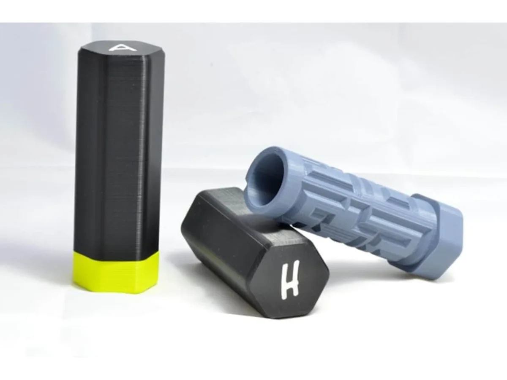

Bij veel families en vriendengroepen zijn de lootjes alweer getrokken en is het tijd om snel surprises in elkaar zetten. Dat kan met lijmstift en schaar bij de hand, maar het kan ook met behulp van een 3D-printer.

> [!NOTE]
> Dit artikel verscheen eerder op [AD](https://www.ad.nl/tech/deze-surprises-kun-je-maken-met-een-3d-printer~ad740afe/).

Het maken van 3D-prints is allang niet meer zo hooggegrepen. Waar de gemiddelde 3D-printer jaren geleden nog rond de duizend euro kostte, haal je nu voor tegen de 200 euro al een prima model in huis. Vervolgens heb je alleen nog een rol filament in de juiste kleur nodig om iets van plastic te maken.

Wie een beetje handig is, kan 3D-ontwerpsoftware gebruiken om zelf een object te ontwerpen dat met de printer kan worden gemaakt. Dat vergt echter enige voorkennis en ook een hoop geduld. Want zelfs als je weet hoe 3D-software werkt, moet je vervolgens óók iets maken dat foutloos geprint kan worden.

Gelukkig zijn er ook een hoop websites waar je andermans 3D-printmodellen kunt downloaden, zodat je ze vervolgens zelf door de printer kunt halen. Verreweg de populairste is Thingiverse, wat een soort YouTube voor 3D-modellen is.

## Favoriete auto, fiets of boot afdrukken

Een Tesla-model voor de 3D-printer. © Thingiverse

Op die site staan inmiddels gigantisch veel creaties om te printen, wat een hoop mogelijkheden biedt voor surprises. Heb je het lootje van je oom getrokken, die net een nieuwe Tesla heeft? Het 3D-model van die auto vind je gewoon [in het archief](https://www.thingiverse.com/thing:2195818). Je kunt hem zelfs zonder wielen afdrukken, zodat je die kunt vervangen met bijvoorbeeld vier pepernoten.

Op diezelfde manier kun je al snel de favoriete gitaar, boot of een ander object vinden waar jouw slachtoffer gehecht aan is, zodat je zonder veel moeite een replica uit je printer laat rollen.

## Een puzzeldoos voor je gedicht

In deze puzzeldoos past een gedicht. © Thingiverse

Het kan ook venijniger. Thingiverse staat ook vol met [speciale puzzeldozen](https://www.thingiverse.com/thing:201097). Het is een kleine container waar je een stuk papier in stopt, die alleen op één specifieke manier geopend kan worden. Ideaal om bijvoorbeeld een sinterklaasgedicht in te verstoppen.

Je bepaalt zelf hoe lastig die puzzel kan worden - je kiest immers zelf welk model je afdrukt. Al zouden we wel een grote maken, zodat je gedicht er goed in past.

## Zelf doen of laten doen?

Je kunt ervoor kiezen om bovenstaande ideetjes zelf af te drukken en als surprise te gebruiken. Een peulenschil voor iedereen die al een 3D-printer heeft en weet hoe ze die het beste afstellen. Heb je nog geen 3D-printer? Dan is het wellicht wat kort dag om er nu eentje te kopen en uit te vogelen. 3D-printen is een hobby met een redelijke leercurve, waardoor je de eerste dagen vooral nog moet leren waar je zoal rekening mee moet houden.

Je kunt er gelukkig voor kiezen om je 3D-prints te laten afdrukken door een ander. Een goede vriend met een printer is dan de beste optie, maar er zijn ook bedrijven die helpen. Die vind je vooral door te googelen naar ‘3D print laten maken’. Let wel op dat de prijs hiervan vrij snel kan oplopen, omdat een grote print uren aan tijd in beslag neemt.
