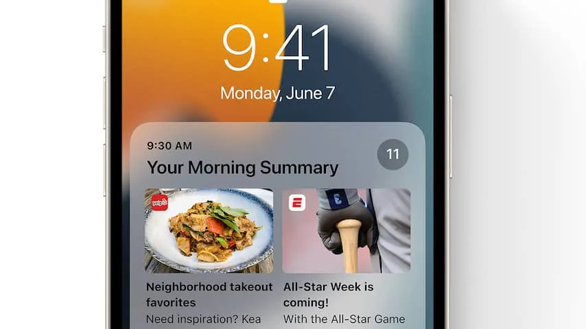
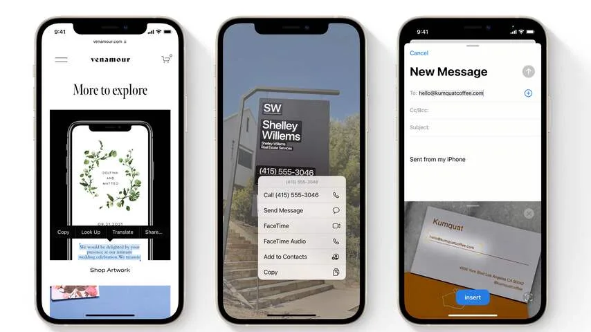
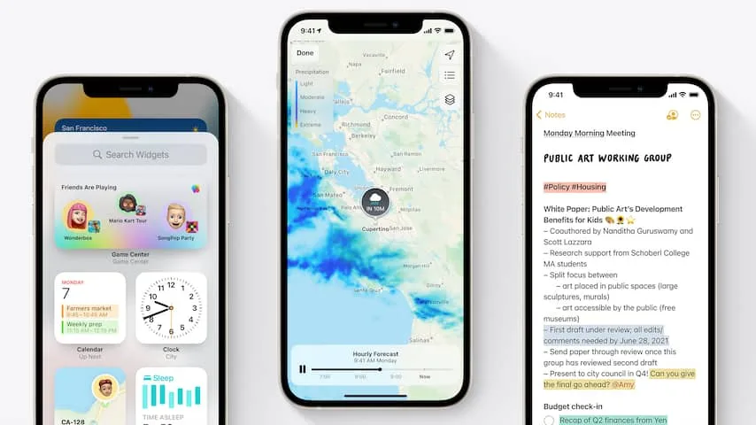
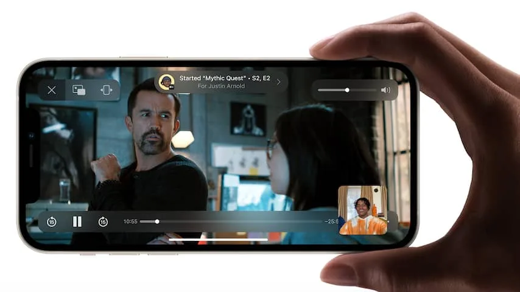

## Notificatie- en appfilters voor privé en werk

De iPhone heeft al langer een Niet Storen-functie die notificaties dempt, maar in iOS 15 wordt deze optie uitgebreid. Je kunt voortaan kiezen tussen modi voor werk, privé en wanneer je gaat slapen.

> [!NOTE]
> Dit artikel verscheen eerder op [NU.nl](https://www.nu.nl/tech/6138433/deze-vernieuwingen-voegt-apple-met-ios-15-toe-aan-je-iphone.html).

Afhankelijk van de gekozen optie worden notificaties van bepaalde apps gedempt. In privémodus krijg je bijvoorbeeld geen berichten meer van zakelijke apps. Ook kun je het iconenscherm van je telefoon aanpassen op basis van de gekozen modus, zodat je zakelijke apps alleen op werkdagen ziet.

_Deze vernieuwingen voegt Apple met iOS 15 toe aan je iPhone_

## Dagelijks overzicht van gemiste berichten

Het notificatiescherm gaat op de schop, waardoor je een eenduidiger overzicht van gemiste berichten te zien krijgt. Die worden gesorteerd op basis van relevantie.

De notificaties zelf worden ook iets anders; er wordt een grotere nadruk op afbeeldingen gelegd.

## Tekst uit foto's kopiëren en plakken

Het camerabeeld wordt met iOS 15 gescand voor tekst, zodat je die rechtstreeks kunt kopiëren en plakken in andere apps.

Zo kun je bijvoorbeeld een foto maken van het logo van een restaurant, waarna je de naam plakt in Googles zoekmachine om meer informatie te vinden.

_Deze vernieuwingen voegt Apple met iOS 15 toe aan je iPhone_

## Nieuw ontwerp Weer-app

De Weer-app krijgt een nieuw ontwerp en toont met iOS 15 meer informatie. Zo is op een kaart de temperatuur te zien, wordt voortaan de luchtkwaliteit vermeld en staan er meer details over neerslag in het weeroverzicht.

De app doet nu deels denken aan Dark Sky, een populaire weerapplicatie die Apple eerder heeft overgenomen.

_Deze vernieuwingen voegt Apple met iOS 15 toe aan je iPhone_

## 3D-kaarten bij navigatie

Wie de Kaarten-app van Apple gebruikt om in de auto te navigeren, kan voortaan kiezen voor een 3D-weergave van de omgeving. Hierin zijn viaducten en bruggen duidelijker te zien, wat het makkelijker moet maken de instructies te doorgronden.

## Veegtoetsenbord ondersteunt voortaan Nederlands

Apple biedt al langer een veegtoetsenbord, waarbij je over de letters tekent om snel een woord te maken. De functie is vergelijkbaar met wat apps zoals Swype en SwiftKey aanbieden.

Met iOS 15 ondersteunt Apples variant ook de Nederlandse taal.

## Rijbewijs op je iPhone (in de VS)

Met iOS 15 wordt het mogelijk een rijbewijs in de Wallet-app te bewaren, die nu al wordt gebruikt om bankpassen voor Apple Pay op te slaan.

Op het moment lijkt de functie zich enkel tot een aantal Amerikaanse staten te beperken. Het is nog niet bekend of andere landen zoals Nederland later ook ondersteuning krijgen.

## Media delen tijdens een FaceTime-gesprek (in latere versie)

Videobelapp FaceTime krijgt in een latere versie van iOS 15 een upgrade, die het mogelijk maakt samen met vrienden dezelfde muziek te beluisteren of een video bij een streamingdienst af te spelen. Dat moet het makkelijker maken online samen iets te doen. Aanvankelijk stond deze SharePlay-functie gepland voor de eerste release van iOS 15, maar Apple heeft hem iets uitgesteld.

Ook wordt het mogelijk mensen met een Android-telefoon of Windows-computer met FaceTime te bellen. Die platformen krijgen een webapp voor de videodienst.

_Deze vernieuwingen voegt Apple met iOS 15 toe aan je iPhone_

## Welke iPhones zijn geschikt?

De nieuwe versie van iOS is bij beschikbaarheid te downloaden via Instellingen > Algemeen > Software-update. De volgende iPhones zijn geschikt:

- iPhone 6S (Plus)
- iPhone SE (2016)
- iPhone 7 (Plus)
- iPhone 8 (Plus)
- iPhone X
- iPhone XS (Max)
- iPhone XR
- iPhone 11 (Pro en Pro Max)
- iPhone SE (2020)
- iPhone 12 (mini, Pro en Pro Max)
- iPhone 13 (mini, Pro en Pro Max)
