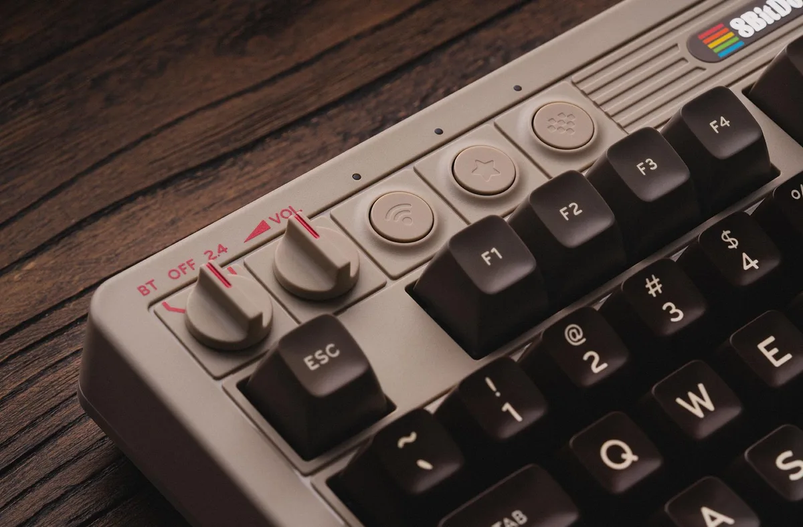
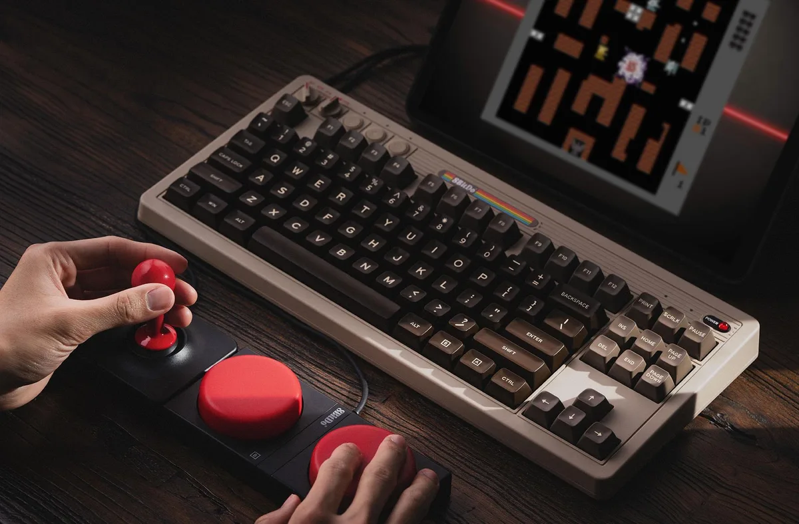

De kleuren, logo’s en lampjes zijn allemaal een regelrechte hommage aan de decennia oude computer. Het is een Commodore 64 in alles behalve naam - 8bitdo noemt hem enkel de 'C64 Edition', vermoedelijk om problemen met de originele makers te vermijden.

> [!NOTE]
> Dit artikel verscheen eerder op [Bright](https://www.bright.nl/nieuws/1189784/dit-commodore-64-toetsenbord-werkt-met-je-moderne-pc.html).

8bitdo staat al een tijdje bekend om zijn authentieke replica’s van oude hardware. Ze werden ooit bekend met draadloze varianten van klassieke gamecontrollers.

Linksboven op het toetsenbord vind je ook ouderwetse draaiknoppen. Met de linker wissel je tussen bluetooth en de ingebouwde usb-dongle, zodat je makkelijk tussen meerdere apparaten schakelt. Daarnaast vind je een simpele knop om het volume mee omhoog te draaien.

## Grote knoppen

Daarnaast verkoopt de 8bitdo losse grote knoppen en een joystick voor het toetsenbord, gemodelleerd naar de oude gameknoppen voor de Commodore 64. Die kun je gebruiken om mee te gamen, of je kunt ze transformeren in gigantische macro-knoppen voor bepaalde snelkoppelingen.

Het 8bitdo-toetsenbord wordt via Amazon verkocht voor [110 dollar](https://www.amazon.com/dp/B0CYSQWYZP). Over een Nederlandse verkoop is nog niks bekendgemaakt, maar eerdere 8bitdo-producten waren hier uiteindelijk ook altijd leverbaar.

Abonneer ook op onze [nieuwsbrief](https://www.bright.nl/nieuws/1175658/abonneer-je-gratis-op-de-bright-nieuwsbrief.html).
