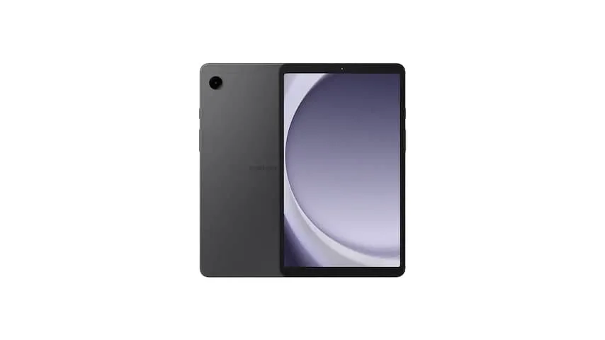
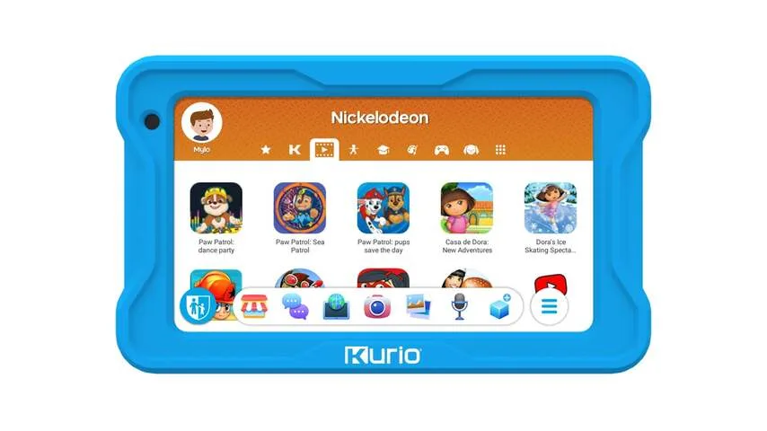
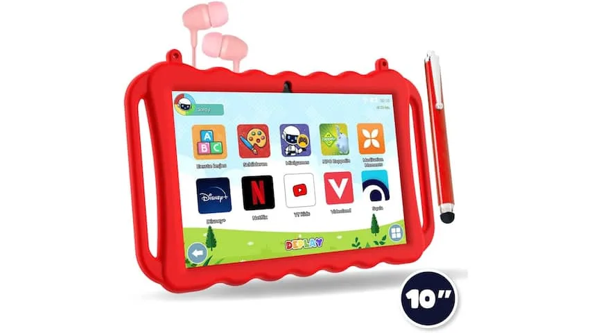

Naast de kracht van de processor, de opslagcapaciteit en andere specificaties spelen er bij kindertablets heel andere dingen mee, weet Kerssenberg van techsite Tweakers. "Het begint met de software die erop staat. Een tablet heeft soms een versimpelde interface en software die is toegespitst op kinderen."

> [!NOTE]
> Dit artikel verscheen eerder op [NU.nl](https://www.nu.nl/slimmer-leven/6312829/dit-is-belangrijk-als-je-een-tablet-voor-kinderen-zoekt.html).

Sommige fabrikanten gooien het over een andere boeg en verkopen reguliere tablets met een kindermodus in de software. Onder andere Samsung doet dat. Google biedt de Kids Space-app aan, waarmee je een Android-tablet in een kindermodus kunt zetten. "Deze app staat gewoon in de Play Store, maar werkt niet met elke tablet."

## 'Jungle van obscure apparaten'

Wie online naar zo'n kindertablet zoekt, komt volgens Kerssenberg in een "jungle van obscure apparaten" terecht. "Je wordt om de oren geslagen met merken met belabberde specificaties en slechte software waar zelfs ik nooit van gehoord heb."

Het kan riskant zijn om blind bij zo'n bedrijf te kopen, want bij een rondgang kreeg hij de bedrijven achter deze tablets vaak niet te pakken. Je krijgt dus wellicht ook geen gehoor als je een beroep wil doen op de garantie.

Kerssenberg heeft voor een [vergelijking op Tweakers](https://tweakers.net/best-buy-guide/tablets/beste-tablet-voor-kinderen) meerdere van deze kindertablets uitgetest. Daarbij kwamen de onderstaande modellen als beste uit de verf.

## De beste kindertablet: Galaxy Tab A9

_Dit is belangrijk als je een tablet voor kinderen zoekt — Beeld: Samsung_

De Galaxy Tab A9 is een algemene tablet met een ingebakken kindermodus. In die modus scherm je de software af, zodat jonge gebruikers er geen rare dingen mee kunnen doen. "Vergeleken met andere kindertablets is hij niet alleen snel, maar heeft hij ook een goed scherm en lange softwareondersteuning."

Met een prijs van 137 euro is de tablet niet heel duur. Bedenk wel dat de tablet zonder speciale kinderhoes wordt geleverd, waardoor de kans op valschade iets groter is. Zo'n hoes moet je er dus nog bij kopen.

## Kant-en-klaar alternatief: Kurio Kindertablet

_Dit is belangrijk als je een tablet voor kinderen zoekt — Beeld: Kurio_

Qua specificaties zou Kerssenberg de Kurio Kindertablet niet zomaar aanraden: "Het is veruit de traagste tablet met het slechtste scherm die we in lange tijd zijn tegengekomen." Maar de meegeleverde software en beschermende bumper eromheen maken het een goed alles-in-éénapparaat. Met een prijskaartje van 119 euro is hij iets goedkoper dan de bovenstaande optie.

Zo staan er standaard veel educatieve apps en kinderspelletjes op de tablet geïnstalleerd, waardoor je niet meteen online iets hoeft te downloaden. Open je de browser, dan kun je door een speciaal filter alleen kindvriendelijke webpagina's bezoeken. De kinderomgeving is vrij gesloten, maar ouders kunnen er handmatig apps aan toevoegen. Zo kun je zelf bepalen of je je kind toegang geeft tot bijvoorbeeld YouTube.

Hoewel de Kurio Kindertablet Premium relatief traag is en geen goed scherm heeft, zit deze tablet op het gebied van software het best in elkaar. Daarom is het apparaat toch een aanrader. Hij bevat veel educatieve software en meer dan genoeg spelletjes.

## Een goede tussenweg: Deplay Kids Tablet Pro

_Dit is belangrijk als je een tablet voor kinderen zoekt — Beeld: Deplay_

De tablet van Deplay is met een prijs van 195 euro duurder dan de bovenstaande alternatieven. Volgens Kerssenberg is het apparaat een goede schakel tussen een normale tablet en een kindervariant: je kunt een speciale kinderomgeving in de software makkelijk in- en uitschakelen.

Hij wordt geleverd met een grote rubberen hoes die wel tegen een stootje kan. "De kinderomgeving heeft een goede balans tussen educatieve software, media en spelletjes. Het valt echter op dat best wat van deze software en media Engelstalig is, ook als de tablet op Nederlands is ingesteld."
