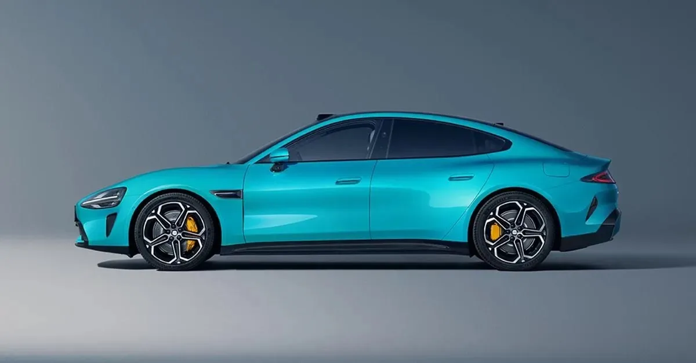

Xiaomi heeft torenhoge verwachtingen van zijn eerste elektrische [auto](https://www.bright.nl/onderwerpen/auto): oprichter Lei Jun zegt dat hij binnen 15 tot 20 jaar één van de vijf grootste spelers op de automarkt wil worden. "We willen een droomauto maken vergelijkbaar met Porsche en Tesla", aldus de topman tijdens de onthulling volgens [Reuters](https://www.reuters.com/business/autos-transportation/china-smartphone-maker-xiaomi-unveils-first-electric-vehicle-2023-12-28/).

> [!NOTE]
> Dit artikel verscheen eerder op [Bright](https://www.bright.nl/nieuws/1170696/dit-is-de-tesla-concurrent-van-telefoonmaker-xiaomi.html).

De SU7 moet nauw gaan samenwerken met andere producten van Xiaomi, door bijvoorbeeld te koppelen met mobiele apps van het bedrijf. Speciale [technologie](https://www.bright.nl/onderwerpen/technologie) moet ervoor zorgen dat de auto ook bij lage temperaturen snel oplaadt. Een ingebouwd zelfrijdsysteem moet een geduchte concurrent worden voor bijvoorbeeld Tesla's Autopilot.

## Twee versies

Xiaomi gaat twee varianten van de auto aanbieden. De goedkoopste heeft een bereik van 668 kilometer, met daarnaast een luxer model met een bereik van 800 kilometer. Ter vergelijking: de Tesla Model S heeft een actieradius van zo'n 650 kilometer.

## Nog weinig bekend

Met de presentatie wilde Xiaomi vooral zijn plannen uit de doeken doen. Veel details over de nieuwe wagen ontbreken nog, zoals ook de uiteindelijke verkoopprijs. Volgens Lei "zal de prijs wat hoog liggen, maar te rechtvaardigen zijn".

Het moet nog blijken wanneer Xiaomi zijn auto zal verkopen. In thuisland China zal hij in elk geval veel concurrentie hebben: daar springen op dit moment elektrische automakers als paddestoelen uit de grond.

**Mis niks, volg [ons WhatsApp-kanaal](https://whatsapp.com/channel/0029VaCVsPU90x2tVfUTEX2b) en ontvang [onze nieuwsbrief](https://www.bright.nl/pagina/nieuwsbrief).**
