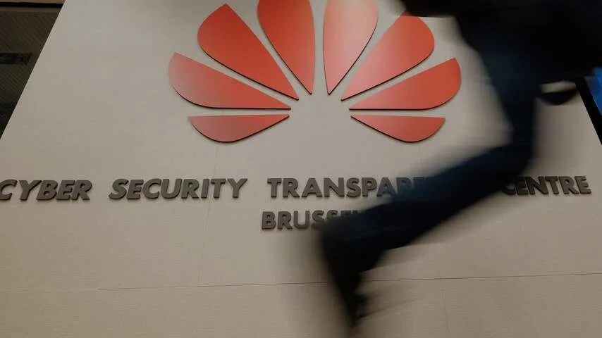

**Het Chinese Huawei zou mogelijk meerdere Nederlanders hebben afgeluisterd. Wat is er aan de hand? We zetten de bekende feiten op een rij.**

> [!NOTE]
> Dit artikel verscheen eerder op [NU.nl](https://www.nu.nl/weekend/5897412/dit-weten-we-over-de-mogelijke-spionage-van-huawei-in-nederland.html).

## Huawei levert zendmastapparatuur aan telecomproviders

Huawei is een Chinese technologiefabrikant die meerdere soorten producten maakt. In Nederland is het bedrijf vooral bekend van de smartphones, die een steeds groter marktaandeel veroveren. Daarnaast maakt Huawei al jarenlang apparatuur die in zendmasten wordt gebruikt.

Telecomproviders kopen hardware van Huawei in voor de bouw van hun telecommasten. In Nederland doen VodafoneZiggo, KPN en de fusie van T-Mobile en Tele2 dat alle drie. Omdat deze apparatuur in zendmasten zit, helpt die met het verwerken van data die verzonden en ontvangen wordt door Nederlandse smartphones.

## Huawei al langer van spionage beschuldigd, maar publiek bewijs ontbreekt

Internationaal vrezen veel landen voor spionage door Huawei. Verschillende inlichtingendiensten en politici zijn bang dat het bedrijf de opdracht heeft gekregen van de Chinese overheid om andere landen af te luisteren en die informatie door te spelen.

In het Verenigd Koninkrijk zouden telecomproviders om die reden ook geen Huawei-apparatuur in de kern van hun telecomnetwerken mogen gebruiken.

In de Verenigde Staten ondertekende president Donald Trump in mei 2019 een decreet dat spionagetelecom in zendmasten verbiedt. Het decreet verbiedt providers in het land om zaken te doen met onder andere Huawei.

[Bekijk ingesloten media](https://content.jwplatform.com/players/nrvynGbt-whqXCOFb.html)

## Huawei zou toegang hebben tot data bij grote Nederlandse provider

Volgens anonieme bronnen van _de Volkskrant_ heeft Huawei toegang gehad tot de klantgegevens van VodafoneZiggo, KPN of de fusie van T-Mobile en Tele2.

Op het moment van schrijven heeft geen van de grote providers toegegeven of het Huawei-lek bij hen is aangetroffen. Het is daarom niet bekend van welke Nederlanders Huawei precies gegevens in handen zou hebben.

## Providers willen niet vertellen welke Huawei-apparatuur ze gebruiken

Het is ook nog de vraag welke informatie precies in handen van Huawei zou zijn. De bronnen van _de Volkskrant_ spreken over ‘klantgegevens’, maar laten in het midden waar dat precies op slaat.

Omdat het onduidelijk is waar de apparatuur van Huawei in de telecomnetwerken zit, weten we ook niet tot welke informatie het Chinese bedrijf toegang kon hebben.

VodafoneZiggo zegt een "relatief bescheiden gebruiker van Huawei-apparatuur" te zijn. Het bedrijf zou vooral elektronica van het Zweedse Ericsson in zendmasten verwerken.

KPN bevestigt ook apparatuur van Huawei te gebruiken. Maar: "We maken niet bekend met welke leverancier we waarop precies samenwerken", vertelt een woordvoerder aan NU.nl.

T-Mobile koopt apparatuur in bij Huawei, Ericsson, Nokia, Cisco en Juniper. "Vanwege concurrentie- en securityredenen geven wij geen informatie over welke vendoren wij voor specifieke onderdelen gebruiken", aldus een persverklaring van de provider.

## Onderzoek moet bepalen of bemachtigde data voor spionage is gebruikt

De vraag is nu of de gegevens in handen van Huawei werden doorgespeeld aan Chinese inlichtingendiensten. Dat onderzoekt de AIVD op het moment.

Officieel heeft de AIVD het onderzoek naar de vermeende spionage nog niet bevestigd. De Nederlandse inlichtingendienst reageert namelijk nooit op geruchten over lopende onderzoeken.

_Huawei — Beeld: Getty Images_

## Data zouden via achterdeurtje bemachtigd zijn

Een zogeheten achterdeurtje zou Huawei ongeoorloofd toegang hebben gegeven tot de klantgegevens. "Een achterdeurtje is een heel breed begrip", vertelde Frank Groenewegen, Chief Security Expert bij Fox-IT in de techpodcast van [NU.nl](http://NU.nl). Fox-IT is onder andere verantwoordelijk voor de IT-beveiliging van overheidsinstanties.

"Ik denk erbij aan een geheime ingang of een bewust gemaakte fout door bijvoorbeeld een leverancier van software", vervolgt Groenewegen. Via die fout is het mogelijk de beveiliging te omzeilen en een systeem binnen te dringen. "Daar kan een spion later misbruik van maken."

Het is volgens Groenewegen echter nog de vraag of die achterdeur bewust is geplaatst. "Je weet dan nog niet of dit met opzet zo ontworpen en achtergelaten is, of dat dit per ongeluk gebeurde." Het zou over het algemeen lastig te bewijzen zijn of een achterdeur expres is gemaakt.

## Nederlandse politiek buigt zich over Huawei

De Nederlandse politiek kijkt op het moment op een aantal fronten naar Huawei. Ten eerste wordt over een paar weken besloten of het Chinese bedrijf betrokken mag zijn bij de aanleg van het Nederlandse 5G-netwerk. De AIVD doet samen met de Nationaal Coördinator Terrorismebestrijding en Veiligheid (NCTV) onderzoek naar de risico’s

Dick Schoof, directeur-generaal van de AIVD, was recent al kritisch over de mogelijke betrokkenheid van Huawei bij 5G. "Als je het hebt over de hardcore van het 5G-netwerk, moet je je heel goed afvragen of je de Chinezen daar wel wil", zei hij in het radioprogramma _1 op 1_.

Daarnaast wordt gekeken naar de strategie van de overheid tegenover China in het algemeen. Minister Stef Blok (Buitenlandse Zaken) publiceerde recent een brief waarin hij deze strategie toelicht. Daarin staat dat het kabinet "constructief-kritisch is ten aanzien van China".
