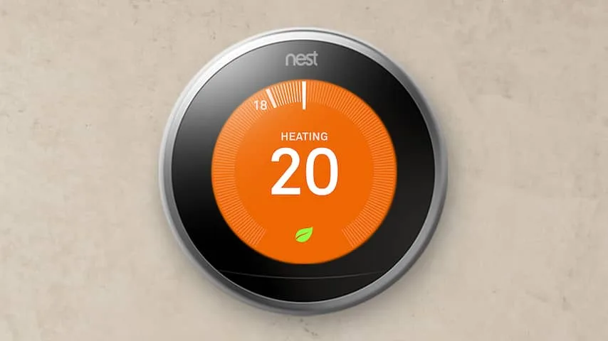
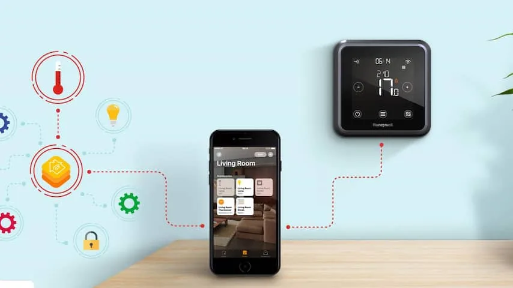
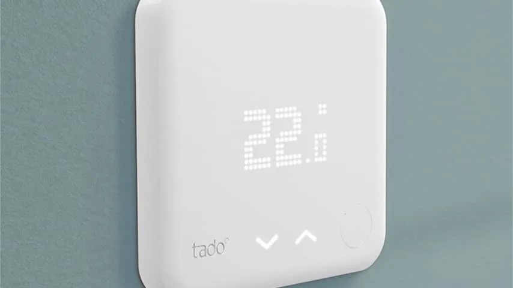
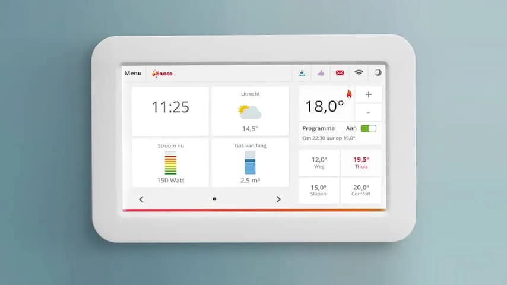

**Steeds meer thermostaten bevatten slimme functies, maar welke kun je het best in huis halen? Wij testen vier populaire opties.**

> [!NOTE]
> Dit artikel verscheen eerder op [NU.nl](https://www.nu.nl/wonen/5756883/dit-zijn-de-beste-slimme-thermostaten-voor-in-huis.html).

De slimme thermostaat is samen met slimme verlichting en slimme camera's met gezichtsherkenning een gadget voor in een 'smarthome'. Je koppelt de warmteregelaar aan je internetverbinding en smartphone, waardoor je bijvoorbeeld automatisch de verwarming aanzet als je bijna thuis bent.

In dit overzicht maken we een selectie uit de slimme thermostaten die in Nederland worden verkocht. Daarbij kijken we ook welke systemen in combinatie met een gewone cv-ketel of met stadsverwarming werken.

> [!INFO] Beste koop: Nest Learning Thermostat (derde generatie)
>
> -   Prijs: circa 250 euro
> -   Werkt met een cv-ketel en stadsverwarming
> -   [Meer over in welk huis Nest werkt, vind je hier](https://nest.com/nl/support/article/Which-heating-systems-are-compatible-with-the-Nest-Learning-Thermostat)

_Nest — Beeld: Nest_

De Nest is de beste thermostaat die wij aan onze tests hebben onderworpen. Dat komt voornamelijk doordat hij qua gebruik amper gedoe met zich meebrengt. De bediening werkt net als veel oude thermostaten met een draairing. De gadget ziet hoe je dagelijkse leven eruitziet, waardoor hij zichzelf instelt en aanpast.

Dat leert de Nest door onder andere de locatie van je telefoon in de gaten te houden. Ook kijkt de bewegingssensor of er activiteit in een kamer is, om zonder bijbehorende smartphoneapp een idee te krijgen van wanneer je bijvoorbeeld in de woonkamer zit.

De thermostaat heeft nog een aantal handigheidjes, zoals een koppeling met de slimme rook- en koolmonoxidemelders van hetzelfde bedrijf. Wordt er gevaar gedetecteerd, dan gaat de gaskraan automatisch dicht.

**Kopen als:** Je er graag op vertrouwt dat de thermostaat zichzelf goed instelt.
**Mijden als:** Je het idee van een bewegingssensor in huis niet fijn vindt.

> [!INFO] Budgetkeuze: Honeywell Lyric
>
> -   Prijs: circa 150 euro
> -   Werkt met een cv-ketel en stadsverwarming
> -   [Meer over ondersteuning in jouw huis vind je hier](https://www.honeywellhome.com/en/general-pages/wi-fi-programmable-thermostat-home-compatibility)

_Honeywell Lyric — Beeld: Honeywell_

De Lyric is pakweg 100 euro goedkoper dan de Nest en biedt veel van de basisfuncties die je verwacht van een slimme thermostaat. Je koppelt hem met wifi en je smartphone, waarna je kunt instellen dat de thermostaat zichzelf inschakelt zodra je thuiskomt en je telefoon in de buurt van het huis is.

De thermostaat is niet zelflerend, wat betekent dat je met de hand moet instellen hoe de gadget zich gedraagt op gezette tijdstippen en bij thuiskomst. Hierdoor vereist hij iets meer instelwerk dan de Nest.

De bediening van de Lyric is wat onhandig. Het apparaat heeft een aanraakscherm dat alleen activeert als je erop tikt, waardoor je niet vanaf een afstand de huidige of ingestelde temperatuur kunt zien. Daarnaast toont dit scherm vooral simpele knoppen, waardoor het touchscreen weinig echte meerwaarde met zich meebrengt.

Activeer je het apparaat, dan toont de gadget virtuele bedieningsknoppen. Hierdoor lijkt de bediening ondanks zijn scherm op die van een traditionele thermostaat.

**Kopen als:** Je een slimme thermostaat wilt zonder al te veel uit te geven.
**Mijden als:** Het wat onhandige aanraakscherm een groot bezwaar voor je is.

## Alternatieven

> [!INFO] Tado
>
> -   Prijs: circa 200 euro, 80 euro voor radiatorknoppen
> -   Werkt met een cv-ketel of stadsverwarming
> -   [Hier zie je of Tado ook in jouw huis werkt](https://support.tado.com/hc/nl/articles/202193195-Welke-verwarmingssystemen-worden-ondersteund-door-de-Slimme-Thermostaat-)

_Tado — Beeld: Tado_

Tado verkoopt twee gadgets voor je verwarming: een slimme thermostaat en een bijbehorende slimme radiatorknop. Hij houdt de locatie van gekoppelde smartphones in de gaten om te zien of iemand thuis is, om op basis daarvan de verwarming aan of uit te zetten. Hij probeert net als de Nest automatisch de juiste instellingen te kiezen door te kijken wanneer je doorgaans thuis bent - maar vereist daarvoor wel een abonnement. Je betaalt hierdoor 3 euro per maand extra, of 25 euro per jaar.

De bijbehorende radiatorknoppen zorgen ervoor dat het huis modulair opgewarmd kan worden. De verwarming kan bijvoorbeeld in alleen de slaapkamer worden opengedraaid, waarna de cv-ketel aangaat om die kamer op te warmen. Bij andere slimme thermostaten kan dat alleen als er een speciaal modulesysteem is aangelegd in een huis.

De totaalprijs van een huis met een Tado-thermostaat en meerdere thermostaatknoppen kan wel snel oplopen. De thermostaat wordt voor een adviesprijs van 200 euro verkocht, plus 80 euro voor iedere radiatorknop. Daarbovenop komen nog de hierboven genoemde abonnementskosten, als je alle functies wilt benutten.

**Kopen als:** Je kamers individueel van elkaar wilt opwarmen.
**Mijden als:** Je niet de hoofdprijs wilt betalen.

> [!INFO] Toon
>
> -   Prijs: 199 euro, of in combinatie met een Eneco-contract
> -   Werkt alleen met cv-ketels, niet met stadsverwarming
> -   [Precieze informatie over ondersteuning vind je hier](https://www.eneco.nl/energieproducten/toon-thermostaat/hoe-werkt-toon/)

_Dit zijn de beste slimme thermostaten voor in huis — Beeld: Eneco_

De Toon-thermostaat van Eneco heeft een iets andere insteek dan zijn concurrenten, door juist in te zetten op energiebesparing. De bijbehorende app laat zien op welke tijdstippen de verwarming wellicht hoger staat dan bij de gemiddelde Nederlander, zodat je weet waar je mogelijk kunt minderen.

Daarbij kan de thermostaat ook kijken naar stroomverbruik. Door pieken en dalen te meten, schat de app automatisch in of bijvoorbeeld een wasmachine veel energie nodig heeft.

Bijna al deze functies vereisen een extra abonnement van 4,50 euro per maand. Eneco benadrukt dat de Toon slechts als 'gewone' thermostaat functioneert als dit abonnement niet wordt betaald.

Daarnaast biedt de Toon veel basisfuncties van zijn concurrenten niet. Hij houdt niet bij of je thuis bent om de verwarming automatisch aan of uit te zetten, hoewel dit via een (betaalde) omweg ([Drebbl thermopilot](https://drebbl.com/)) wel mogelijk is. Daarnaast leert hij niet om de temperatuur op je gedrag aan te passen.

Het is mogelijk om een Toon te gebruiken zonder Eneco-abonnement, al krijg je dan niet te zien wat voor impact je gebruik heeft op de rekening. Daarnaast werkt de slimme thermostaat niet in combinatie met stadsverwarming.

**Kopen als:** Je tips wilt om energie- en gasverbruik te verminderen.
**Mijden als:** Je een thermostaat zoekt die zich aan je gedrag aanpast.
