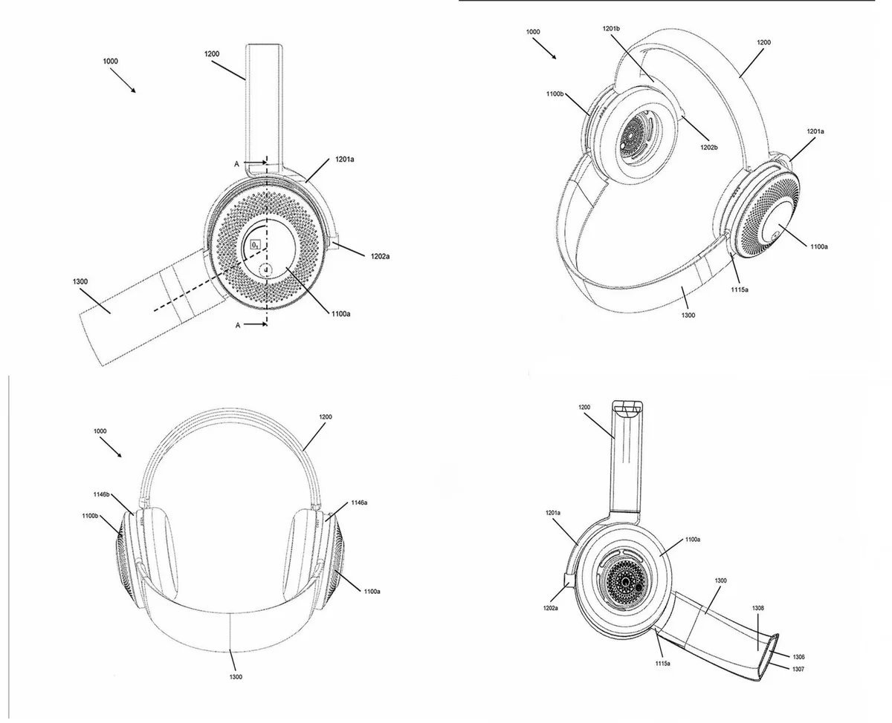

**Masker**

> [!NOTE]
> Dit artikel verscheen eerder op [Bright](https://www.bright.nl/nieuws/1125226/dyson-koptelefoon-zuivert-de-lucht-om-je-heen.html).

Het idee staat omschreven in een patentaanvraag die het bedrijf in juli 2019 [indiende](https://www.ipo.gov.uk/p-ipsum/Case/ApplicationNumber/GB1811994.1) bij het Britse patentbureau. Dit document is deze week openbaar gemaakt.

Het luchtreinigingssysteem zit in de oorschelpen van de koptelefoon. Door een speciale band voor je mond te schuiven, wordt deze lucht naar je longen geleid. Deze band kan worden opgevouwen als hij niet wordt gebruikt.

De ingebouwde motor zou iedere minuut ongeveer 12.000 keer ronddraaien om 1,4 liter aan lucht per seconde binnen te trekken. Omdat de lucht wordt gefilterd, zou de drager minder vervuilende stoffen binnen krijgen.

## Nog maar een idee

Het is nog de vraag wat Dyson concreet met het idee van plan is. Hoewel het bedrijf de uitvinding probeerde vast te leggen, bestaat er een kans dat er vooralsnog niks mee wordt gedaan.

Dyson brak door met zijn [zakloze stofzuiger](https://www.bright.nl/tests/artikel/3911886/strijd-tussen-snoerloze-stofzuigers-wie-wint), waarna het bedrijf onder andere een ventilator zonder bladen bouwde. Recent toonde de fabrikant een [nieuwe lamp](https://www.bright.nl/nieuws/artikel/5001416/flexibele-dyson-lightcycle-morph-lamp-heeft-vier-lichttypen) die het zestig jaar moet volhouden zonder aan kwaliteit, temperatuur of nauwkeurigheid te verliezen.

## Review: deze Dyson zuivert, verwarmt of verkoelt je kamer

[Bekijk ingesloten media](https://www.youtube.com/embed/bAtbCzrahPY?autoplay=1&modestbranding=1)

**[Volg Bright op YouTube](https://bit.ly/brighttv) voor meer tech-video's**
