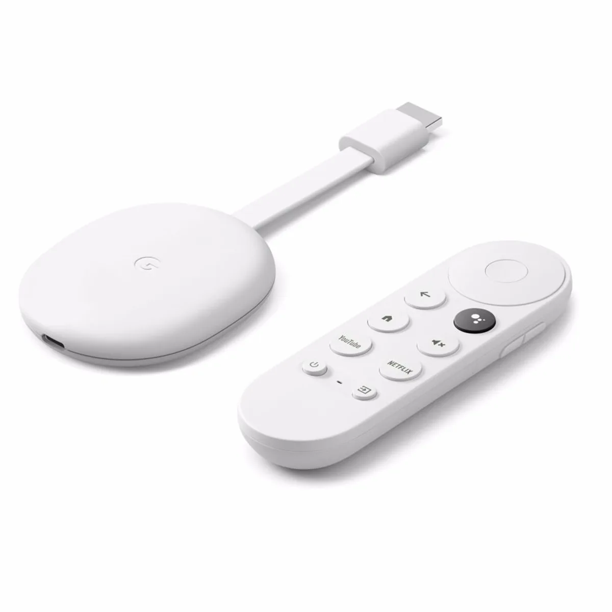

De meeste tv’s hebben apps voor Netflix, YouTube en andere streamingdiensten, maar die zijn vaak log en onhandig. Wie makkelijk tv wil kijken kan dat het beste doen met behulp van een Chromecast of Apple TV - maar welke van die twee is dan je beste optie?

> [!NOTE]
> Dit artikel verscheen eerder op [AD](https://www.ad.nl/tech/een-chromecast-of-toch-een-apple-tv-dit-zijn-de-belangrijkste-verschillen~a70f2efa/).

Ze werken doodsimpel: prik een Apple TV of Chromecast achterin je tv en je kunt er vanaf je telefoon video’s naartoe streamen. Of je pakt de afstandsbediening erbij en installeert apps, zodat je rechtstreeks op het apparaat een film of serie kunt starten.

Het verschil tussen beide apparaten was vroeger best groot: de Chromecast was puur een apparaat om naartoe te streamen, zonder eigen apps of afstandsbediening. Het was een verlengstuk van de video-apps op je telefoon, terwijl de Apple TV je zowel vanaf een telefoon liet streamen als met apps liet werken. Maar nu de meest recente Chromecasts ook apps ondersteunen, zijn de verschillen tussen beide kleiner geworden.

In dit overzicht kijken we naar drie apparaten: de meest recente Apple TV uit 2022 en de HD- en 4K-versies van de Chromecasts.

## Qua video-ondersteuning maakt het weinig uit

Je vindt op zowel de Apple TV als de Chromecasts alle grote streamingdiensten. Koop je er één, dan kun je eigenlijk bij alles wat gangbaar is: Netflix, Videoland, HBO Max, YouTube, enzovoort. Er zijn wat uitzonderingen, zoals de Apple TV-app die je niet kunt openen op een Chromecast, maar je kunt alsnog op Apples website inloggen in een Chrome-browser om video’s daarvan naar het Google-apparaat te sturen.

Beide ondersteunen ook ruwweg dezelfde videocodecs, waardoor je op geen van beide tegen gekke videobestanden zult aanlopen die niet willen opstarten.

De Chromecast met Google TV. © Google

## De Apple TV is een krachtiger apparaat

Kijk je naar de processorkracht, dan wint de Apple TV van de Chromecasts. De machine is krachtiger en dus sneller. We merkten bij onze tests dat de Chromecast heel soms een seconde kan blijven hangen, terwijl de Apple TV eigenlijk altijd vlekkeloos presteert.

In de praktijk is het verschil echter klein. Beide kunnen prima streaming-apps draaien. Het verschil in processorkracht is pas echt merkbaar wanneer je bijvoorbeeld games probeert te spelen.

## De Chromecasts zijn veel opener, maar de Apple TV veiliger

Over die games gesproken: wie een irreguliere app probeert te installeren, is beter af met een Chromecast. Googles onderliggende Android-systeem is open, waardoor je via een omweg bijvoorbeeld je favoriete telefoon-apps er op kunt zetten. Al bedienen die lang niet allemaal even makkelijk.

Bij Apple ben je beperkt tot de apps die in de officiële App Store staan. Daardoor heb je inherent minder keus, al is dit op zijn beurt veiliger: de kans dat je onbedoeld een app met malware installeert, is zo immers kleiner.

## De Chromecasts zijn goedkoper

Voor het geld van één Apple TV kun je twee 4K-modellen en één HD-model van de Chromecast kopen. Dat maakt Googles optie een stuk economischer, mits de hierboven genoemde pijnpunten geen probleem voor je zijn.

## Ieder heeft snelle apps op eigen smartphone-systemen

Heb je een iPhone, dan verandert je telefoon in een afstandsbediening terwijl je de Apple TV bedient. Zo kun je snel een video pauzeren of een zoekterm intikken zonder dat je door allerlei apps hoeft te navigeren. Je kunt een Chromecast ook vanaf je iPhone bedienen, maar dan moet je wél naar een specifieke app toe, wat iets meer gedoe is.

Het tegendeel geldt ook: heb je een Android-toestel, dan kun je een snelle knop voor de afstandsbediening binnen handbereik neerzetten. Het maakt het iets aantrekkelijker om een mediaspeler te kopen die aansluit bij het besturingssysteem van je telefoon.

## Onder de streep: kijk naar je ecosysteem

Voor beide opties is wat te zeggen: een Apple TV is sneller, terwijl een Chromecast juist een stuk goedkoper is. De één is meer open, terwijl de ander iets veiliger is.

Wij zouden vooral kijken naar welk apparaat het beste in je ecosysteem past. Kijk je graag naar Apple TV+? Je kunt dan via een omweg best daar naar kijken op je Chromecast, maar op een Apple TV gaat dat een stuk makkelijker? Maar heb je een Android-telefoon? Dan is de snel bereikbare afstandsbediening-app weer een leuk voordeel.

Met beide haal je hoe dan ook een prima streaming-apparaat in huis dat nagenoeg alles kan draaien.
