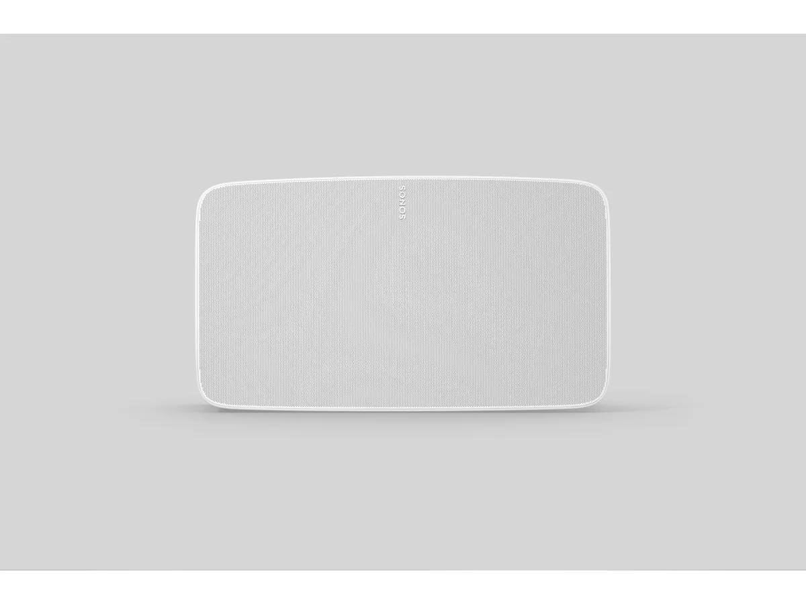
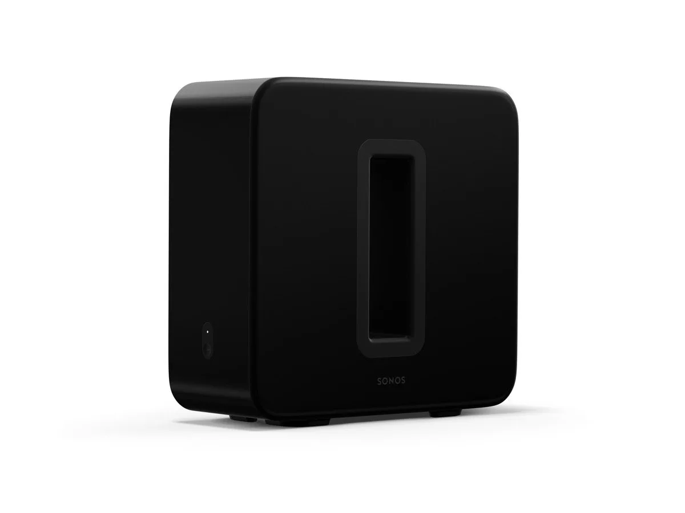

**Vernieuwde speakers**

> [!NOTE]
> Dit artikel verscheen eerder op [Bright](https://www.bright.nl/nieuws/1126314/eerste-beelden-nieuwe-sonos-five-en-sub-gelekt.html).

De beelden werden gedeeld door techjournalist Roland Quandt op [Twitter](https://twitter.com/rquandt/status/1257611091217022976). De Sonos Five zou de opvolger zijn van de Play:5, die al sinds 2015 geen update meer heeft gehad. Een logische naamswijziging: de Play:1 veranderde een tijdje terug ook in de Sonos One.

De afbeeldingen van de Sonos Five tonen een relatief brede luidspreker met een verder simpel ontwerp. Hij zou in het zwart en wit worden geleverd.

De nieuwe Sonos Sub lijkt nagenoeg identiek aan zijn voorganger, en wordt ook in zowel zwart als wit verkocht.

Eerder lekte ook al een afbeelding van een [vernieuwde Playbar](https://www.bright.nl/nieuws/artikel/5110276/sonos-presenteert-nieuwe-playbar-sub-en-play5-juni). Deze soundbar krijgt een wat ronder ontwerp en zou Dolby Atmos ondersteunen.

Sonos heeft de nieuwe speakers nog niet officieel onthuld, maar vermoedelijk gebeurt dat deze week al. Op Twitter suggereert het bedrijf dat er op 6 mei iets gaat gebeuren.

## Kijk ook: Denon-speakers verslaan Sonos?

[Bekijk ingesloten media](https://www.youtube.com/embed/jKMB6xI1eE4?autoplay=1&modestbranding=1)

**[Volg Bright op YouTube](https://bit.ly/brighttv) voor meer tech-video's**
