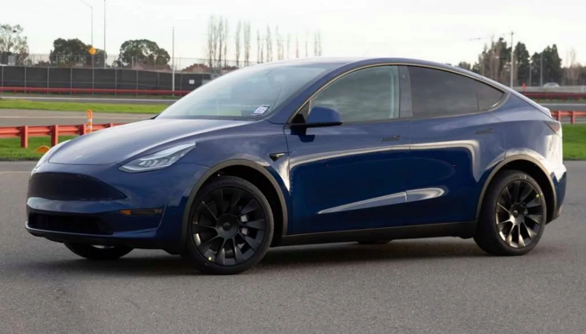

**Bijna te koop**

> [!NOTE]
> Dit artikel verscheen eerder op [Bright](https://www.bright.nl/nieuws/1125197/eerste-echte-foto-van-tesla-model-y-getoond.html).

De foto laat zien hoe de Model Y de productieband af zal rollen. Dat gebeurt al snel: de autofabrikant hoopt in maart dit jaar de eerste exemplaren te verkopen.

Hoewel de auto in grote lijnen hetzelfde lijkt als het vorig jaar getoonde prototype, zijn de vormen aan bijvoorbeeld de voorkant iets aangepast.

Het bereik van de auto is ook vergroot. Op een volle accu moet hij het nu 507 kilometer volhouden, in plaats van de eerder beloofde 450 kilometer. Dat beloofde Tesla vlak na de presentatie van de meest recente kwartaalcijfers

Uit fabrieksbeelden blijkt dat de Model Y wordt samengesteld door grote onderdelen aan elkaar te bevestigen, een proces dat het bedrijf volgens [Electrek](https://electrek.co/2020/01/31/tesla-model-y-production-pictures/) al langer wil toepassen. Een jaar geleden beloofde CEO Elon Musk dat de auto zal worden gemaakt met een aluminium frame.

Met de Model Y spellen alle verschenen Tesla’s bij elkaar het woord 'SEXY'. Daarbij is de Model 3 de letter E.

[Bekijk ingesloten media](https://www.youtube.com/embed/866_Nrmb9Uk?autoplay=1&modestbranding=1)

## Tesla Model S: de auto die autorijden voorgoed veranderde

**[Volg Bright op YouTube](https://bit.ly/brighttv) voor meer tech-video's**
