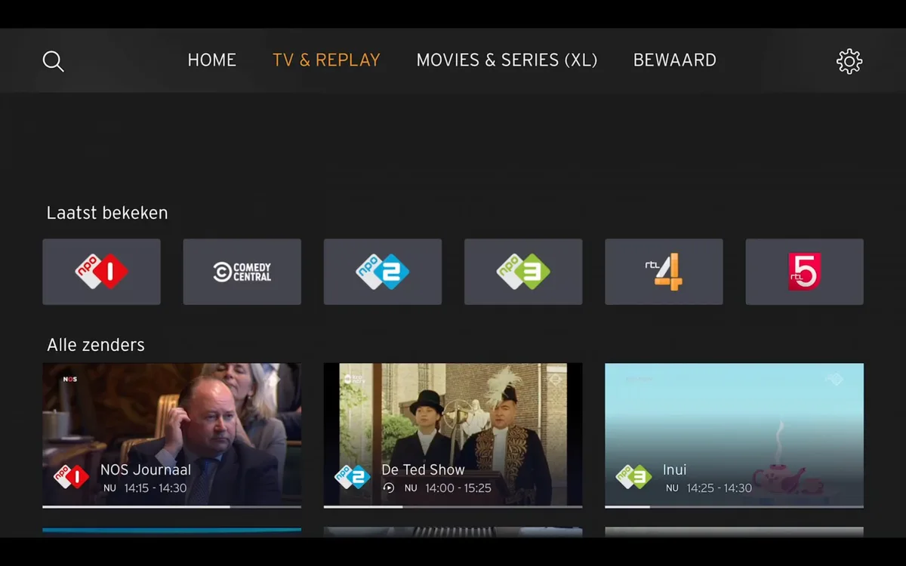
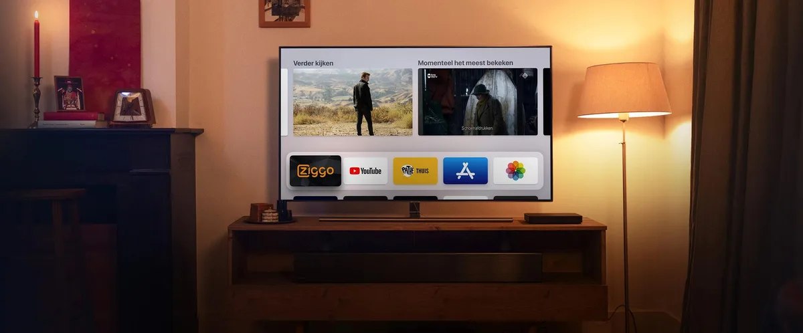
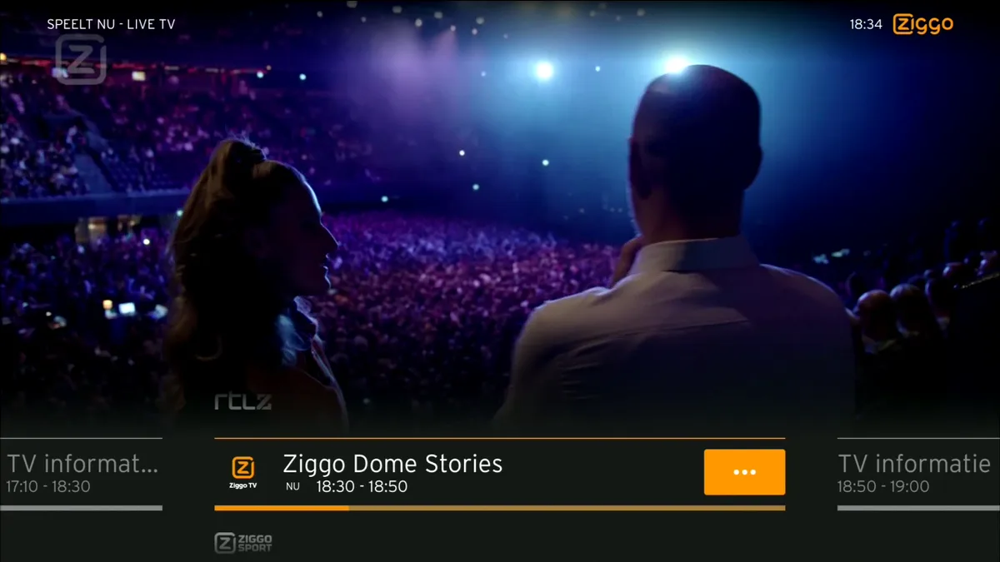
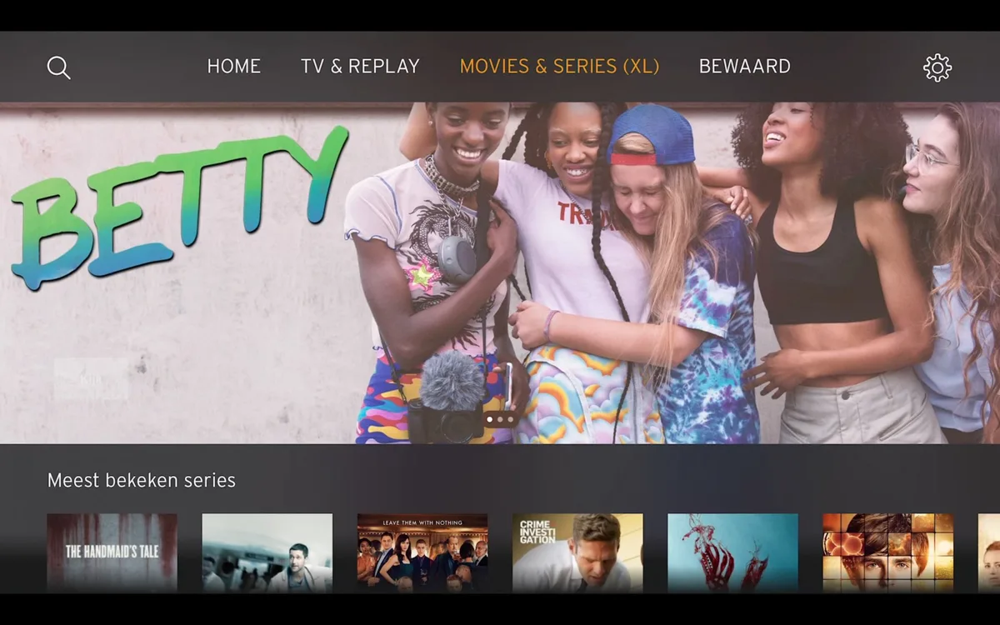

**Android, Fire en Apple TV**

> [!NOTE]
> Dit artikel verscheen eerder op [Bright](https://www.bright.nl/nieuws/1126852/eerste-indruk-ziggo-go-tv-app-maakt-consessies-maar-dat-oke.html).

Een Ziggo Go-app voor smart-tv-platformen heeft de potentie om het tv-kijkgedrag van veel mensen significant te versimpelen. Wie bijvoorbeeld een Apple TV heeft, hoeft immers niet langer een mediakastje aan de televisie te hangen. En dat bespaart weer het wisselen tussen HDMI-kanalen en twee of drie afstandsbedieningen.

In afgelopen weken hebben wij de Ziggo Go-app alvast mogen proberen op de Apple TV. Het ging daarbij om een vroege testversie, die een selecte groep klanten in het geheim ook alvast mocht proberen. Hoewel we de apps voor Android TV en Fire TV niet hebben getest, begrijpen we dat die in functie nagenoeg identiek zijn.

De nieuwe tv-app is qua functionaliteit grotendeels gelijk aan die voor smartphones en tablets. Je kunt kijken naar live-zenders binnen je abonnement of programma's terugkijken. Wie een Movies & Series-bundel heeft, kan ook dit aanbod terugkijken.

## Ondersteuning

De Ziggo Go-app werkt op de volgende apparaten:

-   Smart TV's en settopboxen met Android TV.
-   Apple TV's vanaf de vierde generatie. Dat zijn alle Apple TV's met toegang tot een eigen App Store.
-   Recente Fire TV-sticks van Amazon.

## Haast identiek

Eigenlijk is er slechts een handjevol functies die niet in de TV-app zitten, maar wel op de smartphone of tablet te gebruiken zijn. Je kunt bijvoorbeeld geen video's downloaden om later te bekijken, of beelden van de TV-app naar een ander apparaat AirPlayen of Chromecasten.

Beide logische concessies: de downloadfunctie is vooral handig voor onderweg, als je geen mobiele databundel wil verstoken. En de functies voor AirPlay en Chromecast werden alleen maar gebruikt om beelden op televisies af te spelen, wat deze nieuwe app zelf al kan doen.

De TV-app van Ziggo Go is ook de enige die alleen op een Ziggo-kabelverbinding werkt. Start je de app op via de verbinding van een andere provider, dan worden video's niet afgespeeld. Dat maakt het lastiger om bijvoorbeeld op andermans Ziggo-abonnement in te loggen zodat je kunt tv-kijken zonder te betalen.

## Niet helemaal native

Zet je de Apple TV-app bovenaan je startpagina met iconen, dan zie je in een preview boven in beeld automatisch welke zenders het meeste bekeken worden. Ook kun je vanaf hier snel je lopende films en series weer aanzetten. Daarmee maakt Ziggo goed gebruik van een Apple TV-functie die appbouwers relatief weinig gebruiken.

Tegelijkertijd druist de app op veel fronten regelrecht tegen de designprincipes van Apples besturingssysteem in. Waar je in andere apps door grote lijsten beweegt door grote veegbewegingen over de controllertouchpad te maken, moet je bij Ziggo Go de boven- en onderkant indrukken alsof het traditionele knoppen zijn. Ook werkt het officiële Apple-menu voor ondertiteling en audiotaal niet: Ziggo heeft daar eigen menuknopjes voor verzonnen.

Met deze concessies doet Ziggo vooral één ding: ervoor zorgen dat de app op alle platformen hetzelfde aanvoelt. Qua aankleding en ontwerp sluit hij ook grotendeels aan op de besturingssoftware van de Mediabox. We hebben alleen de Apple TV-app getest, maar vermoedelijk zijn er vergelijkbare besluiten genomen bij de apps op Android TV en Fire TV.

## Lage resolutie

Hoewel de designkeuzes nog prima te begrijpen zijn, is er één front waar de Ziggo Go-app minder aanzien mee scoort: de videoresoluties. Kijk je naar een live-zender of een programma dat eerder werd uitgezonden, dan wordt dit getoond op een 720p-resolutie. Dat terwijl veel Nederlandse tv-zenders hun beelden juist in 1080i uitzenden.

Het betekent dat je televisiebeeld er waziger uit zal zien met de Ziggo Go-app dan met de Mediabox. Dat gezegd hebbende lijkt de bitrate bij de app vrij hoog te liggen, waardoor de verschillen in de praktijk, op een redelijke afstand van de tv, niet gigantisch groot zijn.

Bij het Movies & Series-aanbod ligt de resolutie weer iets hoger, op 1080p. Maar dat valt weer in het niet bij Ziggo's duurste Mediabox die beelden met 4K-resolutie kan afspelen. Al wordt die resolutie bij nog lang niet het gehele aanbod gehanteerd.

## Versus NLZiet

Dan is er nog de vraag hoe Ziggo Go TV zich verhoudt tot zijn grootste concurrent op smart-tv-platformen: de app van NLZiet. Die begon ooit als een gebundelde terugkijkdienst voor de grote tv-zenders, maar biedt nu ook al enige tijd toegang aan tot tv-zenders. Ziggo Go heeft wel een wat rustigere beginpagina met aanraders en gevolgde series, terwijl je bij NLZiet soms vaak voor sommige opties moet navigeren.

NLZiet is vaak wel de betere plek om oude programma's terug te kijken. Waar Ziggo slechts uitzendingen uit het recente verleden bewaart voor klanten, kun je bij sommige NLZiet-series ruim een jaar terugkijken. Daar staat tegenover dat Ziggo's live-aanbod groter is. Het basispakket, dat vereist is om überhaupt een internetabonnement af te sluiten, heeft meer dan vijftig tv-zenders. NLZiet heeft er op dit moment 34.

De resolutie voor videostreams ligt bij NLZiet wel hoger: zowel live als tijdens het terugkijken hanteert de dienst een resolutie van 1080p. Bij Ziggo zijn slechts zes van de vijftig basiszenders in de maximale 720p-resolutie te zien, tenzij je een tientje per maand extra aan abonnementsgeld betaalt. Dan wordt je aanbod wel meteen opgeschaald naar meer dan 80 televisiezenders.

Dat hele prijsverhaal maakt het lastig kiezen tussen Ziggo Go en NLZiet. Hoef je slechts een paar zenders in HD te zien en maakt het resolutieverschil je niet veel uit, dan zit je bij Ziggo goed. Wil je de meeste Nederlandstalige zenders in 1080p, dan kun je beter 8 euro betalen aan NLZiet. Maar wil je een vrij groot, dan is het weer een idee om een tientje per maand bij Ziggo bij te betalen.

## Voorlopige conclusie

De smart-tv-apps van Ziggo Go bieden iets waar we al langer op zaten te wachten: een manier om Ziggo-zenders te kijken zonder steeds van HDMI-kanaal te wisselen. De app maakt op een paar fronten consessies en de resolutie ligt niet heel erg hoog, maar het zal velen een worst wezen: zij hebben immers allang een abonnement en zijn allang blij dat ze deze app soms kunnen gebruiken.

Tegelijkertijd zal de Mediabox echter nog bij velen onder de tv blijven staan. De hogere resolutie zorgt er immers voor dat je toch nog een reden hebt om naar dat andere kanaal te zappen. En dat is toch een beetje balen.

## Eerste indruk: Ziggo Mediabox Next

[Bekijk ingesloten media](https://www.youtube.com/embed/F_kmAk9XKk4?autoplay=1&modestbranding=1)
