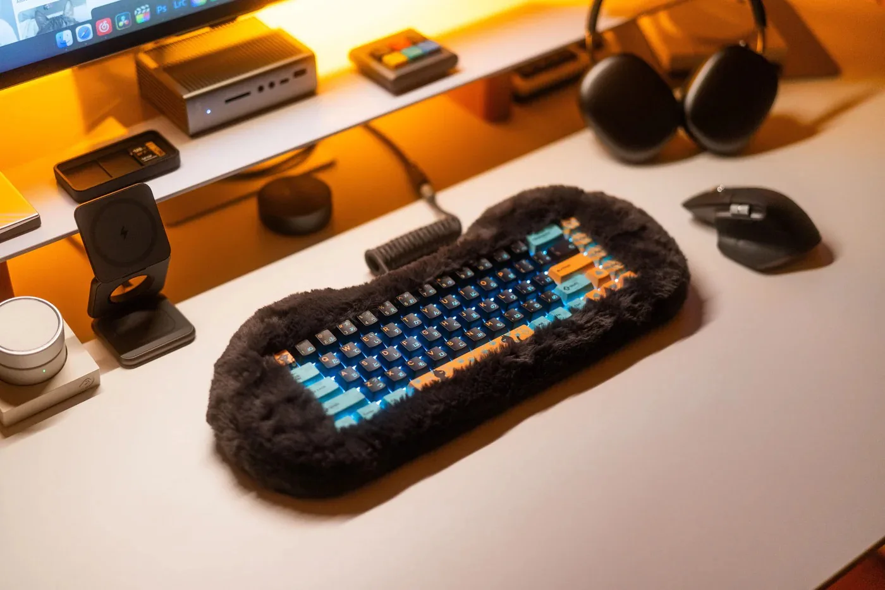

De warm gekleurde toetsen van de [Petbrick 65](https://store.dry---studio.com/products/dry-studio-petbrick-65?variant=50754374959377) zijn omringd door een zachte rand, die hetzelfde moet voelen als een Jellycat-knuffel. Volgens de ontwerpers is het apparaat specifiek bedoeld om te kunnen aaien - wat toch een fijne troost kan bieden tijdens het doomscrollen op sociale media.

> [!NOTE]
> Dit artikel verscheen eerder op [Bright](https://www.bright.nl/nieuws/1245855/eindelijk-een-aaibaar-toetsenbord.html).

Je hoeft je overigens geen zorgen te maken dat het toetsenbord smoezelig wordt: het zachte omhulsel zit met magneten aan het toetsenbord vast, zodat je het makkelijk kunt losmaken om af en toe te wassen.

Het Japanse Dry Studio staat al langer bekend om zijn opmerkelijke ontwerpen van computeraccessoires. Ontwerper Stan Fu wil "uitging geven aan radicale en diverse subculturen waar de jongere generatie om geeft".

## 240 dollar

Het aaibare toetsenbord heeft geen numpad aan de rechterzijde. Wel zit er een batterij van 5.000mAh in voor draadloos gebruik, met bovenaan een USB-poort om op te laden of bedraad te typen. De gadget wordt verkocht voor 240 dollar, de oplage is vrij beperkt omdat ieder exemplaar met de hand wordt gemaakt.
