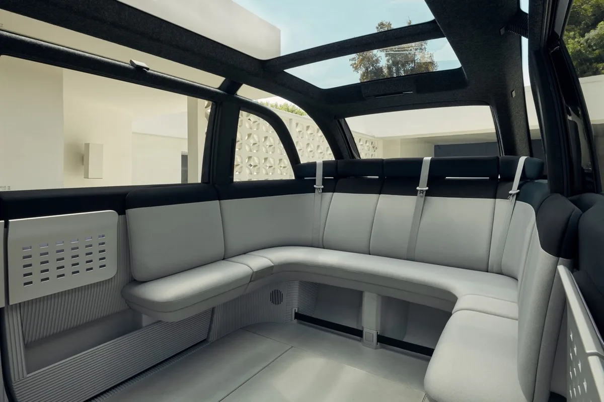
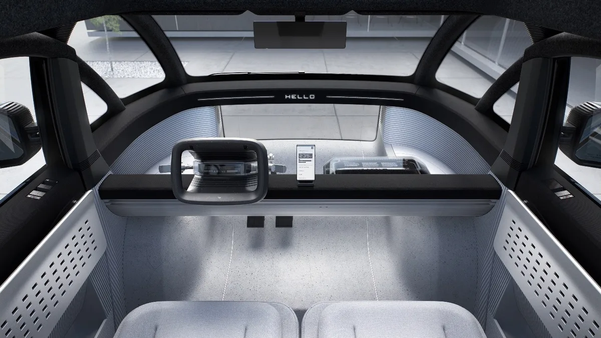

**Elektrisch rijden**

> [!NOTE]
> Dit artikel verscheen eerder op [Bright](https://www.bright.nl/nieuws/1123860/elektrische-bus-canoo-gaat-vanaf-2021-de-weg-op.html).

De [Canoo](https://www.canoo.com/) moet een betaalbare elektrische wagen met veel ruimte worden. De bus kan alleen via een lease-abonnement worden gehuurd waarvan de maandelijkse tarieven nog niet bekendgemaakt zijn. Ook is nog niks gezegd over een uiteindelijke lease in Nederland: in 2021 zal de Canoo eerst in acht Amerikaanse steden worden aangeboden.

In de bus is plek voor zeven mensen, onder andere op een achterbank in de vorm van een halve cirkel. De stoelen voorin zitten aan elkaar bevestigd, waardoor je in feite één grote bank hebt.

Het dashboard is zeer minimaal, met alleen een stuur en een klein aanraakscherm met informatie. Het stuur is niet rechtstreeks met de wielen verbonden, maar stuurt een elektronisch signaal om te bewegen.

## Deels autonoom

In de Canoo zitten twaalf sensoren en zeven camera's die de weg nauwlettend in de gaten houden, waardoor het voertuig deels autonoom kan rijden. Volledig zelfrijdend is de bus op het moment echter nog niet.

De auto waarschuwt in bepaalde gevaarlijke situaties, maar houdt met camera's ook de bestuurder in de gaten. Ziet de auto dat je over je schouder hebt gekeken, dan word je niet gewaarschuwd over wat er daar op het moment gebeurt.

Volgens Canoo kan de bus op een volle accu meer dan 400 kilometer rijden en is hij binnen een half uur meer dan 80 procent opgeladen.

## Hoe bevalt de Tesla Model 3?

[Bekijk ingesloten media](https://www.youtube.com/embed/RtBukp7cnuE?autoplay=1&modestbranding=1)

**[Volg Bright op YouTube](https://bit.ly/brighttv) voor meer tech-video's**
