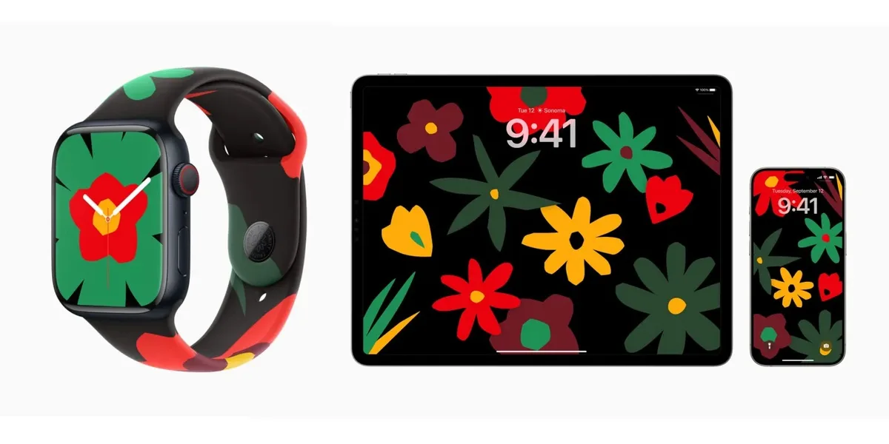

De nieuwe functie, getiteld Stolen Device Protection, voegt een extra beveiligingslaag toe voor als je apparaat is gestolen. Voor het bekijken van opgeslagen wachtwoorden is dan bijvoorbeeld Face ID vereist.

> [!NOTE]
> Dit artikel verscheen eerder op [Bright](https://www.bright.nl/nieuws/1174348/extra-beveiliging-tegen-iphone-dieven-komt-er-aan-update-dropt-volgende-week.html).

Probeert een mogelijke dief gegevens bij je Apple ID aan te passen, dan duurt het even tot dit goed wordt doorgevoerd. De [iPhone](https://www.bright.nl/onderwerpen/iphone) kijkt daarbij naar diens locatie: ligt hij op de keukentafel van een bekende locatie, dan kun je onverhinderd je accountinformatie aanpassen.

## Black History Month

Het nieuwe iOS 17.3 introduceert ook andere functies, zoals een nieuwe, door Apple ontworpen achtergrond voor je toestel. Het bloemenontwerp vertegenwoordigt voor Apple pan-Afrikaanse cultuur en de strijd van meerdere generaties tegen onrecht.

De achtergrond heeft ook een bijbehorend horlogebandje voor de [Apple Watch](https://www.bright.nl/onderwerpen/apple-watch). Daarmee lijkt de techreus stil te staan bij Black History Month, een jaarlijkse Amerikaanse herdenking van belangrijke zwarte Amerikaanse sleutelfiguren en gebeurtenissen.

Afgelopen jaar deed Apple hetzelfde: ook toen verkocht het bedrijf een Black Unity-horlogeband met bijbehorende wallpaper op iPhone, iPad en Apple Watch.

## Uiterlijk 23 januari

Hoewel we nu weten dat Apples update volgende week verschijnt, is er geen exacte dag aangekondigd. Het is geheid voor 23 januari: dat is de datum waarop de bijbehorende horlogeband verkocht zal worden.
