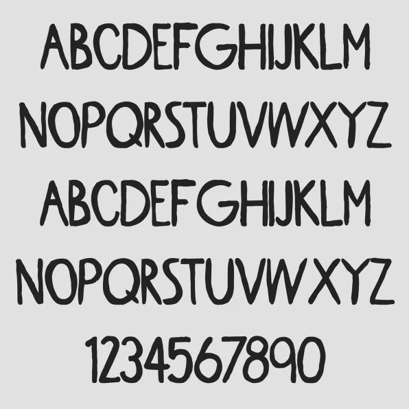

Greta Grotesk bestaat alleen uit hoofdletters en bevat het volledige alfabet, alle cijfers en een beperkt aantal speciale symbolen. De tekenset is samengesteld door het klimaatgerichte designbureau Uno, dat zegt geïnspireerd te zijn door het activisme van Thunberg.

> [!NOTE]
> Dit artikel verscheen eerder op [Bright](https://www.bright.nl/nieuws/1124128/fans-maken-lettertype-van-greta-thunbergs-handschrift.html).

"Al vanaf het eerste moment waarop ik haar protestbord zag, was ik onder de indruk van het ontwerp en de duidelijke boodschap", vertelt hoofdontwerper Tal Shub aan [Fast Company](https://www.fastcompany.com/90409174/theres-now-a-free-font-based-on-climate-strike-hero-greta-thunbergs-handwriting). "Het leek me gepast om de letters van die krachtige boodschap voor iedereen beschikbaar te maken."

Shub liet zijn team foto’s van Thunberg’s teksten opzoeken, waarvan de letters werden verzameld. Foto’s van twee borden hadden voldoende letters om het gros van het lettertype mee samen te stellen.

De letters werden overgetrokken en in een bestand verwerkt. Daarbij moest de grootte en dikte van iedere letter worden afgestemd, zodat een tekst er natuurlijk uitziet.

## Imperfecties namaken

"We wilden niet een mooi afgewerkt letterype maken, maar alle imperfecties namaken", aldus Shub. "Dit is een 'decoratief lettertype' dat je niet in bijvoorbeeld een zakelijk document moet gebruiken. Maar hij is perfect voor een poster."

het lettertype is gratis [te downloaden](https://drive.google.com/file/d/1f6JdU9jG6J69mngi5-xYwbKXtCcnslJo/view) en kan in bijvoorbeeld macOS en Windows worden geïnstalleerd.
