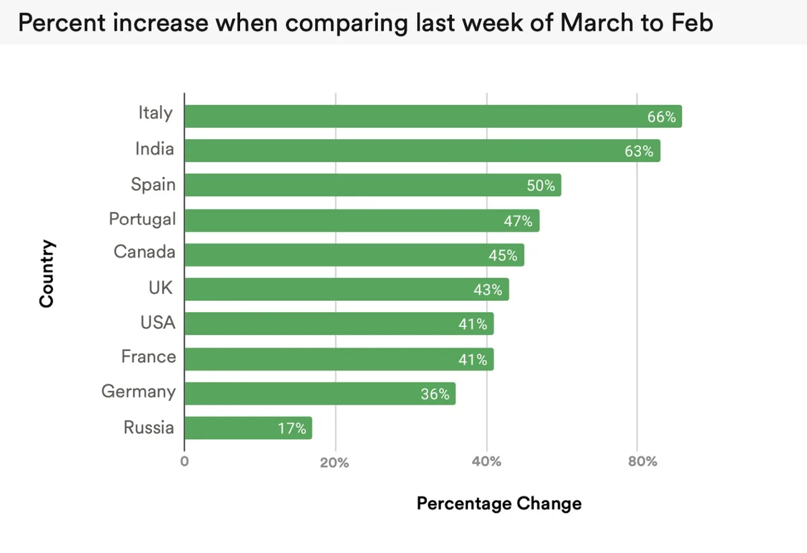

**Popcorn Time**

> [!NOTE]
> Dit artikel verscheen eerder op [Bright](https://www.bright.nl/nieuws/1126250/films-vaker-illegaal-gedownload-tijdens-coronacrisis.html).

Dat blijkt uit onderzoek van marktonderzoeker MUSO, dat [Torrent Freak](https://torrentfreak.com/covid-19-measures-boosted-visits-to-film-piracy-sites-by-over-50-new-data-show-200427/) heeft ingezien. In de onderzochte gebieden zou de hoeveelheid illegale downloads met gemiddeld 50 procent zijn gestegen.

De grootste groei zat in Italië, waar 66 procent meer illegaal werd gedownload. Het land bevond zich door de coronacrisis recent ook in een complete lockdown. In India werd 63 procent meer gedownload, terwijl in Spanje een toename was van 50 procent.

## Films

Volgens MUSO is er nooit eerder sprake geweest van zo'n flinke stijging in een korte periode. "Naarmate meer landen een lockdown afdwingen en burgers thuis moeten blijven, groeit de vraag naar illegale content exponentieel", aldus de onderzoeker. De vraag naar illegale films is vooral gestegen: het aantal downloads voor series is minder rap gestegen, al deelt MUSO daar geen exacte cijfers over.

## Deze series kun je nu (legaal) streamen

[Bekijk ingesloten media](https://www.youtube.com/embed/W1YSc9smixI?autoplay=1&modestbranding=1)

## Popcorn Time

Bij het onderzoek werd bezoek aan illegale downloadsites gemeten, maar ook gebruik van streamingdiensten zoals Popcorn Time werd in de resultaten meegenomen.

Die forse groei zit trouwens niet alleen in de illegale hoek: streamingdiensten zoals Netflix en Disney+ zagen het aantal abonnees en kijkers de afgelopen weken stijgen, waardoor sommigen zelfs hun [videokwaliteit hebben verlaagd](https://www.bright.nl/nieuws/artikel/5063086/netflix-verlaagt-beeldkwaliteit-door-coronacrisis). Op die manier hopen de bedrijven de druk op het wereldwijde internet te verlagen.

## Geld besparen op streamingdiensten

[Bekijk ingesloten media](https://www.youtube.com/embed/E6Lb475B5ao?autoplay=1&modestbranding=1)

**[Volg Bright op YouTube](https://bit.ly/brighttv) voor meer tech-video's**
