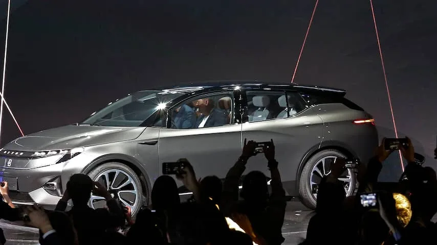
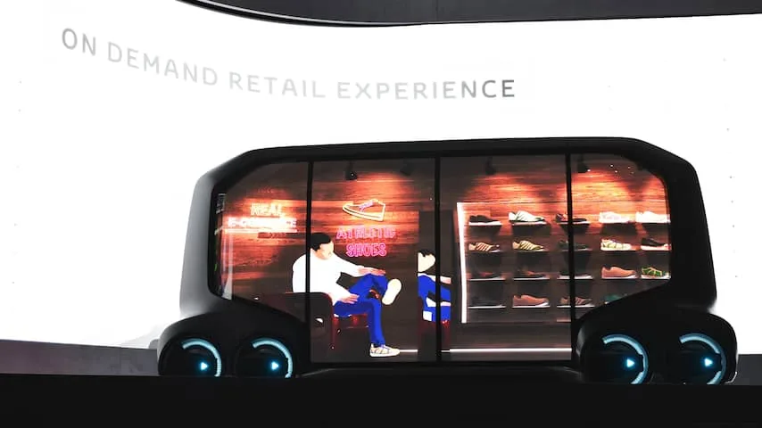

**Het lijkt er op dat de auto in de nabije toekomst vol komt te hangen met camera's, beeldschermen en andere apparatuur om onze levens te verbeteren. Verandert de auto daarmee in de volgende grote gadget, zoals in 2007 ook gebeurde bij de telefoon?**

> [!NOTE]
> Dit artikel verscheen eerder op [NU.nl](https://www.nu.nl/weekend/5095463/gaat-de-auto-op-de-schop-het-is-de-volgende-technologische-revolutie.html).

De auto van de toekomst speelt precies in op je verwachtingen. Bij het instappen ziet hij met een camera wie er gaat zitten, zodat de stoel alvast goed wordt afgesteld. Vervolgens vertelt een virtuele computerstem wat er op de agenda staat, waarna je zelfrijdend richting kantoor gaat. Ondertussen kijk je nog even een aflevering van je favoriete serie op het dashboard, dat inmiddels bestaat uit één groot computerscherm. Is dit een droom? Of nabije realiteit?

Tijdens de gadgetbeurs CES in Las Vegas stond afgelopen week één onderwerp centraal: de auto. Grote techbedrijven zoals Intel en Samsung presenteerden hun ideeën voor zelfdrijdende auto's, terwijl autobedrijven hun eigen slimme gadgets voor in het vervoer lieten zien.

Dat is niet zomaar, vertelt BlackBerry-CEO John Chen in een gesprek met [NU.nl](http://nu.nl). "Ik denk dat auto's de volgende grote technologische revolutie zijn". Zijn bedrijf kondigde onlangs een samenwerking aan met het Chinese internetbedrijf Baidu om zelfrijdende auto's te ontwikkelen. Mary Barra, CEO van autogigant General Motors, heeft meermaals gezegd dat autobedrijven "meer gaan innoveren in de komende vijf jaar dan in de afgelopen vijftig jaar".

Volgens hoogleraar Automotive Maarten Steinbuch aan de Technische Universiteit Eindhoven komt de ontwikkeling van technologie in auto's in een stroomversnelling, omdat elektronica steeds goedkoper wordt. "Een CD-speler kostte in 1990 nog zo'n 500 euro, nu koop je een DVD-speler voor 30 euro", aldus Steinbuch. "Camera's in smartphones zijn nu ook beter dan de beste camera's van 15 jaar geleden."

_Byton — Beeld: ANP_

_Foto: De op CES gepresenteerde Byton_

"Je moet niet denken dat autobedrijven in de afgelopen jaren helemaal niet hebben geïnnoveerd" nuanceert Autoweek-redacteur Roy Kleijwegt. "Automaker Tesla was echt niet verder met zijn ontwikkelingen dan bijvoorbeeld Mercedes, maar traditionele automakers benaderen hun ontwikkelingen anders. Ze doen er langer over om nieuwe technologie te introduceren."

Volgens Kleijwegt kan een bedrijf zoals Mercedes een dodelijk ongeluk met een eigen zelfrijdende auto niet veroorloven, terwijl partijen zoals Tesla daar anders mee omgaan. "De baas van Tesla kan op zo'n moment benadrukken dat de autosoftware juist veel ongelukken heeft voorkomen. Mercedes moet op zijn beurt rekening houden met bijvoorbeeld boze aandeelhouders en grote verliezen."

## Vol met camera's

Eén van de technologieën waar die autobedrijven op het moment naar kijken zijn gezichtsscanners. Hiermee kan de autodeur worden ontgrendeld als de chauffeur hem probeert te openen, of worden de instellingen aangepast op basis van wie instapt. De camera’s hiervoor zijn de afgelopen jaren beter en goedkoper geworden, omdat camera’s steeds belangrijker zijn geworden in smartphones, die ook gezichtsherkenning inzetten.

Autofabrikant Byton demonstreerde tijdens CES een auto met camera's in plaats van spiegels, waarvan het beeld op een groot scherm wordt getoond. Automobilisten hoeven hierdoor niet meer de spiegels af te stellen en hebben ook geen last meer van regen of vorst op de glazen. De eerste Byton moet in 2019 de weg op gaan.

Tegelijkertijd kondigt de ene na de andere automaker ondersteuning aan voor slimme spraakdiensten van Amazon en Google. Deze maken het mogelijk om met je auto te praten, om bijvoorbeeld met een stemcommando je ruitenwissers te starten of de temperatuur van de airco aan te passen.

"Grote ontwikkelingen beginnen altijd bij het duurste segment", aldus Kleijwegt. "De eerste Cruise Control zonder rem werd bijvoorbeeld in 1995 geïntroduceerd door Mitsubishi. Mercedes had de eerste volledige variant in 1999. Inmiddels zit deze technologie ook bij Volkswagen in een Polo, maar je vindt het na 19 jaar nog steeds niet in een Up."

## Zelfrijdende auto's

Maar hoe zit dat dan met technologie voor zelfrijdende auto’s? Dat is op tech- en autobeurzen al jarenlang een veelbesproken ontwikkeling. Op termijn zouden mensen niet langer zelf hoeven rijden, maar brengt de computer ze automatisch naar hun bestemming.

Tech- en autobedrijven hopen dat de eerste zelfrijdende auto rond 2020 de weg op gaat, al zal dat ook deels afhangen van hoe snel wetgeving voor de autonome voertuigen wordt aangenomen. Nederland wordt in elk geval door adviesorganisatie KPMG gezien als "heel geschikt".

Door de komst van zelfrijdende auto's denken bedrijven ook na over wat chauffeurs nu in het verkeer kunnen doen. Zij hoeven op termijn niet meer op de weg te letten, waardoor ze tijd hebben voor andere activiteiten. Ford heeft al een patent op een slimme filmprojector voor in de auto, waarbij de voorruit als beeldscherm wordt gebruikt.

[Bekijk ingesloten media](https://content.jwplatform.com/players/yymLNSrR-whqXCOFb.html)

## Zelfrijdende schoenenwinkel

Concepten laten zien hoe auto's van binnen veranderen door zelfrijdsoftware. Toyota onthulde op CES een slimme bus, die bedrijven kunnen inrichten als een rijdend kantoor of een winkel. Zo kan een webshop bijvoorbeeld een assortiment aan sneakers naar een klant toesturen, die daarna in de zelfrijdende bus gekozen en afgerekend kunnen worden.

_Toyota — Beeld: ANP_

_Foto: Een zelfrijdende schoenenwinkel van Toyota op CES_

De zelfrijdende auto is geen nieuw idee, maar komt nu wel dichterbij. "Wij hebben al een tijd de sensoren die deze auto's gebruiken in massaproductie", vertelt woordvoerder Philippine Auge van de Franse fabrikant Valeo. Daarmee is het voor automakers nu al geen probleem om op grote schaal de benodigde onderdelen te bemachtigen.

## Vijf jaar

Als we automakers en techbedrijven mogen geloven, dan is de ‘auto van de toekomst’ ontzettend dichtbij. Slimme spraakassistenten zijn vanaf dit jaar al in dashboards te vinden, terwijl in 2019 de eerste voertuigen met gezichtsherkenning al de markt op zouden gaan.

Het is nog even de vraag of we ook al zo snel de zelfrijdende auto kunnen verwachten. Optimistische partijen hopen in 2020 al modellen de weg op te sturen, maar in veel landen is de wetgeving hiervoor nog niet goed vastgelegd. Waarschijnlijk moeten we nog iets langer blijven dromen.

**[Lees meer achtergrondverhalen in NUweekend](http://www.nu.nl/weekend)**
