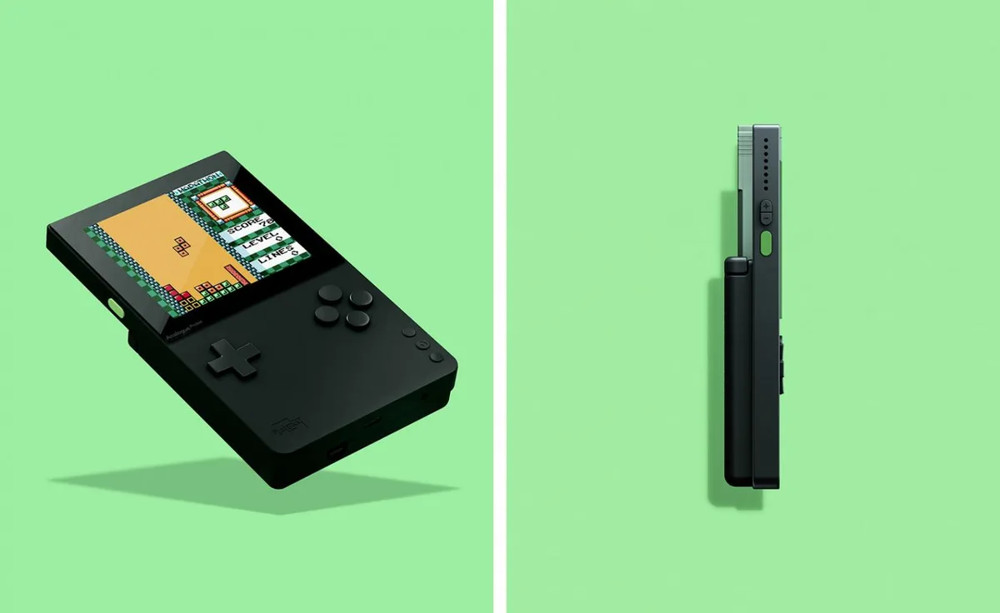

**Analogue Pocket**

> [!NOTE]
> Dit artikel verscheen eerder op [Bright](https://www.bright.nl/nieuws/1124100/game-boy-krijgt-na-30-jaar-een-officieuze-opvolger.html).

De Analogue Pocket ziet er uit als een Game Boy die naar moderne maatstaven is gemaakt. Het apparaatje heeft nog steeds dezelfde vormfactor, maar dan met strakkere lijnen en een compacter ontwerp.

Bonusvoordeel: deze Game Boy heeft een scherp lcd-kleurenscherm, dat ook nog eens wordt verlicht. Je hoeft hem dus niet onder een lamp te houden om je games goed te bekijken. Hij is ook voorzien van moderne gemakken zoals een usb-c-oplaadpoort en een oplaadbare accu.

## Ook spellen voor Sega en Atari

De handheld ondersteunt ook games van andere bedrijven dan Nintendo. Steek de juiste omvormer in de cartridgepoort en je kunt er ook spellen voor de Sega Game Gear, SNK Neo Geo Pocket Colour en Atari Lynx op draaien.

De Analogue Pocket is in de loop van 2020 te koop, voor 199 dollar.

## Eerder gekochte cartridges

Het wemelt op internet van handhelds waarop je oude games kunt afspelen, maar deze gebruiken meestal emulatie om online gedownloade roms te spelen. De Analogue Pocket speelt je games rechtstreeks van de cartridge af, waardoor jouw eerlijk gekochte spelletjes er op draaien.

Of Nintendo erg blij zal zijn met deze officieuze opvolger, valt te betwijfelen. Hij lijkt in elk geval heel bewust niet dezelfde naam als de oude klassieker te hebben om merkrechtproblemen te voorkomen. Daarnaast draait hij alleen cartridges die Nintendo officieel niet meer ondersteunt.

## Specificaties

De Analogue Pocket heeft een 3,5 inch lcd-scherm van 1600 bij 1440 pixels, meer dan tien keer het aantal pixels dan de originele Game Boy. Verder heeft de handheld een sd-kaartingang, een koptelefoonpoort en een ingebouwde synthesizer.

Analogue maakt al langer retrospelcomputers die oude cartridges kunnen afspelen. De revisies van de oude NES en Super NES van het bedrijf laten je hierdoor gamen op een tv met een HDMI-aansluiting.

## Sega's mini-console verslaat die van Nintendo en Sony

[Bekijk ingesloten media](https://www.youtube.com/embed/3WrayBxJCaA?autoplay=1&modestbranding=1)

**[Volg Bright op YouTube](https://bit.ly/brighttv) voor meer tech-video's**
