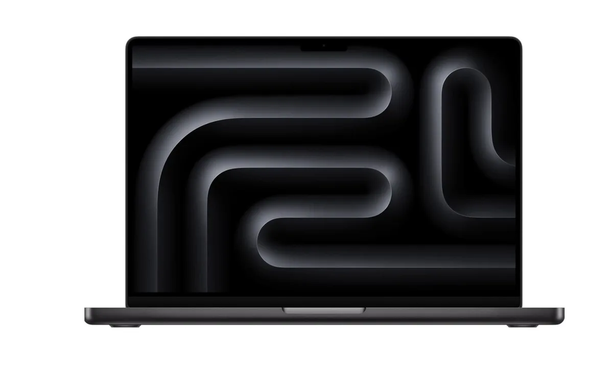

Waar doe je goed aan bij het kopen van een nieuwe MacBook? Apple bracht verspreid over het jaar verschillende laptops uit. De een iets lager in prijs dan de ander of juist een stuk sneller. Tweakers legt uit welke MacBook toch echt hun favoriet blijft.

> [!NOTE]
> Dit artikel verscheen eerder op [AD](https://www.ad.nl/tech/goedkoper-maar-wel-minder-snel-deze-laptop-van-apple-is-de-beste-koop~a656cb6e/).

Apple heeft verspreid over het jaar een aantal nieuwe MacBooks uitgebracht. De MacBook Air kreeg een nieuw jasje en van de MacBook Pro verschenen twee nieuwe laptops met snellere chips.

Een nieuwe laptop schaf je niet zomaar aan en de laptops van Apple zijn zeker niet goedkoop. De term ‘goedkoopste’ gebruiken we daarom wat losjes. Hoewel de onderstaande MacBook één van Apples meest betaalbare opties is, betaal je nog steeds aanzienlijk meer dan voor sommige Windows-laptops.

Onderstaande MacBooks zijn geselecteerd door de redactie van Tweakers, die het hele jaar door [honderden apparaten](https://tweakers.net/best-buy-guide/laptops/beste-apple-macbook) test om de beste te selecteren.

## De beste koop: Apple MacBook Air 2024 met een 13 inch-scherm

Apple MacBook Air 2024 met 13 inch-scherm. © Tweakers

De MacBook Air is al langere tijd favoriet van Tweakers. De laptop heeft met zijn M3-processor niet de snelste Apple-chip, maar biedt nog steeds meer dan genoeg snelheid voor dagelijks gebruik.

Tweakers raadt hier de goedkoopste variant van de Air aan, die inmiddels standaard 16 gigabyte aan werkgeheugen heeft. Op dit moment betaal je daarvoor 1059 euro.

Je zou ook kunnen kiezen voor een ouder model met een M2-processor, die zo’n 80 euro goedkoper is. Maar, zegt Tweakers, voor een paar tientjes extra heb je wel een laptop die 20 procent sneller is en snellere wifi biedt (als je router deze snellere wifi ook ondersteunt).

Met de MacBook Air met M3-chip kun je twee externe schermen aansluiten, terwijl dit bij het oudere model met de M2-chip beperkt is tot één scherm. Het scherm dat in de laptop zit, is scherp en geeft mooie kleuren weer. Een ander voordeel is dat de laptop geen ventilator heeft voor koeling en dus ook geen herrie maakt. Hij bevat onderdelen die de warmte intern verspreiden en naar buiten afvoeren.

De accuduur is met 15,5 uur vrij lang, dus je kunt een lange tijd werken zonder de laptop op stroom aan te hoeven sluiten.

## Beste pro-laptop: MacBook Pro 2024 met 14 inch-scherm

MacBook Pro 2024 met 14 inch-scherm. © Tweakers

Het is lastig een specifieke MacBook Pro aan te raden, omdat iedere professionele gebruiker zijn eigen voorkeuren heeft en de modellen vrij veel van elkaar verschillen. Uiteindelijk wijst Tweakers de MacBook Pro aan met 14 inch-scherm, met 512 gigabyte opslag en 24 gigabyte werkgeheugen. Deze laptop kost momenteel 2239 euro.

Deze laptop heeft een M4 Pro-processor die 63 procent sneller is dan de M3 Pro-chip van een generatie eerder. Verder onderscheidt de laptop zich met zijn mini-ledbeeldscherm, dat in direct zonlicht heel fel kan zijn en ’s avonds laat juist heel donker.

In tegenstelling tot de MacBook Air heeft deze laptop ventilatoren om zichzelf koel te houden. Hij kan bij zware opdrachten wat geluid maken. Veel herrie is het niet, maar deze laptop is wel iets luider dan de MacBook Pro met M3-chip.

## Verantwoording

In deze rubriek schrijven we over technologische apparaten die door Tweakers zijn beoordeeld. Bij Tweakers wordt elk apparaat onderzocht door het testlab, waarbij onder andere accuduur, snelheid en andere belangrijke aspecten worden getoetst.

De redactie van Tweakers is volledig onafhankelijk. Bedrijven betalen op geen enkele manier om in deze artikelen behandeld te worden.
