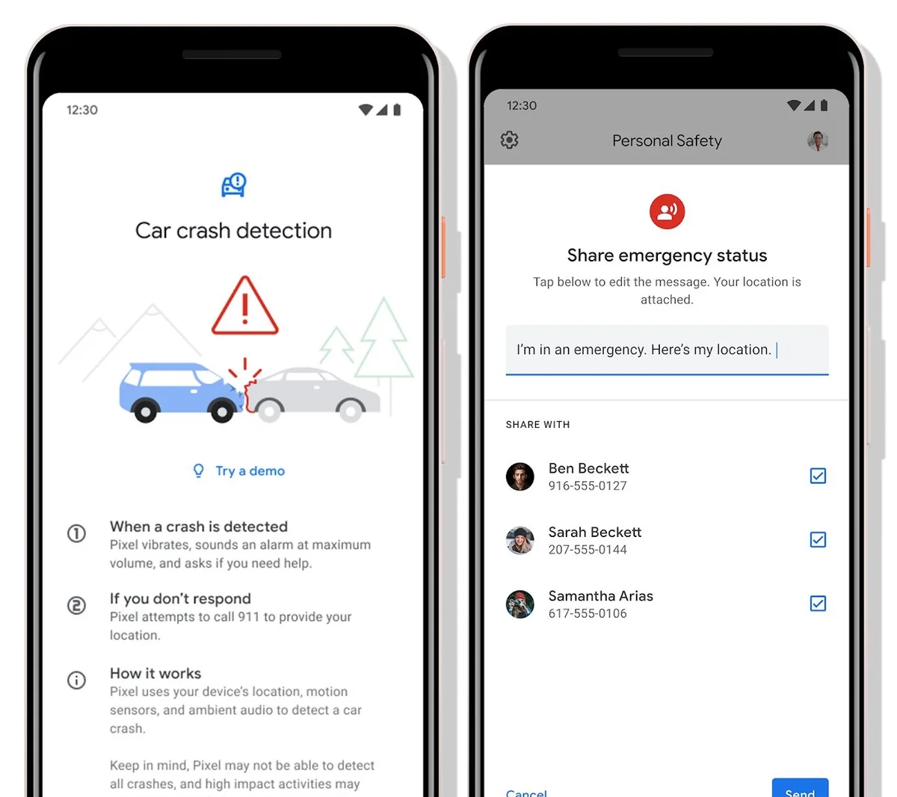

**Persoonlijke veiligheid**

> [!NOTE]
> Dit artikel verscheen eerder op [Bright](https://www.bright.nl/nieuws/1123915/google-app-belt-automatisch-noodnummer-bij-auto-ongeluk.html).

De Persoonlijke Veiligheid-app draait in de achtergrond van [Google Pixel-](https://www.bright.nl/nieuws/artikel/4850736/google-onthult-nieuwe-pixel-4-telefoon-op-15-oktober)telefoons. Met behulp van de gps-locatie, bewegingssensoren en microfoon van je smartphone ziet de app wanneer je door een botsing plotseling tot stilstand komt.

De telefoon gaat trillen en zet het volume op zijn hoogst, om vervolgens te vragen of je hulp nodig hebt. Als er geen reactie komt, wordt het alarmnummer automatisch gebeld en stuurt je telefoon je huidige locatie door.

De app is nog niet te downloaden, maar Google plaatste per ongeluk alvast de Play Store-beschrijving, die [XDA Developers](https://www.xda-developers.com/google-pixel-car-crash-detection/) opmerkte. Het is nog de vraag wanneer de app zal worden uitgebracht. Vermoedelijk gebeurt dat in oktober als de nieuwe Pixel-telefoons worden gepresenteerd.

De Play Store-omschrijving van de app is in het Nederlands, wat doet vermoeden dat hij ook hier te downloaden zal zijn. De ongelukdetectie zal volgens Google echter alleen in de Verenigde Staten werken. In andere landen kunnen gebruikers snel informatie delen tijdens noodgevallen.

[Bekijk ingesloten media](https://www.youtube.com/embed/344s?autoplay=1&modestbranding=1)

## Google Pixel 3a: beste koop onder de smartphones?

**[Volg Bright op YouTube](https://bit.ly/brighttv) voor meer tech-video's**
