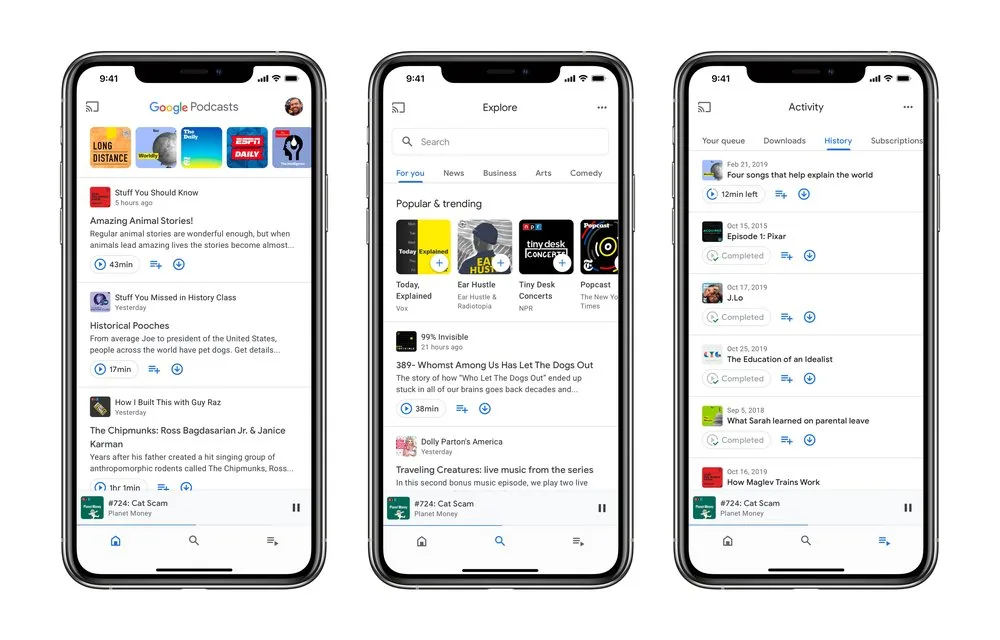

**Google Podcasts**

> [!NOTE]
> Dit artikel verscheen eerder op [Bright](https://www.bright.nl/nieuws/1125901/google-brengt-podcast-app-nu-ook-uit-voor-iphones.html).

Dat heeft de zoekgigant aangekondigd op [zijn blog](https://www.blog.google/products/search/discover-podcasts-youll-love-with-google-podcasts-now-on-ios/). De web-app van Google Podcasts heeft nu ook ondersteuning voor abonnementen, zodat je daar je vaste shows snel kunt vinden en beluisteren.

De vernieuwde app heeft drie tabbladen: Thuis, Ontdekken en Activiteit. In de Thuis-tab vind je nieuwe afleveringen van alle podcasts waar je een abonnement op hebt, terwijl in Ontdekken nieuwe programma’s worden aangeraden op basis van je interesses.

Bij het tabblad Activiteit vind je je huidige wachtrij en geplande downloads. Hier kun je ook je geschiedenis induiken, om te zien welke afleveringen je eerder hebt beluisterd.

## Android later deze week

Het herontwerp is al te vinden in de zojuist uitgebrachte iOS-apps. Android-bezitters zullen in de loop van de week de update ook tot hun beschikking krijgen.

De app heeft ook ondersteuning voor notificaties, zodat je meteen bericht krijgt bij een nieuwe aflevering. Een vergelijkbare functie is al langer op YouTube te vinden, waar gebruikers het belletje kunnen aanzetten voor meldingen bij video’s.

Afleveringen kunnen ook automatisch worden gedownload - waarbij je kunt instellen om alleen op wi-fi te downloaden, of ook op 4G. Het is per podcast in te stellen waarvan je afleveringen meteen wil downloaden. Daarnaast is het mogelijk om beluisterde afleveringen na een bepaalde periode te wissen.

[**Luister ook de Bright Podcast**](https://bit.ly/luisterbright)
