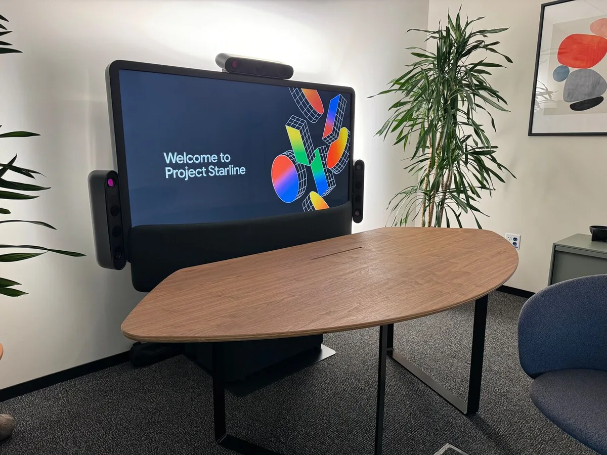

In een geheime kamer diep in Googles hoofdkantoor mochten we het nieuwe Project Starline proberen: een nieuwe vorm van videobellen waarbij het voelt alsof je echt bij elkaar in de kamer zit.

> [!NOTE]
> Dit artikel verscheen eerder op [AD](https://www.ad.nl/tech/google-brengt-videobellen-naar-hoger-niveau-het-is-net-alsof-je-met-elkaar-in-de-kamer-zit~a97aaf4f/).

De opstelling van Starline is eigenlijk best simpel: een groot televisiescherm, met aan weerszijde speakers en bovenop een groot, pilvormig apparaat vol met camera’s en sensoren. Het lijkt op een groot videobelscherm zoals je nu al op kantoren ziet, maar het verschil wordt meteen duidelijk als het gesprek start en je de andere beller ziet.

Hoewel het scherm plat is, lijkt het alsof je naar een persoon in drie dimensies kijkt. Alsof je naar een 3D-bioscoopscherm kijkt, maar dan zonder dat daar een brilletje voor nodig is. Van jou en de andere beller worden 3D-modellen gemaakt, die algoritmisch stiekem worden aangepast om de ervaring natuurlijker te maken.

Toen de andere beller zijn hand uitstak, leek het alsof die vlakbij kwam - we konden een virtuele fistbump uitdelen. Daarna bood hij een appel aan die dichtbij genoeg leek om te kunnen aanraken. Dat lijkt simpel, maar is eigenlijk onwijs complex: Starline moet in de gaten houden waar jij en de ander in jullie kamers zitten zodat het lijkt alsof jullie elkaar echt proberen aan te raken.

Deze trucs om je te foppen werken zo goed, dat we tijdens de demo zelfs begonnen te twijfelen over wat echt en wat nep was. Onderaan het scherm van Project Starline zit bijvoorbeeld een soort klein balkonnetje, om te zorgen dat het 3D-model van de andere beller niet gek in de lucht zweeft. Een echt, fysiek balkonnetje - wat we pas zeker wisten nadat we hem even hadden aangeraakt.

Googles experimentele videobelscherm Starline. © Bastiaan Vroegop

## Alsof je elkaar in de ogen kijkt

Nog een belangrijk detail: Het lijkt alsof je elkaar in de ogen kijkt. Bij gewone videovergaderingen kijk je altijd langs elkaar heen, omdat je anders de lens van je webcam in moet kijken. De software van Starline zorgt dat de ogen van jouw 3D-persoon altijd op de andere beller gericht lijken te zijn.

Er is ook veel minder vertraging op de lijn dan bij een reguliere videovergadering. Je kunt snel door elkaar heen praten. Van ongemakkelijke stiltes is hier geen sprake. Al belden we bij onze demo wel met iemand in de kamer naast ons, wat ook een rol kon spelen. Volgens Google is de verbinding net zo snel als ze vanuit Californië bellen naar hun kantoor in Londen, maar we moeten dat zelf nog uitproberen.

Project Starline zal in 2025 als product worden verkocht in samenwerking met fabrikant HP. Hoeveel het systeem gaat kosten werd niet gezegd, maar vermoedelijk gaat het om vele duizenden euro’s. Naast geavanceerde sensoren is immers een speciaal 3D-scherm nodig. Dat is waarschijnlijk ook de reden waarom Google en HP zich eerst op de zakelijke markt richten.

Zelfs al was Starline goedkoper, dan is het huidige project lastig te slijten voor gemiddelde huishoudens. Het scherm is zo groot als een forse televisie, een vereiste zodat het lijkt alsof de andere beller levensgroot is. Je zou dus een hoekje nodig hebben waar je zo’n groot scherm kunt neerzetten. Google zou ooit de sensoren los kunnen verkopen voor bij een tv, maar dan zou je een speciaal 3D-scherm nodig hebben - en 3D-televisies zijn jaren geleden geflopt.

De eerste ervaring was in elk geval precies wat Google beloofde: pas als je het probeert, valt op hoe goed Google je weet te foppen om het gevoel te geven dat je echt naast iemand zit. Het is alsof je naar een hologram in Star Wars kijkt, een stukje sciencefiction dat ineens in de echte wereld mogelijk is. Fantastisch om te gebruiken, maar het zal nog even duren totdat de gemiddelde Nederlander dit zelf kan ervaren.
