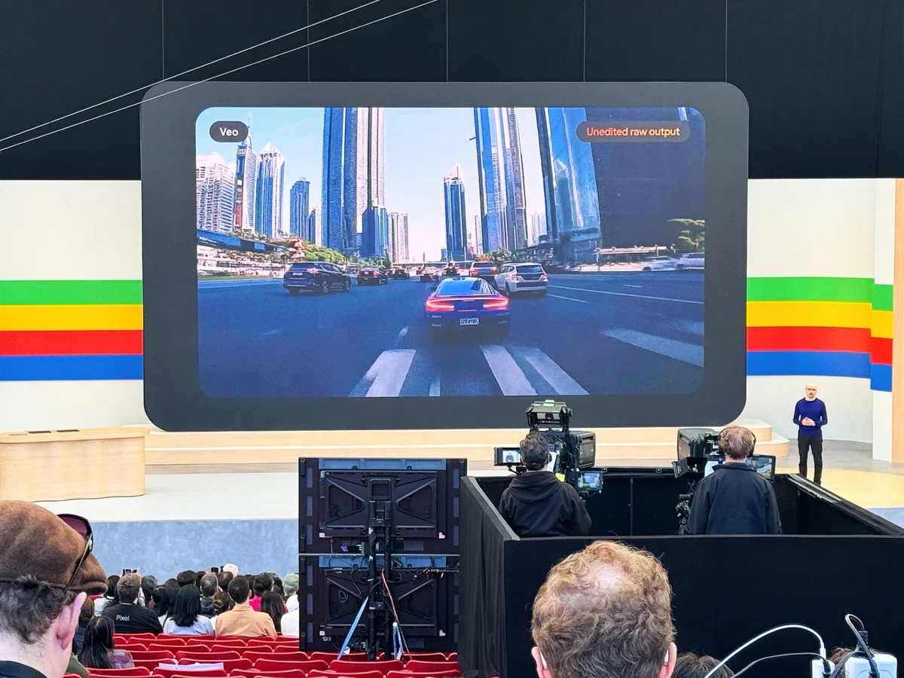

De nieuwe AI-plannen werden onthuld op Google I/O, de jaarlijkse ontwikkelaarsconferentie van de zoekreus. Googles nieuwe videogenerator heet Veo. Het is Googles 'meest capabele generatiemodel voor video', dat in staat is om video’s met een resolutie van 1080p te maken. Deze filmpjes kunnen langer dan een minuut worden - een sneer richting concurrent [OpenAI](https://www.bright.nl/organisaties/openai), wiens AI-model [Sora](https://www.bright.nl/nieuws/1189278/nu-te-kijken-eerste-korte-films-gemaakt-met-sora-van-openai.html) maximaal zestig seconden aan video maakt.

> [!NOTE]
> Dit artikel verscheen eerder op [Bright](https://www.bright.nl/nieuws/1199797/google-onthult-nieuwe-ai-plannen-dit-zijn-de-meest-opvallende-functies.html).

Je vertelt Veo in een chatscherm wat voor video hij moet maken, waarbij je ook kunt vertellen wat voor visuele stijl er gebruikt moet worden. Volgens Google snapt de AI ook wat een timelapse of luchtshot is, waardoor je tot in de kleinste details bepaalt hoe het eindresultaat er uitziet.

Acteur en filmmaker Donald Glover heeft alvast met Veo mogen spelen om een [film](https://www.bright.nl/onderwerpen/film) te maken. Het is een voorproefje van wat er precies mogelijk zal zijn: op het moment is Veo alleen beschikbaar voor een kleine groep makers.

Geïnteresseerden kunnen zich aanmelden voor een wachtlijst. Later zal Veo ook worden geïntegreerd in [YouTube Shorts](https://www.bright.nl/videos/1153548/youtube-shorts.html), zodat je daar makkelijk video’s voor kunt maken.

_[Bright](https://www.bright.nl/) is aanwezig bij de presentatie van Google in Californië._

## Fotorealistische afbeeldingen

Google heeft ook zijn afbeeldingengenerator Imagen een update gegeven. Volgens het bedrijf kan Imagen 3 fotorealistische afbeeldingen maken zonder gekke artefacten waaruit blijkt dat het een AI-afbeelding is. Ook bijzonder: de AI kan nu natuurlijk ogende teksten maken zonder fouten er in, iets waar concurrerende [software](https://www.bright.nl/onderwerpen/software) vaak moeite mee heeft.

Net als Veo is het nieuwe Imagen 3 op het moment beschikbaar voor een kleine groep contentmakers. Geïnteresseerden kunnen zich aanmelden voor een wachtlijst om later toegang te krijgen. Imagen 3 komt later naar Gemini en ook Vertex AI - een open model waarbij iedereen Googles AI-diensten kan integreren.

## Project Astra: universele assistent

Google zegt ook te werken aan een universele assistent die met [kunstmatige intelligentie](https://www.bright.nl/onderwerpen/kunstmatige-intelligentie) werkt. Project Astra volgt waar je naar kijkt en hoe je praat, om natuurlijk en snel op je vragen te reageren. De AI kan bijvoorbeeld vertellen waar je jouw bril hebt laten liggen, of wat een leuke bandnaam is voor een groep mensen waar hij naar kijkt.

## Gemini wordt sneller en slimmer

AI-assistent Gemini krijgt een snellere variant genaamd Gemini 1.5 Flash. Deze zal bestaan naast het reguliere Gemini 1.0 en Gemini 1.5 Pro. De nieuwe Flash-versie kan veel sneller opdrachten verwerken, wat hem ideaal maakt voor snel werk en diensten die veel AI-verwerkingen achter elkaar willen doen.

Bij zowel 1.5 Pro als 1.5 Flash is de hoeveelheid 'context windows' verdubbeld naar twee miljoen. Dit bepaalt hoe diep de AI in data kan graven om je een goed antwoord te geven - feitelijk is het hoe ver de AI kan 'terugdenken'. Het maakt de AI slimmer en zorgt dat hij genuanceerdere antwoorden kan geven.

Google geeft ook de mobiele app van Gemini op zowel [Android](https://www.bright.nl/onderwerpen/android) als iOS binnenkort [nieuwe mogelijkheden](https://www.bright.nl/nieuws/1199908/google-laat-je-praten-met-gemini-op-android-n-ios-dit-moet-je-weten.html), waaronder een nieuwe Live-modus waarmee je kunt praten met de chatbot.

## AI in de zoekmachine

Google kondigde ook aan de [nieuwe AI-functies in zijn zoekmachine](https://www.bright.nl/nieuws/1199800/google-gaat-voor-je-zoeken-met-ai-met-deze-grote-update-van-de-zoekmachine.html) uit te rollen naar alle Amerikaanse gebruikers. Binnenkort volgen meer landen, maar het is nog niet bekend wanneer Nederland aan de beurt is.

Lees meer over [kunstmatige intelligentie](https://bright.nl/onderwerpen/kunstmatige-intelligentie) en abonneer op [onze nieuwsbrief](https://www.bright.nl/nieuws/1175658/abonneer-je-gratis-op-de-bright-nieuwsbrief.html).
