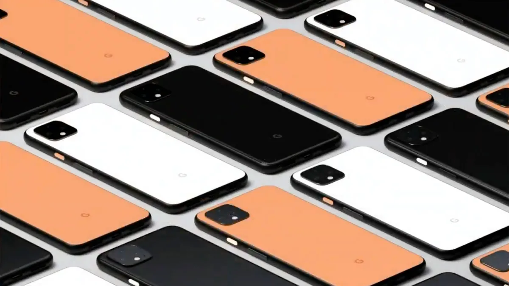
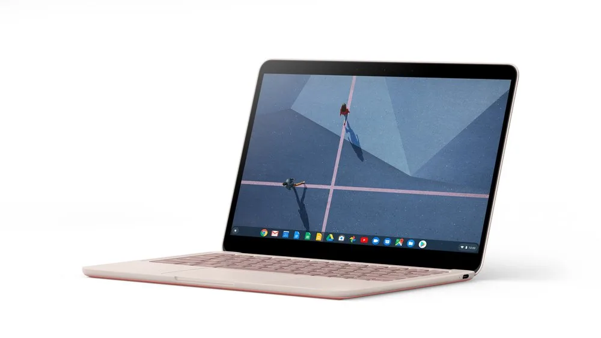
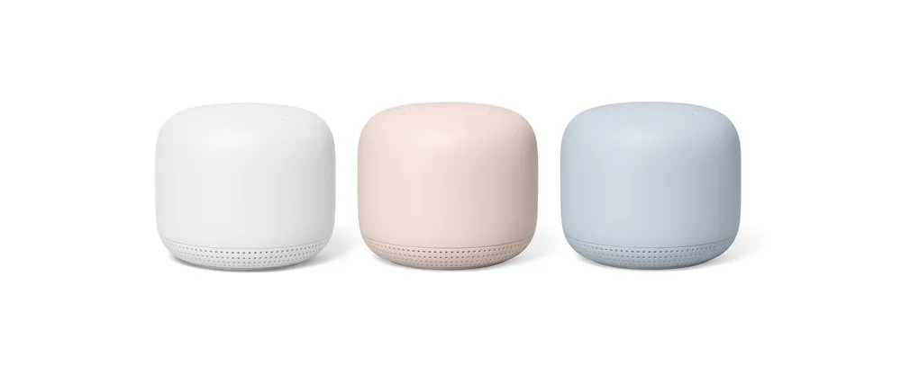

**Nieuwe smartphone**

> [!NOTE]
> Dit artikel verscheen eerder op [Bright](https://www.bright.nl/nieuws/1124085/google-onthult-pixel-4-telefoon-die-handbewegingen-herkent.html).

Door met je hand boven de nieuwe [Pixel 4](https://www.blog.google/products/pixel/pixel-4/)\-telefoons te zwaaien kun je bijvoorbeeld een liedje op Spotify overslaan. Gaat je wekker af, dan kun je een hand boven het scherm houden om hem af te zetten.

De radarsensor wordt ook gebruikt bij Googles nieuwe gezichtsherkenningstechniek. Zodra de telefoon ziet dat je hem oppakt, worden de sensoren al geactiveerd. Hierdoor zou het toestel sneller ontgrendeld worden dan bij andere telefoons.

## Foto-software

Achterop de Pixel 4 zitten twee camera’s, waaronder een telefotolens, plus een sensor en 'een flitser die je hopelijk alleen als zaklamp gebruikt'. Google hoopt dat de nachtmodus van de camera effectief genoeg is en dat flits overbodig wordt.

Speciale software verbetert foto's volgens Google significant, waardoor de achterliggende technologie net zo belangrijk is als bijvoorbeeld de lenzen en camerasensor. De telefoon leert op termijn wat de beste witbalans is en heeft een breder HDR-bereik door de software.

## Snellere Google Assistent

Op de nieuwe Pixels staat ook de volgende generatie [Google Assistent](https://www.bright.nl/nieuws/artikel/4852306/nederlandse-google-assistent-heeft-nu-ook-een-mannenstem-wij-weten-ook-niet) geïnstalleerd. Deze slimme stemassistent kan tot tien keer sneller vragen beantwoorden en werd afgelopen zomer voor het eerst door Google gedemonstreerd.

De Pixel 4 XL heeft een 6,3 inch scherm (quad-hd) en de Pixel 4 heeft een 5,7 inch scherm (full-hd). Beide schermen hebben een hogere verversingssnelheid van 90 Hz, waardoor beelden soepeler ogen, vooral tijdens het scrollen door apps en spelen van games. De telefoons werken met de Snapdragon 855-chip en hebben 6GB werkgeheugen.

## Nog niet in Nederland

De Pixel 4 wordt in de VS vanaf 799 dollar verkocht, de XL-versie vanaf 899 dollar. De telefoons zijn vanaf 24 oktober verkrijgbaar in drie kleuren: zwart, wit en oranje.

Het is nog de vraag of de Pixel 4 en 4 XL officieel in Nederland worden verkocht. Voorgaande jaren werden Pixel-telefoons hier niet officieel aangeboden, maar ze werden wel geïmporteerd door enkele webwinkels.

## Pixel Buds

De draadloze oordoppen van Google hebben een upgrade gekregen. De nieuwe Pixel Buds zijn in-ear-oordoppen die in een oplaaddoosje worden bewaard. Op een volle accu kun je 5 uur naar muziek luisteren. De batterijcase biedt 24 uur aan batterijtijd.

De Pixel Buds werken nauw samen met de stemassistent van Google. Hierdoor kun je snel vragen aan de virtuele dienst stellen, of uitspraken vertalen.

Volgens Google is de Bluetooth-verbinding van de Pixel Buds sterk genoeg om ze vanuit drie kamers verderop te gebruiken. Google gaat de oordoppen vanaf komende lente verkopen voor 179 dollar. Het is nog niet bekend of ze ook in Nederland verschijnen.

## Pixelbook Go

Google toonde ook een nieuwe versie van zijn eigen Chromebook, de Pixelbook Go. De laptop draait op ChromeOS en wordt vanaf 650 dollar verkocht. Of de laptop ook naar Nederland komt, moet nog blijken.

De laptop zelf is 13 millimeter dun en bevat een 13,3 inch-aanraakscherm. De batterij zou ook een stuk forser zijn, waardoor je hem langer kunt gebruiken.

De nieuwe Pixelbook zou een extra stil toetsenbord hebben, zodat collega’s geen last hebben van je getik. Daarnaast wordt hij verkocht in twee kleuren: 'Just Black' en 'Not Pink'.

## Google Nest Mini

Googles kleinste slimme speaker heeft ook een opvolger. De nieuwe Nest Mini ziet er van buiten ongeveer hetzelfde uit als zijn voorganger, maar heeft achterop een haak waarmee je hem aan de muur kunt bevestigen. Hij wordt daarnaast in het lichtblauw geleverd.

In de Nest Mini zit ook een speciale chip, die het mogelijk maakt om sommige stemassistentfuncties lokaal te draaien. Hierdoor hoeft de speaker niet continu met de Google-servers te praten en kan hij sommige vragen sneller beantwoorden.

Het geluid is volgens Google ook verbeterd. De bas is twee keer krachtiger en het algehele geluid moet voortaan een stuk natuurlijker klinken.

De Nest Mini wordt vanaf 22 oktober verkocht voor 59 euro, en zal ook bij de meeste grote technologiewinkels in Nederland liggen.

[Bekijk ingesloten media](https://www.youtube.com/embed/HBx8RBY-79M?autoplay=1&modestbranding=1)

## Nest Wifi

Google heeft ook zijn meshrouters vernieuwd. De nieuwe Nest Wifi heeft een vernieuwd ontwerp, dat volgens Google mooi genoeg is om "niet zomaar in een kastje te verstoppen", waardoor het bereik beter is.

De interne hardware is bovendien beter geworden: de Nest Wifi zou twee keer snellere wifi-snelheden bieden, en heeft een bereik dat 25 procent groter is.

Een ingebouwde luidspreker en microfoon zorgen ervoor dat je de Nest Wifi ook als slimme speaker kunt gebruiken. Volgens de zoekgigant kan iedere meshrouter exact hetzelfde als de Nest Mini.

Ook de Nest Wifi-routers zijn voorlopig nog niet in Nederland verkrijgbaar.

## Google Stadia: wel naar Nederland

Tot slot kondigde Google aan dat de gamestreamingdienst [Google Stadia](https://www.bright.nl/nieuws/artikel/4884351/gamestreaming-google-stadia-start-op-19-november) op 19 november van start gaat, ook in Nederland. Met de dienst zijn tientallen console-games streamend te spelen, zonder dat er een dure spelcomputer nodig is.
