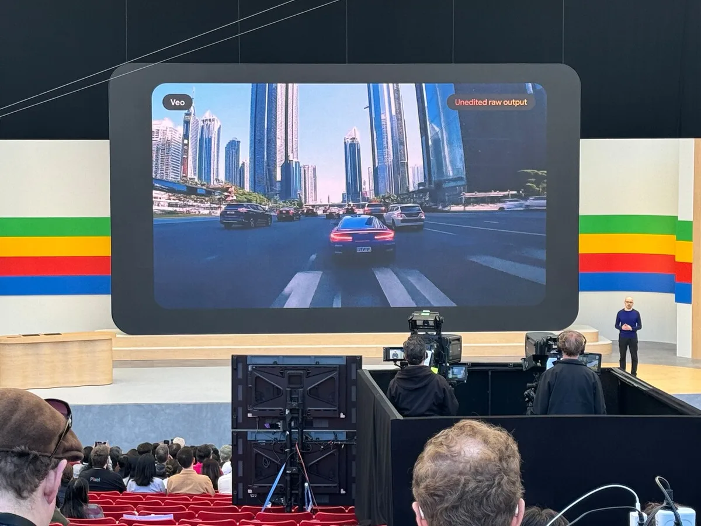
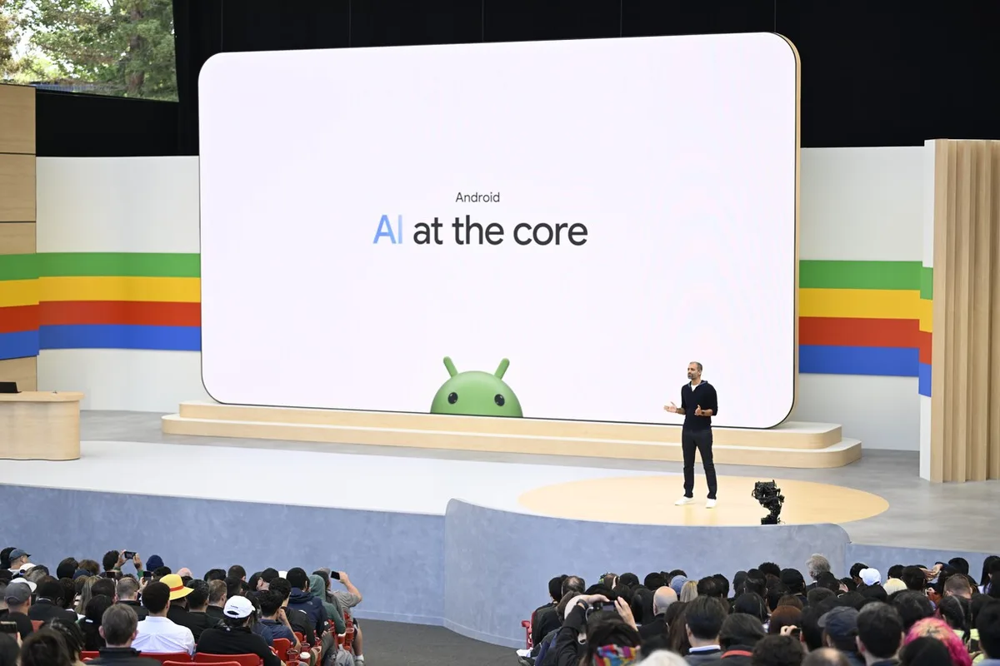

Zoekreus Google onthulde tijdens een jaarlijkse conferentie in Californië zijn grote plannen voor komend jaar. Daarbij ging het eigenlijk alleen maar over kunstmatige intelligentie, oftewel AI. Wie een Android-telefoon heeft, zal merken dat Google voortaan meedenkt.

> [!NOTE]
> Dit artikel verscheen eerder op [AD](https://www.ad.nl/tech/google-onthult-plannen-met-presentatie-waarin-zeker-120-keer-de-term-ai-valt~a17b342e/).

Volgens Google-ceo Sundar Pichai bevindt het bedrijf zich in het ‘Gemini-tijdperk’, waarbij hij verwijst naar de AI-assistent die het bedrijf eerder onthulde. ,,Daar gaan we het komende tijd nog veel over hebben”, beklemtoonde hij aan het begin van de presentatie. Tijdens de presentatie werd de term ‘AI’ meer dan 120 keer genoemd.

Google werkt al jarenlang aan kunstmatige intelligentie, en afgelopen jaren wordt de eerste praktische AI-software beschikbaar. Niet alleen bij het zoekbedrijf, overigens, want concurrenten zoals OpenAI hebben ook populaire diensten en er zijn geruchten over AI-plannen bij Apple.

## Een AI die filmpjes voor je maakt

Veo is Googles videomaker. In een chatscherm kun je de AI vragen om een filmpje voor je te maken, waarbij hij snapt wat bijvoorbeeld een timelapse of zoomshot is. Filmmaker Donald Glover demonstreerde hoe hij met de AI een korte film maakte.

Dit soort videosoftware is nog vrij pril. Concurrent OpenAI presenteerde recent Sora, dat hetzelfde kan. Sora kan video’s van maximaal 60 seconden maken, Google belooft dat Veo veel langere video’s filmt.

Googles nieuwe AI Veo kan filmpjes maken. © Bastiaan Vroegop

## Realistische foto's zonder AI-gekkigheden

Googles AI-afbeeldingengenerator heeft ook een update gekregen. Imagen 3 kun je vragen een plaatje voor je te maken, waarbij ditmaal hyperrealistische beelden ontstaan.

AI-plaatjes bevatten doorgaans gekke foutjes, zoals niet-kloppende teksten op T-shirts of borden. Volgens Google is dat bij Imagen 3 niet langer een probleem.

## Project Astra: Een ‘universele AI-assistent’

Google gaf een voorproefje van Project Astra, een universele assistent op je smartphone of slimme bril. De ingebouwde kunstmatige intelligentie kijkt continu mee en luistert naar geluiden, om zo je vragen zo goed mogelijk te beantwoorden.

In een video liet Google zien hoe de AI bijvoorbeeld een bril op een tafel kon terugvinden, of grapjes kon maken over een huisdier dat naast een knuffel zit. Astra komt later dit jaar uit.

## AI in je Android-telefoon

Besturingsyteem Android gaat nauwer samenwerken met Gemini. De AI kan meekijken in apps en je meehelpen, bijvoorbeeld als je iets in een chatgesprek niet snapt. Op termijn gaat Gemini de oude Google Assistent vervangen, die nu nog op veel telefoons staat ingesteld.

De AI zal ook beter helpen als je online iets opzoekt. Bovendien gaat Gemini helpen om bijvoorbeeld je foto’s te doorzoeken. Vraag je de AI-assistent om het kenteken van je auto, dan gaat hij op zoek naar foto’s daarvan in je bibliotheek.

Google gaat zijn AI nauwer integreren in Android. © Google

## Google gaat voor je googelen

Googles zoekmachine gaat AI gebruiken om namens jou dingen op te zoeken. Vraag je de site bijvoorbeeld naar ‘leuke restaurants in Berlijn’, dan worden sites uitgelezen om een lijstje bij elkaar te sprokkelen.

De functie wordt eerst uitgerold in de Verenigde Staten, andere landen volgen later. De AI-zoekmachine werd al langer getest en is omstreden: websitebeheerders vrezen dat internetters hun pagina’s hierdoor minder gaan bezoeken en zij bijvoorbeeld reclame-inkomsten mislopen.
