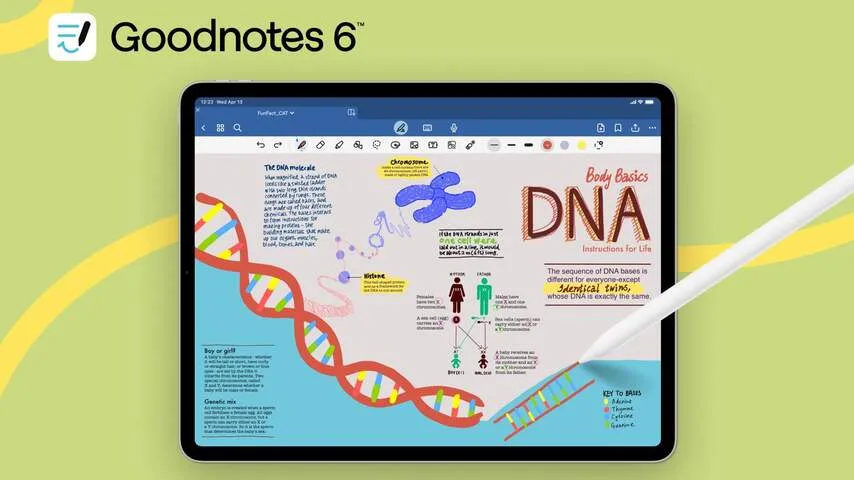
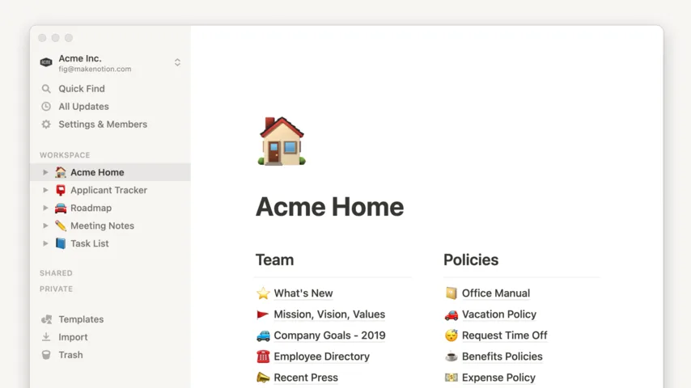
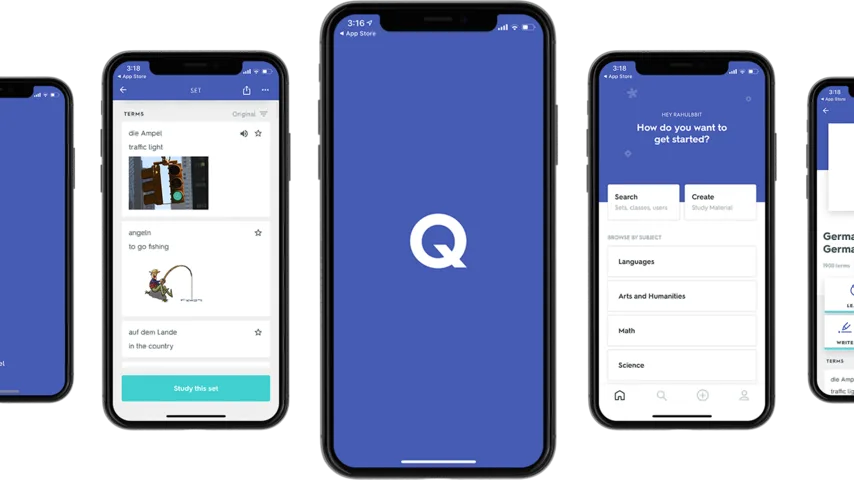
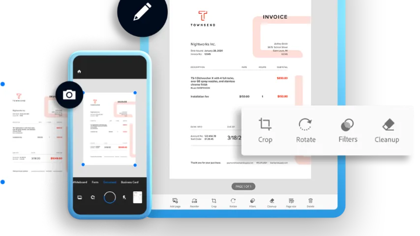
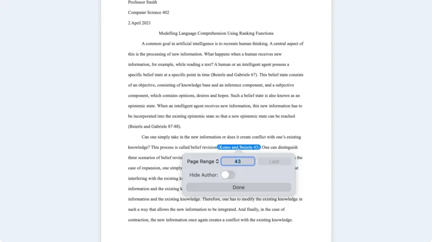

De smartphone wordt op de helft van de opleidingen zelfs in pauzes geweerd. Maar dat betekent niet dat er in de lokalen geen ruimte voor technologie meer is: laptops en tablets vind je vooral in het vervolgonderwijs nog terug.

> [!NOTE]
> Dit artikel verscheen eerder op [NU.nl](https://www.nu.nl/slimmer-leven/6326052/het-collegejaar-begint-weer-deze-vijf-apps-helpen-bij-de-studie.html).

## GoodNotes 6

Deze notitieapp gaat al een tijdje mee en is beschikbaar op iOS, Android en Windows. GoodNotes 6 komt het meest tot zijn recht op een tablet: met een stylus schrijf je op het scherm zoals je ook doet in een ouderwets notitieblok. De app herkent automatisch de woorden die je opschrijft. Hierdoor kun je de ingebouwde zoekmachine gebruiken om bepaalde passages in je notities terug te vinden.

Ook handig zijn de zogeheten templates. Daarmee maak je een digitaal notitieboek voor een specifiek doel, zoals een agenda. Wel is GoodNotes prijzig: een abonnement kost 11 euro per jaar.

_Het collegejaar begint weer: deze vijf apps helpen bij de studie — Beeld: GoodNotes_

## Notion

Voor wie liever met een toetsenbord notities maakt, is Notion een goede optie. In de basis kun je met deze typische notitieapp snel een bestandje met wat schrijfsels maken. Daarnaast zit Notion vol met interactieve blokken, zodat je makkelijk een agenda of een takenlijst kunt toevoegen aan je notitiebestanden.

Notion laat je bestanden naar elkaar linken. Daardoor kun je er een soort interne website van maken met alles wat je voor je studie nodig hebt. De mogelijkheden zijn zeer uitgebreid. Rond Notion bestaat een gemeenschap waarbinnen gebruikers hun digitale notitieprojecten delen. Die kun jij weer downloaden voor eigen gebruik.

_Het collegejaar begint weer: deze vijf apps helpen bij de studie — Beeld: Notion_

## Quizlet

Quizlet laat je snel flashkaarten maken, waarmee je jezelf kunt overhoren voor een toets. De handige ingebouwde AI-functie kan jouw eerder gemaakte notities analyseren om automatisch kaartjes voor je te genereren.

De app is gratis te downloaden, maar die versie toont advertenties en is beperkt qua functionaliteit. Om alles te ontgrendelen, betaal je 32 euro per jaar of 7 euro per maand. Dan krijg je ook toegang tot een bestaande bibliotheek met overhoringen.

_Het collegejaar begint weer: deze vijf apps helpen bij de studie_

## Adobe Scan

Met meerdere apps kun je documenten scannen, waaronder Adobe Scan. Je richt de camera op je papier, laat de software de hoeken van het blad identificeren en krijgt daarna automatisch een pdf-document dat je kunt bewaren.

Handig aan Adobe Scan is de tekstherkenning. Hierdoor kun je geschreven tekst digitaal kopiëren of bijvoorbeeld in je documenten zoeken naar een eerder geschreven passage.

_Het collegejaar begint weer: deze vijf apps helpen bij de studie — Beeld: ADobe_

## Essayist

Essayist is een tekstverwerker voor het schrijven van bijvoorbeeld scripties. Bronnen citeren staat daarbij centraal: je kunt in je tekst makkelijk verwijzen naar de sites en boeken die je aanhaalt. Daarbij kun je ook de geciteerde pagina vermelden. Vervolgens zet Essayist deze informatie netjes onderaan de pagina. Je kunt kiezen uit de citaatstijlen van meerdere gerenommeerde universiteiten.

Essayist vereist een maandelijks abonnement van 6 dollar (5,40 euro) per maand. Je kunt ook jaarlijks 40 dollar betalen. De app is momenteel alleen beschikbaar voor iPhone, iPad en Mac.

_Het collegejaar begint weer: deze vijf apps helpen bij de studie — Beeld: Essayist_
