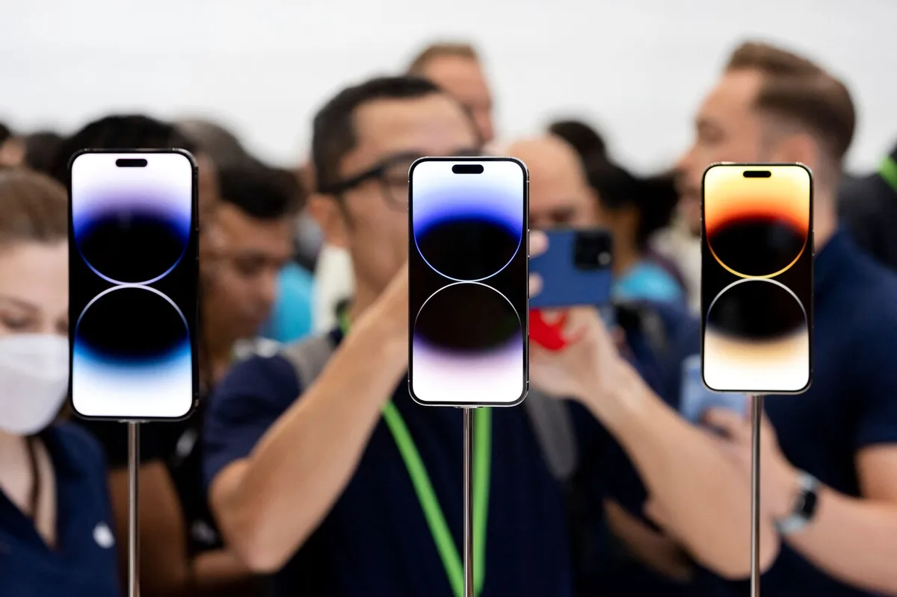
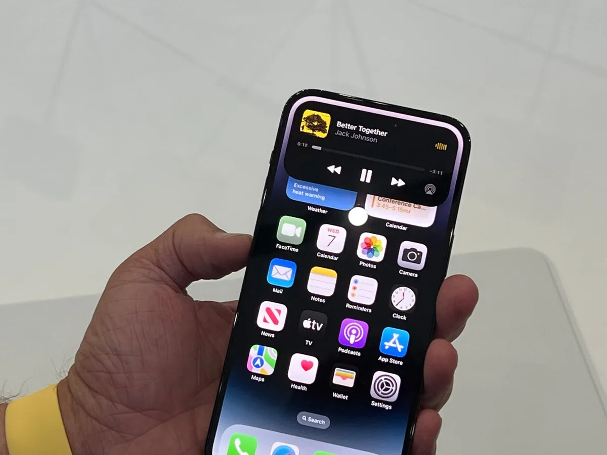

De iPhone 14 is de eerste in Apple-telefoon in vijf jaar die echt iets nieuws doet. Het bijzonderste: een beeldscherm dat bijna nooit uitgaat.

> [!NOTE]
> Dit artikel verscheen eerder op [AD](https://www.ad.nl/tech/het-grootste-nadeel-van-de-iphone-is-nu-een-voordeel~a0330ed3/).

Nieuwe iPhones krijgen meestal maar kleine upgrades. De processor wordt iets sneller, het scherm iets mooier en de camera krijgt een wat grotere sensor. Hoewel ieder jaar wordt gehoopt op iets groots en revolutionairs, komen de echt ingrijpende veranderingen slechts eens in de zoveel jaar. De laatste keer was bijvoorbeeld bij de iPhone X, toen de homeknop verdween en de vingerscanner door gezichtsherkenning werd vervangen.

Dit jaar leek ook even een klein jaar voor de Apple-telefoon te worden. De iPhone 14 lijkt op zijn voorganger van vorig jaar en heeft zelfs een chip die we al in de 13 Pro zagen: het is een mengelmoes van eerdere Apple-hardware met een iets betere camera, voor een wat logischere prijs.

Maar er is dit jaar ook de iPhone 14 Pro, die een paar gedurfde dingen doet. Centraal staat het scherm, dat bij deze iPhone altijd ingeschakeld staat. Een vergrendelde telefoon heeft niet langer een zwart beeld, maar toont een gedimde versie van jouw achtergrond. Wil je even zien hoe laat het is, of hoe lang die timer nog loopt? Dan hoef je de telefoon niet meer te activeren om het te zien.

Er zijn wel een paar uitzonderingen. Ligt de telefoon op je nachtkastje te laden, of zit hij in je broekzak? Dan is hij slim genoeg om het scherm toch uit te schakelen. Software probeert in te schatten wanneer je het scherm niet ziet, om hem dan uit te zetten. Bij onze tests waren echter te weinig situaties om dat goed in te testen.

_Liever een [telefoon van hooguit 500 euro](https://bestgetest.nl/de-beste-midrange-smartphones-tot-500-euro-van-2022?utm_source=ad&utm_medium=tekstlink&utm_term=byo&utm_campaign=redactioneel&utm_content=a0330ed3)? De redactie van BestGetest zette de beste modellen op een rij._

De nieuwste iPhone. © AFP

## Meer dan always-on op Android

Android-telefoons hebben al langer zogeheten always-on-schermen, maar daarbij werkt het net wat anders. Ze tonen op slechts een klein stukje van het zwarte beeld wat simpele iconen en de tijd, waarna je de telefoon moet ontgrendelen om de rest te lezen. Ze hebben in feite twee ontgrendelschermen, waarbij de always-on-versie slechts beperkte informatie geeft. Bij de iPhone is dat niet het geval, omdat je altijd hetzelfde ziet.

Achter deze nieuwe functie schuilt een nieuw soort scherm dat met een veel lagere frequentie kan verversen. Is het toestel vergrendeld, dan wordt het beeld soms slechts één keer per seconde ververst.

Dit maakt het mogelijk om altijd iets te tonen, zonder dat in één klap je accu wordt leeggezogen. Althans, dat belooft Apple: bij onze vroege hands-on konden we de accuduur nog niet goed meten.

## Apples grootste nadeel is nu een voordeel

In 2017 kreeg de iPhone een scherm dat bijna de hele voorkant bedekt. Grote uitzondering was een inkeping aan de bovenkant, ook wel de ‘notch’ genoemd, waar de sensoren voor gezichtsherkenning en de selfiecamera zich in bevinden.

Het is sindsdien het meest bekritiseerde bij de iPhone: terwijl concurrenten de selfiecamera inmiddels onder het scherm weten te verstoppen, hadden iPhones nog steeds een soort wenkbrauw aan de bovenkant. Bij de iPhone 14 Pro is nog steeds een deel van het scherm weggesneden, maar weet Apple hier een pluspunt van te maken.

## Activity Island

De camera en sensoren zijn iets naar beneden geschoven, waardoor ze in een uitgerekte ovaal bovenaan het scherm zitten. Maar die zwarte streep is tegelijkertijd een plek voor extra boodschappen, die Apple het ‘Dynamic Island’ noemt: je ziet er welke muziek speelt, of er een timer loopt of wanneer je taxi arriveert.

Druk op het Dynamic Island en je krijgt meer te zien, zoals de knoppen om je muziek te bedienen. En omdat al deze informatiebalkjes zwart zijn, zitten ze perfect verstopt in de sensorbalk bovenaan de telefoon. Het voelt als een logische plek voor informatie op je iPhone, die de wenkbrauw van je iPhone feitelijk weet te verstoppen.

Rond de selfiecamera ontvouwt zich de muziekspeler. © Bastiaan Vroegop

## Veel moet nog blijken

Het nieuwe scherm en Dynamic Island voelen als grote stappen voor Apple, die moderne iPhones voor de komende jaren gaan definiëren. Maar er is ook een hoop dat we bij onze korte hands-on-sessies nog niet konden proberen.

Zoals we al schreven is de batterijduur van de nieuwe iPhones nog een groot mysterie. En hoewel de camera’s bij een snelle test mooie foto’s maakten, moet nog maar blijken hoe die foto’s uit de verf komen bij lage lichtomstandigheden.

Die vraagstukken hopen we later in een review te beantwoorden. De norm ligt daarbij hoog, want de iPhone 14 Pro is met zijn prijs van 1.329 euro ook duurder dan zijn voorganger in 2021. En wie zoveel betaalt voor een telefoon, mag daar ook veel van terugverwachten.
