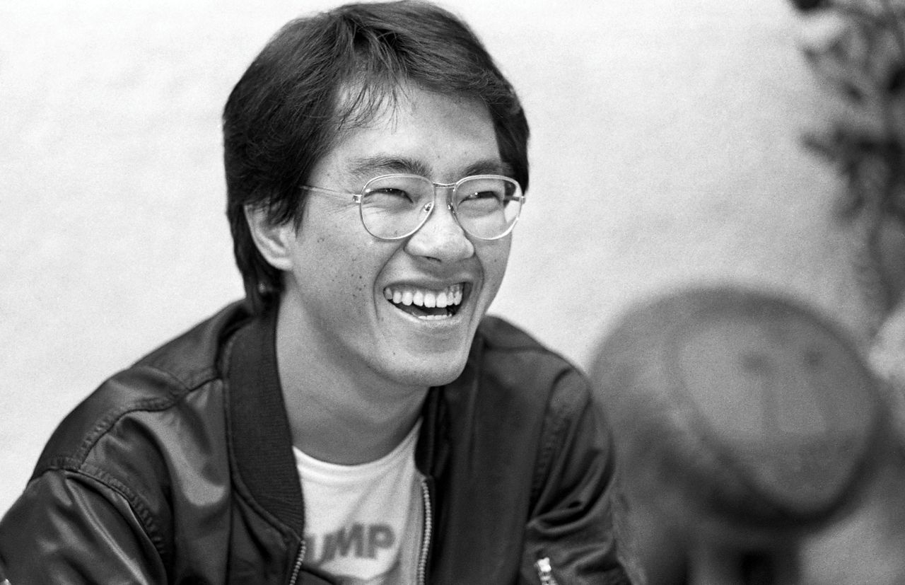
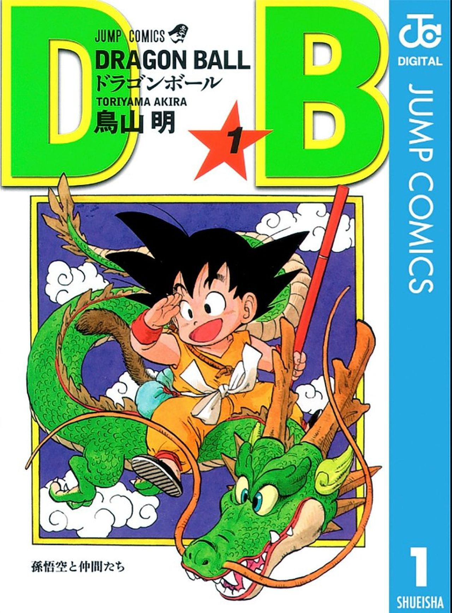

**Akira Toriyama (1955-2024): Striptekenaar Akira Toriyama populariseerde de Japanse manga-strip in het buitenland met zijn vrolijke vechtsportmanga. Hoe vaak hij Dragon Ball ook wilde loslaten, hij kwam altijd terug.**

> [!NOTE]
> Dit artikel verscheen eerder in [NRC](https://www.nrc.nl/nieuws/2024/03/08/het-kamehameha-van-de-verlegen-striptekenaar-akira-toriyama-1955-2024-ging-de-hele-wereld-over-a4192469).

Grote ogen, ronde gezichten met een puntige kin en wilde haren. Leken de personages in de strips van Akira Toriyama te veel op elkaar? Ja, dat gaf hij zelf ook ruiterlijk toe: „De vrouwen die ik teken hebben allemaal min of meer dezelfde persoonlijkheid. Ik kan geen tedere meisjes tekenen, ik weet alleen hoe ik ze met een sterke wil maak.”

Sinds zijn mangastripserie _Dragon Ball_ stond Japanner Toriyama bekend als één van de meest invloedrijke Japanse artiesten van deze tijd, die ook meewerkte aan films, series en videogames. Vorige week overleed hij op 68-jarige leeftijd onverwacht aan een hersenbloeding.

Toriyama werd in 1955 geboren in het Japanse Nagoya. Hij begon al vroeg met tekenen, maar raakte pas echt geïnspireerd toen hij de Disney-film _101 Dalmatiërs_ zag. Hij probeerde het scherpe lijnwerk te imiteren. Maar het was de Japanse animatieserie (anime) _Astro Boy_ die de doorslag gaf: Toriyama wilde alleen nog maar manga tekenen.

Akira Toriyama in 1982.

Foto Jiji Press

Hij stond bekend om zijn verlegenheid. Dagenlang zat hij te tekenen en schrijven in zijn kantoortje terwijl hij verdere aandacht voor zijn persoon zoveel mogelijk probeerde te vermijden. Toen zijn werk bekender werd, stond hij liever niet met zijn gezicht in de krant: daarom bedacht hij een gemaskerde versie van zichzelf, liefkozend Robotoriyama genoemd, die hij gebruikte als een avatar – of alter ego – in zijn notities gericht aan zijn lezers.

Na een paar korte verhalen in de jaren zeventig had hij in 1980 een hit in handen met de stripreeks _Dr. Slump_. Wekelijks verschenen hoofdstukken in het populaire Japanse stripblad _Shōnen Jump_. Die serie zou in het westen nooit een groot succes worden, maar de invloeden van Dr. Slump zijn ook hier voelbaar. De manier waarop Toriyama poep tekende, beïnvloedde bijvoorbeeld hoe de hedendaagse, in sociale media veelgebruikte, poep-emoji er uit ging zien.

> Kamehameha!

Zijn uitgever stelde voor om na _Dr. Slump_ een vechtsportverhaal te tekenen. Hij maakte het tweedelige _Dragon Boy_, waarin een jongen en een prinses al vechtend op avontuur gaan. Dat veranderde later in _Dragon Ball_ – zijn levenswerk.

_Dragon Ball_ was eerst een luchtige klucht over een supersterke jongen met een staart, maar langzamerhand evolueerde de strip in een actieverhaal. Het was de populairste Japanse strip van de jaren tachtig die uitmondde in een animatieserie. Maar Toriyama zou later pas echt beroemd worden met het vervolg, _Dragon Ball Z_. Dit was serieuzer van toon – hoofdpersoon Goku was nu volwassen en een ambitieuze vechtsporter. Televisiezenders van over de hele wereld zonden deze reeks uit, waaronder ook Nederland. Het werd naast Pokémon het populairste exportproduct van de Japanse televisie-industrie. Het was stoer en meeslepend – een actieserie voor millennials zoals _The A-Team_ dat ooit voor voor Generatie X-ers was. Ook in Nederland probeerden kinderen iconische aanvallen uit _Dragon Ball_ na te doen: de kreet ‘_Kamehameha_’ klonk op menig schoolplein.

## Invloedrijk

Decennia later wordt _Dragon Ball_ in thuisland Japan gezien als één van de meest invloedrijke strips uit zijn tijd. Het werk van Toriyama definieerde het zogeheten shōnen-genre, actievolle strips en animatieseries met als primaire doelgroep jonge jongens. Het is de inspiratiebron voor bijvoorbeeld ook _One Piece_, wat inmiddels de populairste stripreeks ter wereld is geworden.

„Ik bewonderde hem als kind zo ontzettend”, schrijft _One Piece_\-auteur Eiichiro Oda in een reactie op Toriyama’s dood. „Ik kan me nog de dag herinneren dat hij mij het eerst bij mijn naam noemde. En toen ik voor het eerst naar huis ging op de dag dat hij mij en Kishimoto (de maker van stripreeks Naruto, red.) als ‘vrienden’ had beschreven. Ik was dolblij.”

> Ik had Dragon Ball achter me gelaten. Maar die film maakte me echt boos. Ik denk dat ik deze serie te veel liefheb om hem ooit nog los te laten.

Akira Toriyama over de slecht ontvangen Hollywood-verfilming van Dragon Ball

Dragon Ball dijde uit: de strip telde uiteindelijk 194 hoofdstukken, gevolgd door nog eens 325 hoofdstukken voor opvolger _Dragon Ball Z_. Beide televisieseries hadden respectievelijk 151 en 291 afleveringen. Meermaals overwoog hij te stoppen, maar werd steeds weer verleid om toch nog even door te gaan. In 1995 tekende hij het laatste hoofdstuk.

Het stripverhaal werd opgepikt voor een Hollywood-verfilming die buitengewoon slecht werd ontvangen: op recensieverzamelsite Rotten Tomatoes heeft de film een berucht lage score van slechts 14 procent. „Ik had _Dragon Ball_ achter me gelaten”, schreef Toriyama jaren later in een artikel. „Maar die film maakte me echt boos. Ik denk dat ik deze serie te veel liefheb om hem ooit nog los te laten.”

_De trailer voor de nieuwe serie Dragon Ball DAIMA begint met een terugblik op de carrière van Toriyama._

[Bekijk ingesloten media](https://www.youtube.com/watch?v=CYcrmsdZuyw)

## Tekenaar achter gamehits

Toriyama werd in de jaren tachtig ook benaderd door gamebedrijf Enix, dat werkte aan een nieuw rollenspel getiteld _[Dragon Quest](https://www.nrc.nl/nieuws/2019/09/23/steven-spielberg-van-de-japanse-game-a3974296)_. De artiest maakte de ontwerpen voor personages en monsters, zodat de game zich kon onderscheiden van concurrerende titels op de markt.

Ook dat bleek een gouden formule: _Dragon Quest_ werd de populairste gamereeks in Toriyama’s thuisland. Nintendo vroeg de spellenmaker uiteindelijk om nieuwe delen op zaterdagen uit te brengen, vrezend dat scholieren anders zouden spijbelen om ze te spelen.

De stripartiest zou in de jaren negentig ook meehelpen aan _Chrono Trigger_, een rollenspel over tijdreizen gemaakt door Final Fantasy-studio Squaresoft. Ook daarvoor ontwierp Toriyama de personages en monsters, met daarnaast korte filmpjes toen de game een tweede keer op de PlayStation werd uitgebracht. _Chrono Trigger_, verder gemaakt door een _dreamteam_ aan gamemakers, zou bekend komen te staan als één van de beste games uit zijn tijd en misschien wel het beste Japanse rollenspel ooit gemaakt.

De omslag van de manga Dragon Ball

Foto Bird Studio/AP

Door al die hits werd de tekenstijl van Toriyama synoniem voor Japanse producties uit de jaren tachtig en negentig. Hij zou in de jaren erna hier en daar meewerken aan kleinere projecten. In de jaren tien kwam het tot een wederopstanding van zijn meesterwerk _Dragon Ball_: Toriyama werkte mee aan een grote nieuwe animatiefilm. Die kreeg meerdere vervolgen en een nieuwe, 131 afleveringen tellende animatieserie.

## Straten vol

Ook dat werd een wereldhit: vooral in Mexico was de animatieserie mateloos populair, waar de laatste aflevering door grote groepen fans op straat en in stadions werd gekeken. Hoofdpersoon Goku werd tijdens zijn laatste gevecht toegejuicht alsof hij een beroemde sporter was.

[Bekijk ingesloten media](https://www.youtube.com/watch?v=Zg6IMwLAPSk)

De laatste jaren werkte Toriyama weer aan een nieuwe animatieserie, waarin een jonge Goku op avontuur moest gaan. De eerste afleveringen staan gepland voor later in 2024, het is onduidelijk of zijn overlijden hier invloed op zal hebben.

Toriyama is overleden, zijn personages blijven avonturen beleven. Afgelopen jaren heeft hij steeds meer de touwtjes overgedragen aan een jonge pupil met de naam Toyotarou. Volgens geruchten begon Toyotarou ooit zijn loopbaan – net als veel generatiegenoten – met het tekenen van _Dragon Ball_\-fanstrips.
