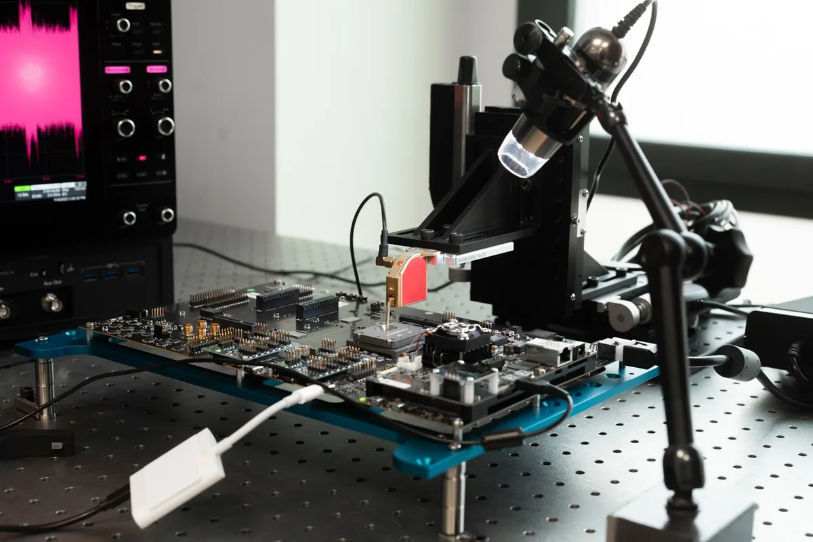
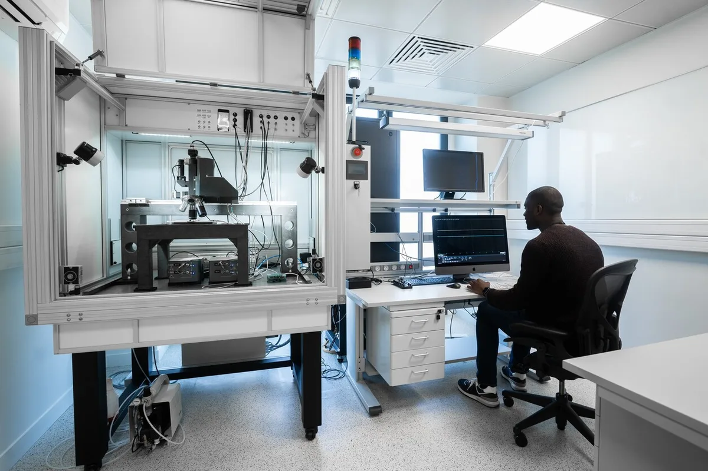

Een lab van Apple in Parijs werkt al jaren aan het verbeteren van de beveiliging van iPhone-chips. In het diepste geheim, tot deze week: voor het eerst bevestigt Apple het bestaan van deze Franse locatie en worden journalisten voorzichtig toegelaten om te komen kijken.

> [!NOTE]
> Dit artikel verscheen eerder op [AD](https://www.ad.nl/economie/hier-proberen-apple-hackers-de-iphone-te-kraken-met-speciale-lasers-een-kijkje-in-het-geheime-lab~aa9ba4fc/).

Het Franse lab specialiseert zich vooral in één ding: het zo goed mogelijk beveiligen van de hardware die in je iPhone, iPad of Mac zit. Ze zorgen dat de gebruikte chips tot op de nanometer goed zijn beveiligd voor aanvallen van buitenaf. Want hoewel veel hackers juist via de software proberen binnen te komen, zijn er ook manieren om de apparatuur rechtstreeks te beïnvloeden.

Een team aanvallende hackers probeert nieuwe manieren te bedenken waarop de apparatuur kan worden gekraakt door de onderdelen zelf te manipuleren. Bijvoorbeeld door een minuscule laser af te vuren op een transistor in een chip en zo een nulletje in een één te veranderen, of door het stroomverbruik van een chip te analyseren om te zien wanneer hij het hardst rekent, en zo de cryptografische sleutel van een foto te ontcijferen. Er wordt benadrukt: de gedemonstreerde methodes zijn versimpelde versies van de realiteit - het kraken van Apple-apparatuur is in het echt veel lastiger.

Zijn deze nieuwe aanvalsmethodes succesvol, dan gaat een tweede team aan de slag om nieuwe verdedigingen te implementeren. Op deze manier weet Apple al lange tijd hackers buiten de deur te houden: ,,Er is nog nooit wijdverspreide malware op iPhones geweest”, vertelt Apples hoofd van Security Engineering trots tijdens een gesprek in het lab.

Laboratorium van Apple in Parijs waar Apple-hackers de iPhone, iPad en iMac proberen te kraken. © Apple

Dat is ook waarom in het lab een kat-en-muisspel op zo’n hoog niveau wordt gespeeld. De gemiddelde hacker heeft al die lasers en andere gespecialiseerde apparatuur in huis, maar de techreus wil voorbereid zijn op zelfs de meest onwaarschijnlijke scenario’s. Voor de huis-tuin-en-keukenhacker is dat niet nodig, maar ook staatshackers moeten buiten de deur worden gehouden.

Het hackerslab zit in Frankrijk omdat daar de expertise zit om hardware goed te testen: het is het thuisland van de smartcard, de kleine chips die sinds de jaren 70 in bankpassen verwerkt zitten. Beveiligingsexperts zijn daarom al decennialang bezig om piepkleine apparatuur zo goed mogelijk te beveiligen.

Jarenlang werd er door Apple geheimzinnig over gedaan. ,,We zijn onze secrity-initiatieven nooit begonnen omdat we er graag over praten, we wilden gewoon onze gebruikers goed beveiligen”, vertelt Ivan Krstić. ,,Maar we willen nu graag dat mensen weten dat we ze helpen om veilig te blijven. En één van de manieren om dat te doen, is door te laten zien wat we hier de afgelopen jaren allemaal hebben gedaan.”

Ivan Krstić . hoofd van Security Engineering bij Apple © privebeeld

Het zal geen toeval zijn dat Apple dit bezoek plant net nu het bedrijf zorgen uit over de beveiliging van iPhones in Europa. Op het moment kunnen apps alleen via de App Store worden geïnstalleerd, maar met de Verordening digitale markten verplicht Brussel om ook apps buiten de appwinkel toe te laten. De techreus heeft tot maart 2024 om aan die nieuwe wetgeving te voldoen.

Apple ziet de App Store als extra beveiligingslaag: omdat alle apps vooraf worden gecontroleerd, wordt malware buiten de iPhones van gebruikers gehouden. Als apps buiten de App Store worden geïnstalleerd, bestaat een kans dat er toch malware op telefoons terechtkomt. Krstić: ,,Ik had nooit gedacht dat iPhones ooit slechter binnen Europa beveiligd zouden worden. De wet zet beveiligingssystemen op het spel die wij over een lange periode hebben ontwikkeld.”

© Apple
