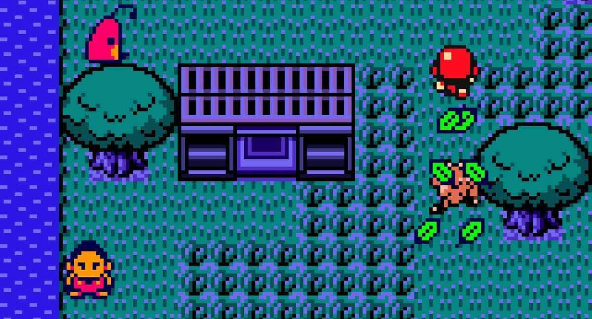
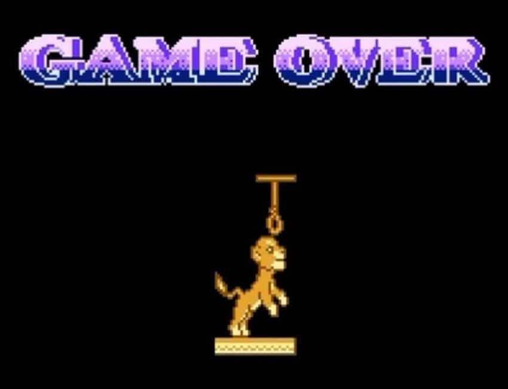

**Slimme bootleggers pikten graantje mee van hype.**

Pokémon Diamond verscheen officieel in 2006, maar ik speelde de game al zeker vijf jaar daarvoor. Niet op de Nintendo DS, waar het spel voor is uitgebracht, maar gewoon op mijn oude Game Boy Color.

Een klasgenootje had tijdens een vakantie naar Polen voor een schijntje het pas verschenen Pokémon Crystal opgepikt in een ongure technologiewinkel, waar hij meteen gratis een cartridge van Pokémon Diamond bij kreeg. Dat was volgens hem een zéér zeldzame titel in de reeks – iets dat ik meteen wilde geloven. Online kwamen vaak genoeg geruchten voorbij over titels voor toekomstige Pokémon-spellen, maar tot op heden had ik nog nooit over Diamond gehoord. Nintendo zou pas jaren later het spel officieel aankondigen.

> [!NOTE]
>
> Dit verhaal verscheen eerder [op Laadscherm](https://laadscherm.nl/hoe-ik-jaren-voor-de-aankondiging-al-pokemon-diamond-speelde/).

Diamond bleek ook anders in elkaar te steken dan eerdere games in de reeks. In de game heb je bijvoorbeeld niet zes monsters bij je om mee te vechten, maar kun je een veel grotere verzameling beesten op ieder moment bellen met je mobieltje.

De normaal stille Pokémon-trainer was daarnaast omgeruild voor een spraakzamere honkbalspeler, die in de Pokémon-wereld terechtkomt als hij in een boom valt. Er was geen Pokémon Gym of Elite Four-trainer te vinden. In plaats daarvan had het spel een vreemd verhaal dat ik maar moeilijk kon volgen.

## Keitai Denjū Telefang

Pas jaren later zou ik er achter komen dat die Pokémon Diamond-cartridge weinig te maken had met de inmiddels twintig jaar oude gamereeks. Het betrof eigenlijk een aangepaste van Keitai Denjū Telefang, een monsterverzamelgame die de studio’s Natsume en Smilesoft eind 2000 in Japan uitbrachten.

Officieel is Telefang nooit in het westen verschenen, maar fanatieke vertalers wisten de game voor het westen te lokaliseren. Met één kleine wijziging: de twee versies van het spel gingen voortaan door het leven als Pokémon Diamond en Pokémon Jade.

> “Some points of 5 lost”

De games werden op cartridges gezet en samen met illegaal verworven kopieën van Pokémon Crystal verkocht, om zo een centje mee te verdienen aan de Pokémon-rage. Daarbij werd inbreuk gedaan op meer dan één licentie: op het doosje van Pokémon Jade stond een afbeelding uit de animatiefilm Princess Mononoke, om zo mogelijk nog meer mensen te trekken. Hoe succesvol de Pokémon-variant van Telefang is geworden, zullen we vermoedelijk nooit weten. De games werden vooral via de zwarte markt verkocht. De makers probeerden tijdens die verkoop vooral duidelijk te maken dat zij niks te maken hadden met deze vorm van piraterij.

De vertalingen leidden waarschijnlijk tot onherstelbare imagoschade voor het Japanse Telefang, dat nooit naar het westen is gekomen. Niet alleen werden de games door de lokalisatie gezien als Pokémon-klonen, maar de Engelstalige versies waren door haastig vertaalwerk ook haast onspeelbaar. Teksten waren inconsistent: verloor je tijdens een gevecht vijf levenspunten, dan kreeg je de tekst “some points of 5 lost” in beeld te zien. Programmeerfouten leidden tot corrupte savegames en crashes, waardoor het uitspelen van de game verdraaid lastig bleek.

## Bootleggers

Pokémon Diamond en Jade zijn inmiddels beruchte voorbeelden van bootleggames – deels omdat de naam Diamond jaren later nog eens door Nintendo zelf werd gebruikt. Het uitbrengen van ongelicenseerde games om snel een zakcentje te verdienen, is echter niks nieuws. Rond de jaren ‘90 en begin jaren ‘00 was er een actieve markt voor bootlegtitels, die zich vooral richtte op Azië. Titels die in het westen uitkwamen, kenmerkten zich vooral door een slordige vertaling.

De meeste bootleggames waren snelle ports van nieuwe games voor oudere spelcomputers, die zo verwarde ouders konden foppen. Midden jaren ‘90 verscheen bijvoorbeeld Mega Man X voor de Super Nintendo (SNES), maar al snel was [Rockman X](https://www.youtube.com/watch?v=9twLEiglJm0&ref=gamepraat.nl) ook te koop voor de Game Boy, Famicom en Nintendo Entertainment System (NES). De makers van Rockman X combineerden onderdelen uit eerdere NES-games van de reeks met eigen ideeën, om zo snel een nieuwe game te maken voor fans die nog geen SNES in huis hadden staan.

Kinderen die opgroeiden met deze bootlegs, ontdekten jaren later vaak pas wat ze nu eigenlijk hadden gespeeld, waardoor deze games een wat unieke reputatie hebben gekregen. Tijdens de speedrunmarathon [Games Done Quick](https://gamesdonequick.com/) werd dit jaar bijvoorbeeld de bootlegtitel Donkey Kong 5: The Journey of Over Time and Space gespeeld. Een spel met zijn eigen, vreemde charme, dat in de praktijk vooral bestaat uit opnieuw gemaakte levels uit Super Mario Bros. met zeer slecht vertaalde teksten in het Engels.

Sommige bootleggers maakten ook volledig unieke games op basis van grote merken waar ze geen recht op hadden. The Lion King V: Timon & Pumbaa is gebaseerd op een animatieserie van Disney, maar hier was geen game van om onderdelen van te stelen.

Het is een titel die geheid tot veel verwarring heeft gezorgd onder ouders en kinderen, die niet wisten dat het spel niks met de originele makers van The Lion King te maken had. Zo is het spel gevuld met controversiële Game Over-schermen, waarop bijvoorbeeld de leeuw Simba zelfmoord pleegt met een strop.

## Fangames

Anno 2017 is het een stuk lastiger geworden om succes te boeken met een ongelicenseerde bootleggame. Uitgevers hebben betere banden met winkeliers, waardoor er nog maar zelden een onbedoelde titel in het assortiment van bijvoorbeeld de lokale Intertoys kan glippen. Daarnaast zorgt het internet ervoor dat je al snel weet of een game een nepperd is.

Het enige overblijfsel uit die tijd is misschien wel de fangame. Fanatieke ontwerpers en programmeurs proberen geregeld vervolgen te maken van hun lievelingsgames, die ze vervolgens gratis voor iedereen beschikbaar willen stellen. Onder andere Nintendo steekt geregeld een stokje voor dat soort praktijken, maar andere gamebedrijven omarmen dit soort initiatieven juist. Zo is bijvoorbeeld Black Mesa: Source, een remake van Valve’s Half-Life, gewoon in de gameswinkel Steam van het bedrijf te vinden.
