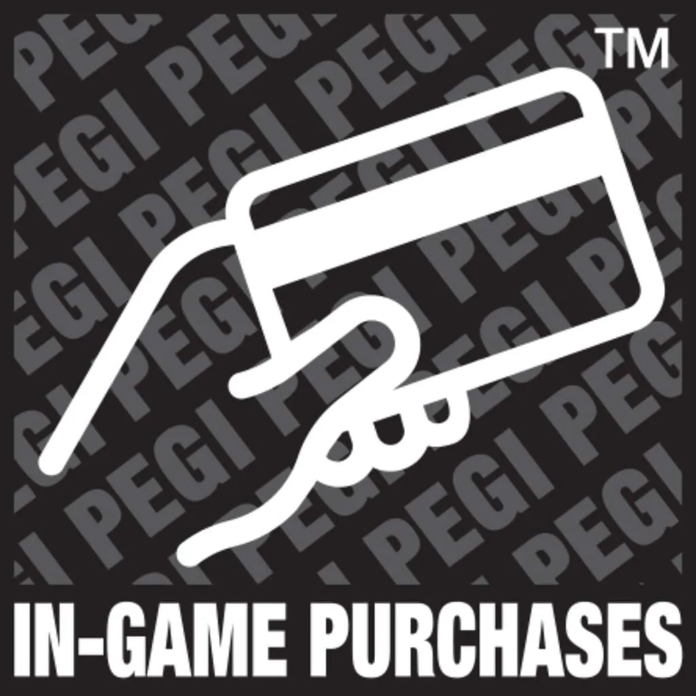

Na de aanschaf van een game ben je vaak nog niet klaar: wil je alle leuke upgrades krijgen, dan moet je soms diep in de buidel tasten om losse extra's te kopen. Andere games bieden abonnementen aan die vereist zijn om ze te spelen.

> [!NOTE]
> Dit artikel verscheen eerder op [NU.nl](https://www.nu.nl/slimmer-leven/6327978/hoe-weet-ik-of-een-game-extra-geld-van-me-vraagt.html).

Koop je een game in de winkel, dan staat op het doosje of er extra aankopen in zitten. Sinds 2018 verplicht de Europese kijkwijzerorganisatie PEGI dat er dan een icoontje van een hand met een pinpas op staat. "Dat betekent dat spelers digitale goederen of diensten kunnen kopen met echt geld", zegt [PEGI](https://pegi.info/what-do-the-labels-mean). Daarbij kun je denken aan content , zoals bonuslevels, outfits, voorwerpen en muziek, maar ook aan bijvoorbeeld de mogelijkheid om geen advertenties te zien.

Deze PEGI-iconen zie je ook in de digitale winkels van Sony, Microsoft en Nintendo. Koop je een game in de appwinkels van Apple of Google, dan staat hierbij vermeld of je in-appaankopen kunt verwachten. Bij Apple staat dit zowel naast de downloadknop als onder in de beschrijving. Google laat onder de naam van de app zien of er extra koopopties in zijn verwerkt.

_Hoe weet ik of een game extra geld van me vraagt? — Beeld: PEGI_

## Niet iedere aankoop is hetzelfde

De waarschuwingen voor in-appaankopen zijn universeel: ze staan bij games en apps met honderden euro's aan koopbare upgrades, maar ook bij games die bijvoorbeeld één optionele upgrade bevatten.

De impact van die extra aankopen verschilt per game. Doe daarom per spel goed onderzoek of het spel gemaakt is om jou te verleiden steeds weer geld uit te geven, of dat de extra's onschuldiger zijn. Recensies vermelden vaak wat je van de aankopen kunt verwachten; [Metacritic](metacritic.com) verzamelt de analyses van de grootste internationale media.

## Blokkeer aankopen voor kinderen

Het is op alle gameplatformen mogelijk de betaaloptie te blokkeren op accounts van kinderen. Bij Sony, Microsoft en Nintendo doe je dit door een speciaal kinderaccount te maken. Jonge gamers kunnen vervolgens alleen iets kopen als daar toestemming voor wordt gegeven via het account van een ouder.

Op iPhones en Android-telefoons kun je apparaatbreed de mogelijkheid om extra aankopen te doen blokkeren. Doe je dat op het account van een kind, dan krijg je op jouw eigen smartphone bericht als het kind probeert iets aan te schaffen.
