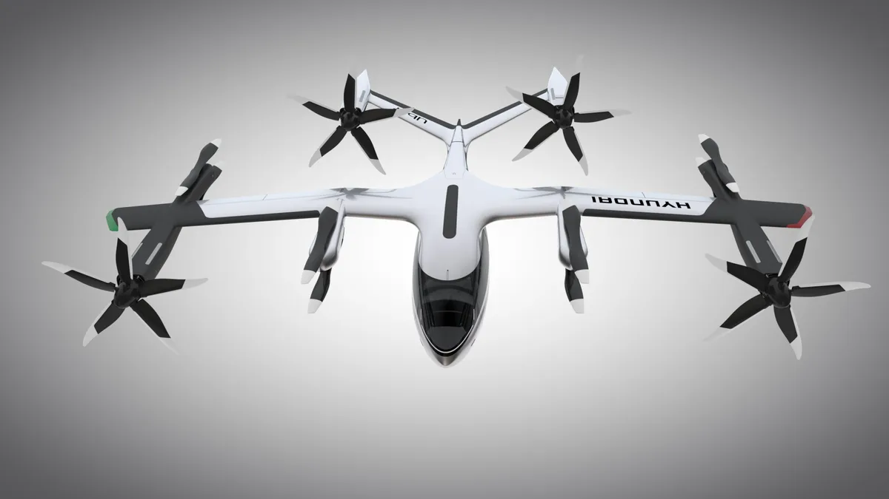

**S-A1**

> [!NOTE]
> Dit artikel verscheen eerder op [Bright](https://www.bright.nl/nieuws/1124910/hyundai-en-uber-presenteren-vliegende-taxi-met-propellers.html).

[Bekijk ingesloten media](https://www.youtube.com/embed/PIptSMAOjoo?autoplay=1&modestbranding=1)

De taxi is [te zien](https://www.hyundainews.com/en-us/releases/2948) op gadgetbeurs CES in Las Vegas. Hij is groot genoeg om vier mensen tegelijk te vervoeren met een snelheid van 290 kilometer per uur. Daarbij gaat hij niet hoger dan 600 meter.

Beide bedrijven willen de luchttaxi ook echt gaan gebruiken. De S-A1 moet vanaf 2023 mensen door het luchtruim vervoeren, belooft het duo. Al moet nog blijken in welke landen hij zal rondvliegen en hoeveel er tegelijk worden ingezet.

## 100 kilometer

Voorin zit een plek voor een piloot, maar die moet op termijn verdwijnen: volgens Uber en Hyundai wordt de vliegtaxi op een dag autonoom. Op een volle accu kan de SA-1 een vlucht van 100 kilometer maken. Tussendoor wordt hij dan opgeladen, wat hooguit zeven minuten in beslag moet nemen.

Hoewel de SA-1 als een vliegende taxi wordt gepresenteerd, heeft het ontwerp vrij weinig weg van een auto. In de praktijk is het eigenlijk gewoon een vliegtuig, dat door het viertal propellers comfortabel kan opstijgen.

[Bekijk ingesloten media](https://www.youtube.com/embed/YBLUKfYtFa4?autoplay=1&modestbranding=1)

## Kijk ook: drone-auto van Audi en Airbus

**[Volg Bright op YouTube](https://bit.ly/brighttv) voor meer tech-video's**
