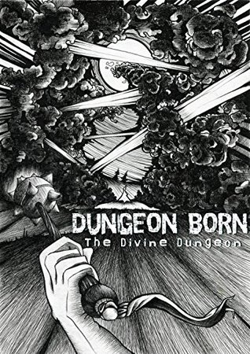

Fantasyboeken zitten meestal vol met clichés. Elven met bogen, dwergen met hamers en oude mannen met lange baarden en toverstaven. Samen vullen zij de pagina’s van deze dikke pillen, vaak indirect geïnspireerd door de werken van Tolkien. Wat dat betreft voelt het boek Dungeon Born alvast vrij uniek. Hierin speelt de zelfbewuste, gamende kerker Cal de hoofdrol.

Cal begint als een simpele edelsteen, maar ontdekt al snel dat hij zijn directe omgeving kan beïnvloeden. Hij gebruikt die kennis om kamers om hem heen te bouwen met daarin monsters, planten en valstrikken, waarmee hij nieuwsgierige avonturiers probeert weg te houden van zijn gevoelige kern.

Klinkt dat je bekend in de oren? Dat kan best, want het is precies wat je moest doen in de klassieke game Dungeon Keeper. In de jaren ’90 was het concept ervan nog uniek: spelers waren eens niet de held die een kerker moest doorkruizen, maar de architect die de met monsters gevulde kamers ontwierp.

Naarmate het boek vordert, worden er steeds meer game-elementen geïntroduceerd. Cal leert hoe hij de wereld kan waarnemen zoals wij een game zien – als schermen gevuld met statistieken en andere basisinformatie. Volledige hoofdstukken worden er gewijd aan uitleg van spelmechanieken, zoals bijvoorbeeld hoe het in-game level van Cal wordt bijgehouden:

__“Laat ik eerst een paar basisprincipes beschrijven. Er zijn veel verschillende niveaus waarop je Essentie kunt cultiveren. Als je begint bij de laagste, dan heb je G, F, E, D, C, B, A, S, SS, SSS, Hemels en Goddelijk. Elke rang heeft tien levels, waarbij nul het laagst is en negen het hoogst.”__

Houd je het nog bij? Even later leert de hoofdpersoon ook nog over de vaardigheden van monsters en hoe het spel daarop inspeelt:

__“Ik keek naar wat het konijn nu kon doen.__

__<Het heet ‘Cleave’. Wat betekent dat?>__

__“Ooh, cool! Dat betekent dat hij bij een aanval een kwartcirkel voor zich raakt. Omdat hij het element lucht heeft, zal hij waarschijnlijk een windvlaag oproepen om alles voor zich te raken. Zelfs als de aanval mist, kan de lucht alsnog de vijand raken!”__

## litRPG

In het boek wordt vrij direct en uitgebreid gerefereerd naar systemen zoals die ook in games bestaan. Daarmee is Dungeon Born een vrij vreemd boek, maar zeker niet uniek. Boeken als deze zijn onderdeel van een relatief nieuw genre genaamd litRPG, waarbij de personages druk bezig zijn met het spelen van games.

De schrijver van Dungeon Born is daarom vooral aan het uitleggen hoe de game waarover zijn boek vertelt precies wordt gespeeld. Er is amper ruimte voor de ontwikkeling van personages of een spannend, achterliggend verhaal. In de traditionele zin is het daarom geen heel goed boek.

## Zolderkamer

LitRPG’s weten echter als geen ander terug te grijpen naar bijzondere momenten die je ooit beleefde in games. De boeken zijn immers doordrenkt met gamedesign. Schrijvers benoemen tot in detail hoe iedere menu-optie ter beschikking van de hoofdrolspeler staat, of hoeveel levenspunten een bepaald monster heeft.

Zo kan een LitRPG beschrijven hoe je net één levenspunt overhield, de juiste spreuk gebruikte om een tweede aanval te vermijden en vervolgens de zwakke plek van een monster raakte om hem te verslaan. En LitRPG’s kunnen overbrengen hoe jij je voelde op die ene avond dat je tot 3 uur ’s nachts op zoek was naar dat zeldzame zwaard. Niet door er een volwaardig fantasyverhaal omheen te verzinnen, maar gewoon door de game te bespreken. De rest mag je er zelf bij bedenken. Draait het toch nog om fantasie.
