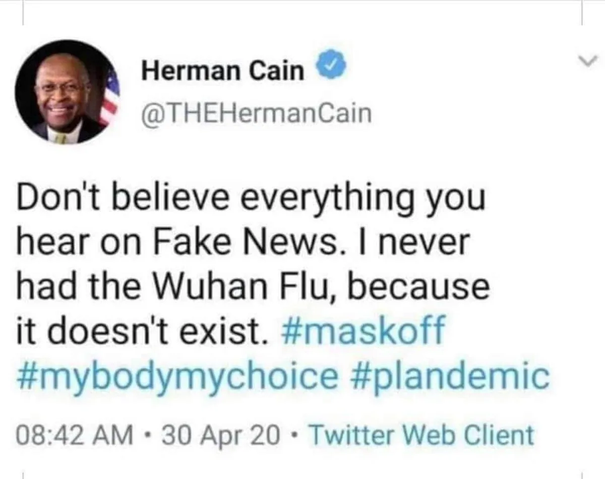

Op een populair online forum kijken bezoekers hoe corona-ontkenners het virus oplopen, op de ic belanden en er soms zelfs door sterven. Die mensen wordt vervolgens de morbide ‘Herman Cain Award’ uitgereikt.

> [!NOTE]
> Dit artikel verscheen eerder op [AD](https://www.ad.nl/tech/in-dit-morbide-uithoekje-van-het-internet-wordt-de-dood-van-corona-ontkenners-gevierd~a2541743/).

Al bijna een half miljoen mensen hebben een abonnement op de Reddit-pagina HermanCainAward, waar een online prijs ‘postuum wordt uitgereikt’. De winnaars zijn allemaal overleden aan het coronavirus, kort nadat ze bijvoorbeeld zeiden dat het virus eigenlijk een hoax is of dat vaccinaties niet zouden werken.

## Vernoemd naar Amerikaanse corona-ontkenner

De prijs is genoemd naar de Amerikaanse politicus Herman Cain van de Republikeinse Partij. In april 2020 riep hij zijn volgers op de verhalen over COVID-19 niet te geloven: ‘Ik heb de Wuhan-griep nooit gehad, want het bestaat helemaal niet’, sneerde hij op Twitter.

Cain bleef het bestaan van het ontkennen en riep iedereen op te demonstreren. Volgens hem hoefde ook niemand mondkapjes te dragen bij samenkomsten om oud-president Donald Trump te steunen. Een paar maanden later bleek Cain echter het virus zelf te hebben opgelopen, waarna hij hier eind juli aan overleed.

Cain ontkende het bestaan van Covid-19, maar overleed kort daarna aan het virus. © Twitter

## Nominatie in het ziekenhuis, prijs bij overlijden

Sindsdien reikt de HermanCainAward-pagina op Reddit ‘prijzen’ uit aan iedereen die hetzelfde deed als Cain. Bij nominaties plaatsen gebruikers plaatjes van sociale media waarop iemand het gebruik van vaccins of mondkapjes afkeurde of bespotte en vervolgens in het ziekenhuis bleek te belanden.

Is deze persoon hierna aan het virus gestorven, dan ‘winnen’ ze de award. Of, zoals de beheerders van het forum het beschrijven: ‘De prijs wordt uitgereikt zodra de genomineerde onze aarde heeft verlaten.’

## 20.000 upvotes voor overleden vaccin-ontkenner

Dat gebeurde afgelopen week [bijvoorbeeld](https://www.reddit.com/r/HermanCainAward/comments/s7pyhm/only_30_years_old_she_took_a_gamble_and_lost/) bij een vrouw die beweerde dat de sterfkans bij het coronavirus op slechts 0,09 procent zou liggen. Ze deelde berichten over het vaccin en de werking van mondkapjes, waarover ze veel ruziemaakte op haar Facebook-pagina. Totdat ze op 30-jarige leeftijd overleed aan het virus.

Het is een morbide blik op het leven van coronasceptische vrouw wie het virus vervolgens fataal werd. De awarduitreiking kreeg ruim 20.000 upvotes, de Reddit-equivalent van ‘vind-ik-leuks’, met daaronder meer dan 1300 reacties van andere bezoekers.

In die reacties wordt de pas overleden vrouw vooral bespot. ‘Ze heeft niet moedig tegen corona gestreden, maar had al opgegeven voor de strijd begon’, schrijft één bezoeker. ‘Dit vat perfect samen wat er mis is met deze mensen’, stelt een ander.

## Toestemming wordt niet gevraagd

In de tussentijd wordt gespeculeerd welke corona-ontkenner als volgende in het ziekenhuis kan belanden - bijvoorbeeld de ongevaccineerde Amerikaanse politica Sarah Palin, die eerder deze week positief werd getest. Er wordt druk gediscussieerd of de overleden muzikant Meat Loaf alsnog een prijs moet winnen, omdat hij tegen het gebruik van vaccins was.

De awarduitreikingen leiden tot kritiek. Eind vorig jaar schreven onderzoekers van de Universiteit van Amsterdam nog op [een blog](https://mastersofmedia.hum.uva.nl/blog/2021/10/03/the-questionable-ethics-of-r-hermancainaward/) dat de prijs ‘niet de ethische standaarden van academisch onderzoek handhaven’. De Reddit-beheerders stellen dat ze de negatieve gevolgen van desinformatie proberen te documenteren, maar volgens de onderzoekers gebeurt dat hier zonder toestemming terwijl slachtoffers negatief worden neergezet. ‘Wie echt de gevolgen van desinformatie wil vastleggen, kan dat beter op een ander platform doen.’
