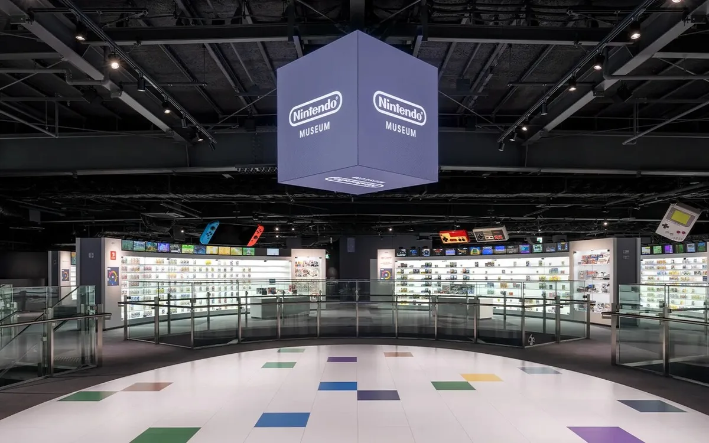
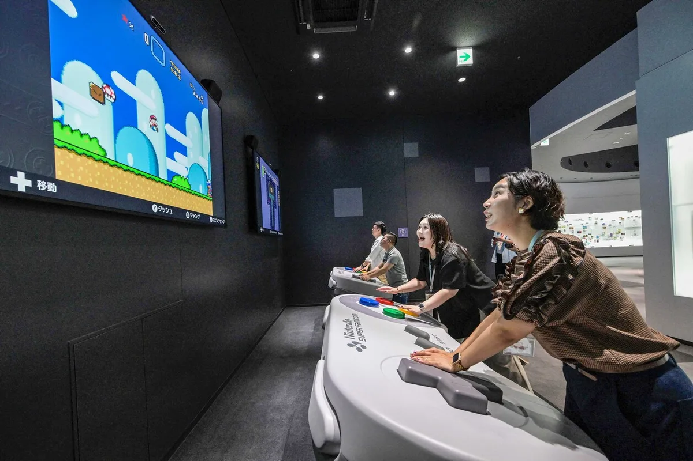

Op de plek van één van Nintendo’s oudste fabrieken in het Japanse Kioto staat nu een fonkelnieuw museum, waar de geschiedenis van het gamebedrijf is uitgestald. Het is een poging voor de Japanse spellenmaker om zijn oudste games in de schijnwerpers te zetten - die met de dag populairder worden bij fans. De deuren gaan vandaag voor het eerst open voor het grote publiek.

> [!NOTE]
> Dit artikel verscheen eerder op [AD](https://www.ad.nl/tech/in-het-nieuwe-nintendo-museum-staat-nostalgie-centraal~a8195dc2/).

Bij een rondje door het museum kom je Nintendo’s volledige geschiedenis tegen. Daarbij gaat het vooral om de games: iedere spelcomputer staat uitgestald in een eigen vitrine, omsingeld met de populairste Nintendo-spellen en accessoires die daarbij werden verkocht. Een beetje alsof je door een gigantisch grote gamewinkel rondloopt waarin alles van de afgelopen veertig jaar te zien is. De grootste hits zijn aanwezig, maar het bedrijf durft ook zijn flops te demonstreren: in één hoek vind je bijvoorbeeld een ode aan de Virtual Boy, de virtualrealitybril die midden jaren ‘90 in recordtijd uit de winkels verdween na klachten van hoofdpijn en misselijkheid bij gamers. En weer ergens anders is de eerste Super Mario-film te zien, wat nog steeds één van de slechtst beoordeelde films aller tijden is.

In een paar kasten is ook de oudere geschiedenis van Nintendo te zien. De gamereus werd namelijk al opgericht in 1889 en maakte van alles. Ze werden ooit groot met de licentieverkoop van Disney-bordspellen, experimenteerden met kaartspellen en kinderwagens, totdat ze rond de jaren ‘60 met gadgets begonnen te experimenteren. Dat groeide uiteindelijk uit tot de videogames waar Nintendo in de jaren ‘80 groot zou worden. Nintendo-uitvinder Gunpei Yokoi zag in de metro hoe iemand op een rekenmachine een spelletje speelde en kreeg toen een idee voor een gameconsole.

© Nintendo

## Eigen herinneringen herbeleven

Opmerkelijk is het complete gebrek aan teksten bij iedere kast in het museum: Nintendo laat de producten voor zichzelf spreken. ‘Je eigen ervaring’ staat centraal, aldus het bedrijf. Voor gamers leuk, want zij zien in de vitrines de oude apparaten liggen waar ze zoveel herinneringen aan hebben. Maar neemt die gamer een vriend of familielid mee die niks met games heeft, dan zal die persoon enkel een kamer vol oude apparaten en speldoosjes zien.

Voor die gamers zijn er bovendien weinig echt grote verrassingen: het museum richt zich vooral op de al bekende verhalen van Nintendo, met apparaten die al eens elders te zien waren. De enige uitzondering is een klein hoekje van het museum waar oude prototypes liggen die nog nooit aan de buitenwereld zijn getoond.

Naast de expositieruimte heeft Nintendo ook een verdieping aan speciale spelletjes gewijd, die zijn ontworpen voor het museum. Je kunt bijvoorbeeld met de oude zappistolen van de NES uit 1984 op een gigantisch scherm schieten, of met Nintendo’s honkbalknuppel ballen in een woonkamer schieten. In één kamer staan gigantisch grote replica’s van gamecontrollers, die je met zijn tweeën moet bedienen om bijvoorbeeld een level in de oude Mario te voltooien. Ieder spel laat stiekem een stukje van Nintendo’s oude geschiedenis zien.

Mario-bedenker Shigeru Miyamoto denkt dat Nintendo’s oude directeur nooit een museum had gewild, omdat ‘de producten voor zichzelf dienen te spreken’. Toch ziet Miyamoto nu de vraag naar een plek waar Nintendo zijn geschiedenis kan laten zien, die nu voor steeds meer mensen belangrijk is. Het is voor hem ook een manier om zijn nalatenschap tentoon te stellen - met zijn 71 jaar sorteert Nintendo voor op een tijdperk zonder zijn beroemdste gameontwerper.

© AFP

## Geld verdienen met nostalgie

Daarnaast zal de leeftijd van de gemiddelde fan vast ook een rol spelen: de generatie die in de jaren ‘80 en ‘90 opgroeide met de spelcomputers van Nintendo, is nu in de dertig. Zij kijken inmiddels met verlangen terug naar die vroege gamejaren en hebben het besteedbare inkomen om naar een museum af te reizen voor zo’n nostalgietrip. Het maakt Kioto nog iets meer een bedevaartsoord voor gamers. In de stad bevindt zich onder andere ook een Nintendo Store, een soort Apple-achtige winkel vol met unieke merchandise die je nergens ter wereld kunt kopen. Bovendien bevindt het museum zich vlakbij het Japanse pretpark Universal Studios, waar zich sinds 2021 een Nintendo-themapark binnen bevindt.

De gamemaker probeert zo al jaren op de nostalgie van zijn oudste fans te kapitaliseren. In 2016 en 2017 bracht het bedrijf de NES Mini en SNES MIni uit, kleine replica’s van Nintendo’s oudere spelcomputers volgeladen met spellen om op je moderne tv te spelen. Op de huidige generatie gameconsoles verkopen ze bovendien het Nintendo Switch Online-abonnement, waarmee je toegang krijgt tot een verzameling oude titels op de NES, Super NES, Game Boy en GameCube. Hiermee verleidt het bedrijf fans om nogmaals geld uit te geven aan spellen die ze decennia geleden al eens hebben gekocht en gespeeld.
