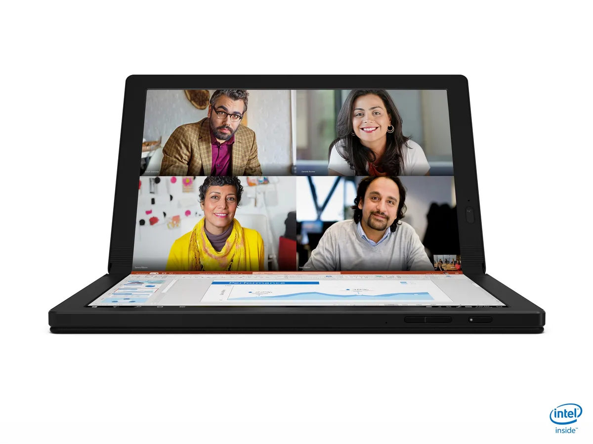
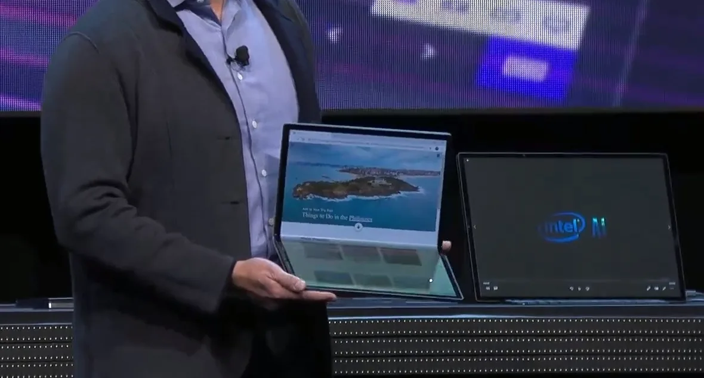
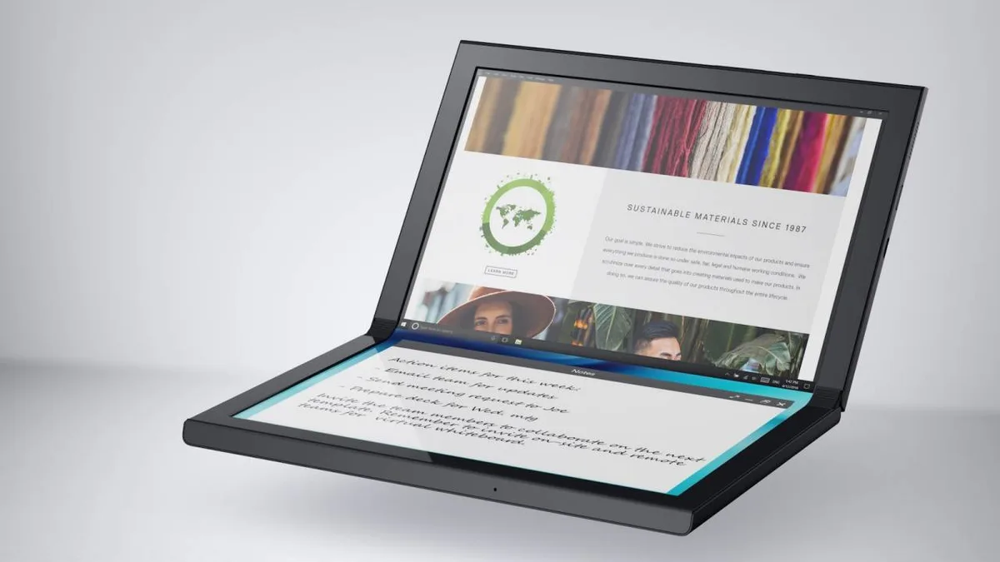

**Thinkpad X1 Fold**

> [!NOTE]
> Dit artikel verscheen eerder op [Bright](https://www.bright.nl/nieuws/1124883/intel-en-lenovo-tonen-laptops-met-opvouwbare-schermen.html).

Alle drie de laptops werden gepresenteerd op de gadgetbeurs CES in Las Vegas.

De [Lenovo Thinkpad X1 Fold](https://news.lenovo.com/pressroom/press-releases/worlds-first-foldable-pc-thinkpad-x1-fold-ushers-in-a-new-era-of-mobile-computing/) heeft één groot oled-scherm van 13,3 inch dat het gehele apparaat bedekt. Door het apparaat in het midden te vouwen, kan hij als een laptop worden neergezet.

Op het touchscreen aan de onderkant kan een toetsenbord worden getoond, of verschijnen app-specifieke opties. Ook is er een speciale hoes waarmee een fysiek toetsenbord kan worden toegevoegd aan de laptop. Ook is het mogelijk de tablet rechtop te zetten, zodat je draadloos een losse muis en toetsenbord kunt koppelen.

## Windows 10X

De laptop draait op Windows 10 en zal later ondersteuning krijgen voor Windows 10X. Deze nieuwe variant van het besturingssysteem wordt op dit moment ontwikkeld voor de [Surface Neo](https://www.bright.nl/nieuws/artikel/4871571/eerste-indruk-microsoft-gaat-dual-screen), een Microsoft-tablet met twee schermen.

Lenovo hoopt zijn nieuw soort laptop vanaf mei dit jaar te verkopen. In de Verenigde Staten kost hij 2.499 dollar, omgerekend ruim 2.200 euro. Over verkoop in Nederland is nog niks bekendgemaakt.

Met de laptop volgt Lenovo het voorbeeld van de smartphonemarkt, waar onder andere Huawei en Samsung al [opvouwbare telefoons](https://www.bright.nl/nieuws/artikel/4958661/verrassing-samsung-brengt-galaxy-fold-toch-nederland-uit) op de markt brachten. Steeds meer fabrikanten kunnen de flexibele schermen die hiervoor benodigd zijn produceren.

## Horseshoe Bend

Tegelijkertijd demonstreerde Intel zijn Horseshoe Bend - een hybride laptop die ongeveer hetzelfde in elkaar steekt als de Thinkpad X1 Fold. Het grootste verschil is het scherm: die is bij Intel 17 inch groot.

De Horseshoe Bend is op het moment slechts een prototype, waarmee Intel zijn nieuwe Tiger Lake-chips voor mobiele apparaten demonstreert. Er zijn vooralsnog geen plannen om Horseshoe Bend op grote schaal te produceren en verkopen.

## Concept Ori

Dell toonde net als Intel een prototype van een laptop met opvouwbaar scherm. Op afbeeldingen ziet deze er grotendeels hetzelfde uit als bovenstaande alternatieven. Het apparaat heeft een 13 inch-scherm met een QHD+-resolutie. Daarnaast zijn verdere specificaties nog niet gedeeld.

De Concept Duet is een laptop met twee schermen, vergelijkbaar met de Surface Neo. Beide schermen zijn 13,4 inch groot. Daarop kunnen individuele apps worden getoond, of één programma worden uitgerekt.

Omdat beide apparaten slechts concepten en prototypes zijn, is het nog de vraag of ze op korte termijn verkocht worden. Mogelijk volgt pas op CES 2021 een verkoopklare variant.

[Bekijk ingesloten media](https://www.youtube.com/embed/GdWYIlynNV8?autoplay=1&modestbranding=1)

## Eerste highlights van techbeurs CES 2020

**[Volg Bright op YouTube](https://bit.ly/brighttv) voor meer tech-video's**
