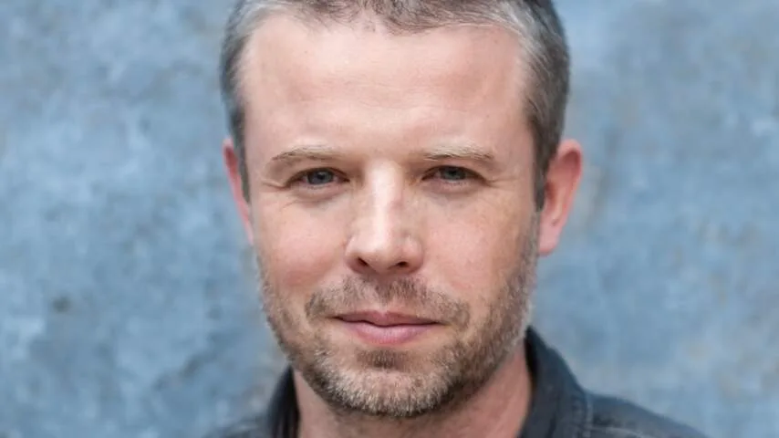

**Op vrijdag verschijnt de nieuwe PlayStation-game Horizon Forbidden West, waarin de jonge jager Aloy moet overleven in een wereld vol robotdinosaurussen. Het is een van de grootste games die ooit in Nederland werd gemaakt. We spraken met Mathijs de Jonge, de game director die het project regisseerde.**

> [!NOTE]
> Dit interview verscheen eerder op [NU.nl](https://www.nu.nl/tech/6184689/nieuwe-horizon-game-had-eerder-kunnen-uitkomen-we-wilden-niet-overwerken.html).

**Je bent een game director. Wat moet ik me daarbij voorstellen?**

"Het is het makkelijkst om mij te vergelijken met een filmregisseur. Iemand die vaak met een verhaal of schrijvers werkt, met een idee werkt en de hele film bij elkaar regisseert en zorgt dat er een heel gave film uitkomt. Dat is een beetje mijn rol, maar dan bij een videogame."

**Voelt het alsof _Forbidden West_ 'jouw' game is?**

"Ik heb wel de eerste presentatie opgezet om de richting van het project uit te zetten. Het team gaat dan aan de slag en komt terug met ideeën, en daar halen we weer de gaafste dingen uit."

"Dus uiteindelijk is het wel echt samenwerken. Het is niet dat ik met een zweep rondloop en zeg: zo moet je het allemaal doen (lacht). Zo werken wij absoluut niet."

_Nieuwe Horizon-game had eerder kunnen uitkomen: 'We wilden niet overwerken' — Beeld: Guerrilla Games_

**Zit er een boodschap achter _Forbidden West_?**

"Er zitten best veel verborgen boodschappen en thema's in de game. Bijvoorbeeld over de '_stupidity of mankind_', dat de mensheid altijd weer iets weet te verknallen. En over de opkomst van robots en de macht van miljardairs."

"Al is het niet ons doel om echt een statement te maken met de game. Uiteindelijk is het een entertainmentproduct en willen we dat mensen plezier hebben."

**Je merkt dat steeds meer PlayStation-games over volwassen zaken gaan.**

"Ik denk dat dit altijd wel een beetje zo geweest is, maar dat verhalen nu steeds beter gevisualiseerd worden. Daardoor komen ze ook beter over op spelers en voelen zij zich meer aangesproken."

"Ons team wordt ook steeds ouder: steeds meer hebben kinderen, waardoor je het daar sneller over hebt. Of je krijgt bijvoorbeeld te maken met een lockdown en schrijft verhalen over het gevoel van isolement dat daarbij komt kijken. Je speelt een beetje in op je persoonlijke leven, waar je staat en wat je meemaakt."

**Toen _Zero Dawn_ uitkwam, waren er niet veel vrouwelijke gamehelden. Is dat in de tussentijd veranderd?**

"Toen we werkten aan _Killzone_, waren we gefrustreerd omdat op de dozen van onze games nooit de hoofdpersoon stond. In plaats daarvan was het altijd de vijand, zo'n enge Helghast-soldaat. Bovendien was de wereld van _Killzone_ erg grauw."

"Het concept voor _Horizon_ was een soort tegenreactie, die haaks stond op _Killzone_. In plaats van een stoere soldaat wilden we een vrouwelijk personage in een kleurrijke wereld. Tegelijkertijd zagen we dat er niet veel sterke, vrouwelijke personages waren, maar dat was eigenlijk secundair."

**Veel vrouwen in games werden geseksualiseerd, dat lijkt bij Aloy niet het geval.**

"We wilden een jonge robotjager die gaaf is om mee te spelen en er gewoon uitzag, zonder de seksualiserende kant op te gaan. We hadden het idee dat dat niet nodig was. Als je een goed, gaaf personage neerzet, dan ben je er al."

**Wij praten nu Nederlands, maar je team is best internationaal.**

"We hebben meer dan dertig nationaliteiten in het team zitten, dus de voertaal is Engels. Er zijn best veel Nederlanders, dus we moeten altijd opletten dat we niet per ongeluk Nederlands gaan praten."

"Degene die over het verhaal gaat is een Amerikaan, maar in de leiding zitten vooral Nederlanders. Het voelt hier ook heel Nederlands, als je bijvoorbeeld kijkt naar hoe processen lopen en hoe we dingen bespreken."

[Bekijk ingesloten media](https://www.youtube.com/embed/Lq594XmpPBg)

**Je hoort steeds vaker dat bij gamebedrijven stelselmatig wordt overgewerkt.**

"Dat gebeurt bij ons heel weinig. We zijn ons heel bewust van de nadelen van crunchen, dus we houden daar bij onze planning veel rekening mee. Om een voorbeeld te geven: met Kerst hebben we gezegd dat er niet gewerkt gaat worden en dat iedereen gewoon twee weken vakantie kon vieren. Het bedrijf was dicht, je kon er niet eens naartoe om te werken."

"Sommige mensen vinden het leuk om door te werken, die willen niet per se kerstvakantie. Dat mag, dat gaan we niet tegenhouden. Maar vanuit het bedrijf geven we heel sterk een signaal."

"_Forbidden West_ had misschien eind vorig jaar uit kunnen komen, maar dan hadden we misschien moeten overwerken. Mensen moeten ook kunnen ontspannen en vakantie nemen, bijvoorbeeld om bij familie en vrienden te zijn. Dat heeft ook meegespeeld bij het besluit om de game nu pas uit te brengen."
